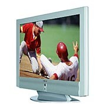

= ALAN 3 BEGINNER’S GUIDE
:toc:

- Initial version by Michael Arnaud © 2006
- Converted to AsciiDOC by Thomas Nilefalk © 2014-2017

*The Alan Adventure Language* - created by Thomas Nilefalk

*Beginner’s Guide* - by Michael Arnaud © 2006

image::images\4EA5EB596A6EDB3CC92206A2D8BDF967E38BD9B6.jpg[]

:numbered!:
== Notes on the current version

This excellent guide was written by Michael Arnaud back in 2006. It
got published on the link:http://alanif.se[Alan website], where it
still lives, but the original sources was lost. It was written in a
format that made it possible to generate various output formats. Today
the format of choice with those properties is
link:http://asciidoc.org[AsciiDOC].

In 2014 I started converting it from the only remaining format, the
HTLM.  By cleaning that from crud I could make AsciiDOC out of
it. Then it was mostly a matter of restoring the formatting that
Michael intended. I think it is fairly true to the intention.

The library that is used in this guide is no longer current. Anssi
Räisanen have made huge efforts in creating a better library, which is
available at the link:http://alanif.se[Alan website]. Perhaps someone
is interested in converting this guide to use a moderna Alan library.

Even so, it is a clear and concise guide on writing text adventures
with Alan. I hope his efforts in writing this, and mine in converting
it to a modern, and sustainable format, make this helpful to someone.

As a last side note, in 2016 I changed my last name from Nilsson to
Nilefalk.

_Thomas Nilefalk, 2017_

:numbered:

== Introduction
[[introduction]]
=== Introduction to Alan 3

From the ALAN website (http://www.alanif.se):

[quote,http://www.alanif.se]
____
Alan is one of the most easy to use tools specialized for creating
works of Interactive Fiction, a.k.a text adventures. It’s focus has
always been on the authoring aspects.
____

According to the
http://groups-beta.google.com/group/rec.arts.int-fiction/browse_thread/thread/7ab9ece381198e00/8fa96802f44c4c73?q=faq+%22tier+i%22+alan&rnum=6#8fa96802f44c4c73[rec-arts.int.fiction]
FAQ, ALAN version 2 is included in the "Tier I" of Interactive Fiction
programming languages, along with Inform, TADS, and Hugo. That is very
good company.

Recently, TADS has been updated with TADS 3 — not just a revision, but
an essentially new language, which may well be the most powerful
"Adventure Development System" out there. There are rumors at the time
of this writing of a similar update — more than mere revision — of
Inform as well, with promises of greater power and versatility in this
already excellent and popular language.

Interestingly, ALAN has undergone the revision process as well (I
don’t know if Thomas Nilsson saw the other languages revising and
decided, "Me too!", though I tend to think not. On the ALAN website he
describes this revision process as beginning "_a couple of years
ago…_").

Like TADS 3 (and if the rumors are true "Inform 7"), ALAN 3 is not
just a revision or update of ALAN version 2. ALAN 3 incorporates
"object oriented programming" (OOP) and is much more powerful, more
versatile and capable than ALAN 2. It will surprise those who are
unfamiliar with ALAN how very powerful it is; and those who are
familiar only with ALAN 2 ought to be very pleased with the new ALAN 3
language.

Every programming language has its distinct advantages. TADS 3, for
example, has a completely programmable parser. Inform is ported for
just about any machine out there, including handhelds. Hugo can
implement nearly every kind of multimedia an author might wish to put
into his or her game.

ALAN 3’s most notable distinction from the other adventure languages
is _its ease of use and lower learning-curve_. Even though it is a
powerful Tier I language, ALAN 3 is considerably easier for an
inexperienced or "non-programming" author to use than the other
languages. It is a "higher" language; that is, it is much more like
English than "computerese". ALAN 3 does not use confusing brackets and
braces, semicolons, or other C, C++, Pascal and other such programming
conventions as used in TADS, Inform, and Hugo.

=== Introduction to This Beginner’s Guide

This material is _not_ a manual. This is only a primer, a beginner’s
guide. The focus of this guide is on writing a game with the ALAN 3
adventure language. Technical questions and those concerning software
issues such as compiler switches or debugging are best addressed by
the manual. This guide does not cover everything that ALAN 3 is
capable of, nor is its claim to _exhaustively_ cover _anything_ ALAN 3
is capable of. Therefore I highly recommend familiarity with the ALAN
3 manual as your main source of information.

TIP: Paragraph symbols ( ¶ ) throughout this guide refer to paragraph
numbers in the Alan Manual.  Another thing I recommend is browsing the
archived messages at the
http://groups.yahoo.com/group/alan-if/?yguid=20632878[ALAN Yahoo!
Group]. You can learn about the development of ALAN 3 as it has
progressed, hitting snags and bugs that were fixed along the way. You
can find programming help for more advanced and tricky techniques in
ALAN 3 that we will not go into in this beginner’s guide.

If you are new to writing Interactive Fiction games or new to
programming, I recommend that you read this guide through from
beginning to end to get a full overview of what it covers. Then go
through it again more slowly, working through the steps one at a time
to master them.

As has been done in primers for other IF languages such as Inform and
TADS, we will build a complete though simple game one step at a time
and then develop it into one somewhat more complex. Before we get to
that, however, there are a few things you will need besides this
beginner’s guide.

[[tools]]
=== Tools You Will Need

(¶ 2.3.1) You need the ALAN 3 programming system (available for
Windows, Mac, and Linux), which includes the ALAN manual in PDF
format, the compiler, and the interpreter. (I also recommend the
third-party http://ghostscript.com/~tor/software/gargoyle/[Gargoyle
interpreter], which has a very pleasant display for ALAN and other
game files.)  You will also need the __standard library__. The library
is a set of preprogrammed basic verbs and classes. The standard
library is not included with the ALAN programming system and must be
downloaded separately. You can download both the programming system
and the standard library from http://www.alanif.se/[the ALAN website].

[float]
==== Text Editor

It is also very highly desirable to use a text editor rather than a
word processor to write your source code. First and foremost, source
code must be in plain text format, without the special formatting that
word processors use. Second, it is helpful to have quick and easy
access to multiple files (such as the standard library files) that
most text editors provide. Most text editors will also provide means
within the program itself to compile the source code into a game file.

There are several good text editors available free online. The ALAN 3
website and manual suggest
http://www.imaginate.free-online.co.uk/[Imaginate], which has syntax
highlighting that some people find helpful. _I_ prefer
http://www.crimsoneditor.com/[Crimson Editor], available as freeware.
(At the time of this writing, Imaginate supports version 2 but not yet
version 3.)

[float]
==== Image Editor

ALAN 3 supports jpeg images (and some audio formats). Our tutorial
game will include such an image. You might wish to convert, resize, or
otherwise manipulate images to include in your game. An excellent
freeware program, http://www.irfanview.com/[Irfanview], is available
that can help you do these things.  If you plan to release your game
to the public, be sure the images used are free of copyright.

=== Comments in the Code

[float]
==== The First Few Lines

Okay, let’s get started. Start a new file in the text editor and save
it as "tvtime.alan". (Actually, you can name it "mygame.alan" or
whatever you want, but the compiler will be looking for that .alan
extension.)

The first couple of lines of your source file should probably be
something to identify what it is. In this beginner’s guide we will do
it this way (note than whenever new code is displayed in this guide it
will be in [red]#RED#):

[subs="quotes"]
----
 [red]#-----------------------------------------------
 --             \*\** TV TIME! \***
 -- An ALAN 3 Interactive Fiction Tutorial Game
 --        By Michael Arnaud (c) 2006
 -----------------------------------------------#
----

These lines won’t do anything to, for, or in the game. They are just
there for anyone who happens to read the source file. These are called
"comment" statements (in some computer languages they are called
"REMARK" statements), and are written in ALAN 3 with a double-hyphen
(--) at the beginning of _every comment_.

Whenever the compiler sees a double-hyphen, it ignores everything that
follows on that line. We can make notes, reminders, and explain things
throughout our program this way.

Now we are ready to program our beginning `LOCATION` — what other IF
languages usually refer to as a "Room".

== PART ONE: LOCATIONS and EXITS

=== LOCATIONS and the START AT Statement.

`LOCATION` are just "where" the player is located in the game
map. Even though we usually think of `LOCATIONs` in terms of (as other
IF languages might call them) "Rooms", they can be outdoors or
indoors, under water, in outer space, or anywhere at all.

The basic template for a `LOCATION` is:

----
 THE ? Isa LOCATION
     NAME '?'
     DESCRIPTION
         "? ? ?"
     EXIT ? TO ?.
 END THE ?.
----

Following the format of the ALAN manual, we are using "?" as a
stand-in or place-holder.

The word `THE` is used to introduce specific instances (¶ 2.4.5) of
`LOCATIONs`, `OBJECTs`,`ACTORs`, etc. In other words, with "`THE`", we
are creating a particular `LOCATION` or a particular `OBJECT`, etc.

The word "`Isa`" is an ALAN 3 programming word to identify what class
THE (instance) IS. In this case, THE (instance) Isa (particular member
of the class) `LOCATION.

The beginning `LOCATION` for our tutorial game is the TV Room. A
completed `LOCATION` appropriately ends with an END statement, which
itself ends with a full-stop (or period ".").

[subs="quotes"]
----
 ...
 [red]#THE tv_room Isa LOCATION
 END THE tv_room.#
----

The word "tv_room" is our programming word (using an underscore in the
place of a space makes it a single word) for the first `LOCATION`. We
could have called it "in_a_house", "spaceship", "gertrude", or
anything at all.

[float]
==== START AT the End.

Every game must tell the compiler where to start, using the `START AT`
statement. The `START AT` statement always comes at the very end of
your program.

This is a complete game that will compile and run, though very limited
in description or action. Try it.

[subs="quotes"]
----
 ...
 THE tv_room Isa LOCATION
 END THE tv_room.
 [red]#START AT tv_room.#
----

[float]
==== Adding a NAME and DESCRIPTION

If we were to play the game at this point, we would not see anything
about the TV Room, except "Tv_room" (note that the interpreter
capitalized the first letter! ¶ 2.4.8). Following the template at the
top of the page, we can add a `NAME` and `DESCRIPTION`. Type in the
`NAME` statement followed by what you want the game to display as the
NAME of the LOCATION. Be sure to enclose it in single (not double)
quotes.

[subs="quotes"]
----
 ...
 THE tv_room Isa LOCATION
     [red]#NAME 'TV Room'#
 ...
----

(We sometimes use the ellipsis, "...", in this guide to indicate that
there is more code preceding and/or following.)

Now fill out a brief `DESCRIPTION` of the `LOCATION`, basically
telling the player what he/she sees when entering. `DESCRIPTIONS, as
information displayed to the player, are placed within double quotes.

[subs="quotes"]
----
 ...
 THE tv_room Isa LOCATION
     NAME 'TV Room'
     [red]#DESCRIPTION
         "This is your favorite room in the house, because you love to
           watch television. You recently purchased a giant screen
           plasma TV that is set up in this room, ideally located
           across from your comfy chair and table."#
 END THE tv_room.
 ...
----

Compile and run the game to see how this is displayed to the player.

[float]
==== Another LOCATION.

Using the same basic template, let’s make a second simple `LOCATION:

[subs="quotes"]
----
 ...
 [red]#THE kitchen Isa LOCATION
     NAME 'Kitchen'
     DESCRIPTION
         "This is the kitchen."
 END THE kitchen.#
 ...
----

=== EXITS

[float]
==== We need an EXIT strategy.

In game play, the player starts in the TV Room and is locked
in. He/She cannot see or go into the Kitchen. They need some way to
move from the TV Room to the Kitchen. This is most often accomplished
with an `EXIT`.

Note that `EXITs` are always one-way.  If we want the `EXIT` to work
in both directions (for example, "south" to the Kitchen, and "north"
back to the TV Room), we need to put an `EXIT` in the other
`LOCATION`.

[subs="quotes"]
----
 ...
 THE tv_room Isa LOCATION
    NAME 'TV Room'
    DESCRIPTION
        "This is your favorite room in the house, because you love to
         watch television. You recently purchased a giant screen plasma
         TV that is set up in this room, ideally located across from
         your comfy chair and table."
    [red]#EXIT south TO kitchen. -- Note the full-stop.#
 END THE tv_room.
 -----------------------
 THE kitchen Isa LOCATION
    NAME Kitchen
    DESCRIPTION
        "This is the kitchen."
    [red]#EXIT north TO tv_room.#
 END THE kitchen.
 -----------------------
 START AT tv_room.
----

Compile and run the game. You can go back and forth from the TV Room
to the Kitchen.

[[nowhere]]
=== DIRECTIONS TO Nowhere

In our game so far, we have programmed EXITS "south" from the TV Room
and "north" from the Kitchen. But suppose the player would like to go
east or west or up or down? The interpreter does not know what any of
those words mean, and will tell the player so.

TIP: In game transcripts we'll use _this type face_ to indicate what
the player types.

[subs="quotes"]
----
> _west_
I don’t know the word 'west'.
----

The remedy is to include in our program every different direction we
might use in our game. We need not use any of the standard directional
words at all. We can use "thisaway", "thataway", "moonward", or
anything we want. However, most players of Interactive Fiction are
used to playing with at least the four cardinal directions, plus "up"
and "down". They will need some instruction within the game if we want
them to try such directions as "moonward".

[float]
==== This Is Going NOWHERE

One of the most convenient devices we can use in the Alan adventure
language is what the manual calls a "limbo" LOCATION (¶ 2.4.6). That
is, a LOCATION that the player never sees or knows anything about, he
cannot travel there or back again. We can use such a limbo LOCATION to
establish any directional or EXIT words we want. We could call our
limbo LOCATION "limbo", "bimbo", or anything else, but for our game we
will call it "Nowhere". Put these lines before the code for the
tv_room:.

[subs="quotes"]
----
 ...
 [red]#THE Nowhere Isa LOCATION
         EXIT north TO Nowhere.
         EXIT south TO nowhere.
         EXIT west TO nowhere.
         EXIT east TO nowhere.
         EXIT up TO nowhere.
         EXIT down TO nowhere.
 END THE nowhere.#

 THE tv_room Isa LOCATION
 NAME 'TV Room'
 ...
----

Now compile and play the game. Try to go "west" in the TV Room, and
instead of getting the message "I don’t know the word west" you get
the somewhat more reasonable response:

[subs="quotes"]
----
> _west_
You can’t go that way.
----

[float]
==== N, S, W, E

It is an IF convention that the player need only type "n" for north,
"s" for south, and so on. But at this point if we type n, s, w, or e,
we are back to "I don’t know the word n". We could program these
single-letter words as we did the full words above:

[subs="quotes"]
----
 THE Nowhere Isa LOCATION
         EXIT north TO Nowhere.
         EXIT south TO nowhere.
         EXIT west TO nowhere.
         EXIT east TO nowhere.
         EXIT up TO nowhere.
         EXIT down TO nowhere.
         [red]#EXIT n TO Nowhere.
         EXIT s TO Nowhere.
         EXIT w TO Nowhere.
         EXIT e TO Nowhere.#
 END THE nowhere.
----

The problem with this is, both "north" and "n" are two separate
directions. We would have to program the Kitchen, for example, with
both of them to go to the same place:

[subs="quotes"]
----
 ...
 THE kitchen Isa LOCATION
     NAME 'Kitchen'
     DESCRIPTION
         "This is the kitchen."
     EXIT north TO tv_room.
     [red]#EXIT n TO tv_room.#
 END THE kitchen.
 ...
----

If we had four or more directions to program from the Kitchen, we
would also have to double that number just to have the abbreviations
for each one. There is, however, a much easier way: use the SYNONYMS
statement.

=== SYNONYMS

[float]
==== SYNONYMS Mean the Same Thing

It is a very simple matter to create synonyms, words (or letters) that
the player can type and that will be understood by the interpreter to
mean the same thing as the main original word.

To create a synonym, simply use the SYNONYMS statement, then first the
synonym word; then an equals sign followed by the word you want the
synonym to equal. Be sure to end each synonym with a full-stop.

[subs="quotes"]
----
 ...
 [red]#SYNONYMS
     n = north.
     s = south.
     e = east.
     w = west.
     u = up.
     d = down.#

 THE Nowhere Isa LOCATION
     EXIT north TO Nowhere.
     EXIT south TO nowhere.
     EXIT west TO nowhere.
     EXIT east TO nowhere.
     EXIT up TO nowhere.
     EXIT down TO nowhere.
 END THE nowhere.

 THE tv_room Isa LOCATION
 NAME 'TV Room'
 ...
----

Now the player can indicate which direction he/she would like to go
with a single letter, rather than typing the full word. Try it.

[[import]]
=== Nowhere in the Library

Now we are going to look at a big time-and-trouble saver, the standard
library (see the xref:tools[Introduction]). If you have
downloaded the library you will find a folder called (as of this
writing) "alanlib_6_1dev". The exact name of the folder may vary as
later developments of ALAN and/or the library are released, but it
will probably always begin at least with "alanlib".

I highly recommend keeping the alanlib folder in a separate place on
your computer from the ALAN V3 folder. Copy the alanlib folder into
the ALAN V3 folder and rename it something like "my_lib" or "tv_lib"
or whatever you like.

Inside the folder is the standard library: a collection of files, most
of which carry the extension, ".i". The letter "i" here stands for
"import".

These are files that you are going to import into your main game file
(which will be explained in a moment). For now, let’s look at one of
these ".i" files in particular, which you should be able to open with
your text xref:tools[editor].

The file to open is called "nowhere.i". It should look very familiar
to you:

[subs="quotes"]
----
 -- nowhere.i
 -- Library version 0.5.0
 -- 0.4.1 - converted to ALANv3
 SYNONYMS
     n = north.
     s = south.
     e = east.
     w = west.
     ne = northeast.
     se = southeast.
     nw = northwest.
     sw = southwest.
     u = up.
     d = down.

 -- Useful for placing disappearing things
 -- Also defines the default directions
 THE nowhere ISA LOCATION.
     EXIT north TO nowhere.
     EXIT south TO nowhere.
     EXIT west TO nowhere.
     EXIT east TO nowhere.
     EXIT northeast TO nowhere.
     EXIT southeast TO nowhere.
     EXIT northwest TO nowhere.
     EXIT southwest TO nowhere.
     EXIT up TO nowhere.
     EXIT down TO nowhere.
 END THE nowhere.
----

This is the same section of code we needed to establish various
directions in our game, already written for us. The library has quite
a few files of this sort, which you can explore with your text
editor. Many of the library files may seem strange to you, but the
system is really very simple and you will soon understand and use it
all, quickly and easily.

=== IMPORTING the Library

[float]
==== Importing Is Important

How do we get all those library files into our game? Well, one way
would be to open each one with the text editor and copy-and-paste it
into our main game file. However, that would be tedious, it would add
a lot of code for us to wade through in our source file, and it would
be entirely unnecessary.

All we need to do is put the following line in our source code (I
recommend putting it right after the introductory comment statements):

[subs="quotes"]
----
 -----------------------------------------------
 --             \*\** TV TIME! \***
 -- An ALAN 3 Interactive Fiction Tutorial Game
 --        By Michael Arnaud (c) 2006
 -----------------------------------------------
 [red]#IMPORT 'std.i'.#

 THE tv_room Isa LOCATION
 ...
----

Be sure to type it just this way, with the single-quotes around the
name of the file and a full-stop at the end.

How does that get "nowhere.i" into our game? Let’s take a look. Open
another file in the library, this one called "std.i" — the one we are
importing into our source file.

[subs="quotes"]
----
 -- std.i -- Library version 0.6.1
 -- All verb definitions have a small, simple default body. To make
 -- them do other things use DOES ONLY in your specialized verb body.
 -- player character, etc
 import 'hero.i'.
 import 'global.i'.
 -- People, male/female etc.
 import 'people.i'.
 -- Standard verbs
 import 'look.i'.
 import 'take.i'.  -- + pick up, drop, put down.
 import 'open.i'.  -- + close.
 import 'lock.i'.  -- + unlock.
 import 'eat.i'.  -- + drink.
 import 'throw.i'.
 import 'push.i'.
 import 'touch.i'.
 import 'examine.i'. -- + look at, search
 import 'read.i'.
 import 'put.i'.   -- + put near,behind,on,under
 import 'give.i'.
 import 'talk.i'.  -- + ask, tell, say, shout,
 import 'attack.i'. -- + shoot
 import 'kiss.i'.
 import 'turn.i'.  -- + switch
 import 'listen.i'.
 import 'smell.i'.
 import 'knock.i'.
 import 'jump.i'.
 import 'wear.i'. -- + remove, undress, put on
 import 'help.i'.  -- + notes, hint
 -- Scenery import scenery.i.
 -- Inventory verb and inventory limits (including clothing items)
 import 'invent.i'.
 -- The limbo location and directions Defines directions as full
 -- words, and short directions as synonyms to these. So remember to
 -- use the full words in your exits or you will have E 333's
 -- (e.g. 'e' defined both as a synonym and another word class)
 #import 'nowhere.i'.#
 -- Verbose and brief mode
 import 'brief.i'.
 -- Score, save, restore etc.
 import 'meta.i'.
----

[float]
==== Here's How

In the std.i file there is a lengthy string of "import" statements. So
here is how "nowhere.i" and a large collection of other pre-programmed
files from the library are included in our program. When we typed that
single line

----
 IMPORT 'std.i'.
----

we also imported all those other _.i_-files in the library that are
_imported by the std.i file._ This will save us a lot of time and
trouble as we write our game. The remainder of this beginner's guide
will assume that you have imported std.i and all its library files.

Compile and play the game with the imported library. In the play of
the game, type "help".

[subs="quotes"]
----
> _help_
----

You will see some helpful information displayed. This demonstrates the
power of importing the library files.

[[exits]]
=== CHECKING EXITS

Let’s return to our source file and the TV Room and Kitchen. We have
imported the library files, so now while playing the game and in the
TV Room we type ">w" or ">west", the interpreter will not tell us "I
don’t know the word west", but will tell us

[subs="quotes"]
----
> _west_
You can’t go that way!
----

It is generally desirable to tell the player why he/she "can’t go that
way", perhaps because there is a wall in that direction. Here’s how we
would do that:

[subs="quotes"]
----
 THE tv_room Isa LOCATION
     NAME TV Room
     DESCRIPTION
         "This is your favorite room in the house, because you love to
          watch television. You recently purchased a giant screen
          plasma TV that is set up in this room, ideally located across
          from your comfy chair and table."
     EXIT south TO kitchen.
     [red]#EXIT north, east, west TO tv_room
         CHECK
             "There is only a wall in that direction."
     END EXIT.#
 END THE tv_room.
 -----------------------
...
----

[float]
==== CHECK Means STOP

Here a new and important statement is introduced: the CHECK statement.

Basically, _a CHECK stops the action that would otherwise take place._
In our example, when the player types

[subs="quotes"]
----
> _west_
----

the interpreter sees the CHECK and does not carry out whatever typing
"west" would otherwise do. It stops the action and displays an
explanation to the player, adding to the illusion of realism.

[subs="quotes"]
----
> _west_
There is only a wall in that direction.
----

Also notice that several directions are included on the same line:

----
 EXIT north, east, west TO tv_room
----

so that we do not have to make separate EXITS for north, east, and
west. If they all have the same result, i.e. a wall in that direction,
they can all be included in the same EXIT statement.

Every EXIT must have a destination ("TO" a LOCATION) even if it is CHECKED.

[float]
==== What About a Really Big Room?

If our game were in a larger room, say, a banquet hall, we might want
to give a different illusion of realism with our CHECK statement. We
might want the player to feel, not stopped by a wall or obstacle, but
that they are moving around, when they are in fact not going
anywhere. Like this:

[subs="quotes"]
----
 THE hall Isa LOCATION
     NAME Banquet Hall
     DESCRIPTION
         "This is a magnificent banquet hall with many things to see."
     EXIT south TO kitchen.
     EXIT north, east, west TO hall
         CHECK
             "You move about in the great hall, examining various
              things."
     END EXIT.
 END THE hall.
----

So we have still stopped the player from going in that direction, but
instead of giving the sense of being stopped, we give the illusion of
moving about.

[subs="quotes"]
----
> _west_
You move about in the great hall, examining various things.
----

Our little tutorial game only has little rooms, so we will simply put
"a wall in that direction".

=== Transitions with DOES

[float]
==== A Few Words of Transition

In our game so far if the player in the TV Room types "south", this is
the response:

[subs="quotes"]
----
TV Room
This is your favorite room in the house, because you love to watch
television. You recently purchased a giant screen plasma TV that is
set up in this room, ideally located across from your comfy chair and
table.

> _south_

Kitchen
This is the kitchen.
----

We might prefer to have a bit more descriptive move from one room to
another. We can do that within the EXIT statements.

[subs="quotes"]
----
 ...
 THE tv_room Isa LOCATION
     NAME 'TV Room'
     DESCRIPTION
         "This is your favorite room in the house, because you love to
          watch television. You recently purchased a giant screen plasma
          TV that is set up in this room, ideally located across from
          your comfy chair and table."
     EXIT south TO kitchen
         [red]#DOES
             "You go south, into the kitchen."
     END EXIT.#
     EXIT north, east, west TO tv_room
         CHECK
             "There is only a wall in that direction."
     END EXIT.
 END THE tv_room.
 -----------------------
 THE kitchen Isa LOCATION
     NAME 'Kitchen'
     DESCRIPTION
         "This is the kitchen."
     EXIT north TO tv_room
         [red]#DOES
             "You return to the TV Room, north."
     END EXIT.
     EXIT south, east, west TO kitchen
         CHECK
             "There is only a wall in that direction."
     END EXIT.#
 END THE kitchen.
 -----------------------
 ...
----

[float]
==== DOES Means GO! …er,  DO!

A very important statement, DOES, tells the interpreter, well, to do
something, and what to do. We do not want the interpreter only to
carry out the EXIT statement, but to do something more before the EXIT
statement is completed. We want the interpreter to display a
transition message as the player is EXITED from one LOCATION to
another.

Note the change in format whenever we put a CHECK or DOES in the EXIT
statement. It is no longer only

----
 EXIT south TO kitchen. — NOTE THE full-stop here!
----

but now we write it like this:

----
 EXIT south TO kitchen — The full-stop is moved to after the END.
    DOES — (or CHECK)
        "You go south, into the kitchen."
 END EXIT. — We added the END statement with a full-stop.
----

[float]
==== Tell the Player Which Way to Go

Better than having to guess, it is often good to tell the player which
directions are open to him/her. This is often done within the LOCATION
DESCRIPTION.

[subs="quotes"]
----
 ...
 THE tv_room Isa LOCATION
    NAME TV Room
    DESCRIPTION
        "This is your favorite room in the house, because you love to
         watch television. You recently purchased a giant screen
         plasma TV that is set up in this room, ideally located
         across from your comfy chair and table. [red]#The kitchen is
         south.#"
 ...
 THE kitchen Isa LOCATION
     NAME Kitchen
     DESCRIPTION
         "This is the kitchen. [red]#North returns to the TV Room.#"
 ...
----

Here is the result:

[subs="quotes"]
----
TV Room
This is your favorite room in the house, because you love to watch
television. You recently purchased a giant screen plasma TV that is
set up in this room, ideally located across from your comfy chair and
table. The kitchen is south.

> _west_
There is only a wall in that direction.

> _south_
You go south, into the kitchen.

Kitchen
This is the kitchen. North returns to the TV Room.

> _west_
There is only a wall in that direction.

> _south_
There is only a wall in that direction.

> _north_
You return to the TV Room, north.

TV Room
This is your favorite room in the house, because you love to watch
television. You recently purchased a giant screen plasma TV that is
set up in this room, ideally located across from your comfy chair and
table. The kitchen is south.
----

== PART TWO: OBJECTS and Attributes

=== OBJECTS

There is much more to an IF game than moving around from one LOCATION
to another. Within the LOCATIONS there are usually various OBJECTS to
be found, things the player can look at and in many cases manipulate
in some way. In our game so far we have told the player that in the TV
Room there is a TV, a chair, and a table.

The basic template for an `OBJECT` is:

----
THE ? Isa OBJECT AT ?
    NAME '?'
    <Attributes>
    DESCRIPTION
        "? ? ?"
    <Verbs>
END THE ?.
----

Our first OBJECT in "TV Time!" will be the plasma TV.

[subs="quotes"]
----
 [red]#THE tv Isa OBJECT AT tv_room
 END THE tv.#
----

Here we are simply telling the compiler that THE tv Isa (is a)
particular _instance_ of the _class,_ OBJECT. We are also telling the
compiler where to place the tv "AT". Pardon the poor grammar, but it
is what we are doing: the TV is placed AT the LOCATION tv_room.

This is all that is necessary to create an OBJECT. In fact even this
little bit of code is more than what is necessary to create an OBJECT,
for we could have left it in a true digital limbo by not giving it any
LOCATION at all:

[subs="quotes"]
----
 THE tv Isa OBJECT
 END THE tv.
----

This would leave the TV unseen, unknown, unreachable. That might be
where we want some OBJECTS to be at the start, perhaps to be magically
transported later into the game. For now, however, we will simply
place the TV in the TV Room.

It is a good idea to code OBJECTS following their LOCATIONS.

[subs="quotes"]
----
 ...
 THE tv_room Isa LOCATION
     NAME TV Room
     DESCRIPTION
         "This is your favorite room in the house, because you love to
          watch television. You recently purchased a giant screen
          plasma TV that is set up in this room, ideally located across
          from your comfy chair and table. The kitchen is south."
     EXIT south TO kitchen
         DOES
             "You go south, into the kitchen."
     END EXIT.
     EXIT north, east, west TO tv_room
         CHECK
             "There is only a wall in that direction."
     END EXIT.
 END THE tv_room.
 -----------------------
 [red]#THE tv Isa OBJECT AT tv_room
 END THE tv.#
 -----------------------
 THE kitchen Isa LOCATION
     NAME 'Kitchen'
     DESCRIPTION
         "This is the kitchen. North returns to the TV Room."
 ...
----

=== NAME that OBJECT

[float]
==== NAME the TV

As it is, the interpreter will identify the TV as, well, the tv; and
the player will be able to interact with it (to a limited degree) as
the tv. Note, however, that we have told the player in the TV Room
DESCRIPTION that it is not just a "TV", but it is "a giant screen
plasma TV". He/She may want to refer to it as "plasma tv", "screen",
"television", etc. The interpreter will then give the message "I don’t
know the word television." To preclude that, we can give the TV a
NAME.

[subs="quotes"]
----
 ...
 THE tv Isa OBJECT AT tv_room
     [red]#NAME giant screen plasma TV#
 END THE tv.
 ...
----

This is better, but far from best. It will recognize any and all
adjectives in front of the word "TV", and so will understand if the
player types "plasma tv" or "giant tv". But it will not understand
"plasma" or "giant" alone, much less "television". Another thing we
might not be happy with is that every time the interpreter refers to
the TV it will be by the full NAME, the "giant screen plasma TV".

There are several ways we can make it cleaner and more
co-operative. The first is by multiple NAME statements:

[subs="quotes"]
----
 ...
 THE tv Isa OBJECT AT tv_room
     [red]#NAME TV
     NAME plasma
     NAME screen
     NAME giant#
     NAME giant screen plasma [red]#television#
 END THE tv.
 ...
----

The interpreter will now refer to the TV by the first NAME statement,
"TV". But it will understand input by the player in any combination of
"giant screen plasma tv/television". The interpreter will understand
any and all of the adjectives whether applied to "television",
"screen", "tv", etc. So we only need to include the adjectives in one
NAME statement, my preference is to place them in the last one.

Be careful with multiple NAME statements. They can make game play
easier and more "interactive," but can also lead to problems of
disambiguation  — the Alan program may become confused where the same
words are used as NAMES for different OBJECTS, especially those in the
same LOCATION. If necessary, keep a separate list of all your NAME
statements to avoid duplication and disambiguation.

Another tool to use here is SYNONYMS, like we did in the
xref:nowhere[Nowhere LOCATION]. It is important to note that SYNONYMS
must be declared before, not after, the main word is defined.

[subs="quotes"]
----
 ...
 [red]#SYNONYMS
     television = tv.#
 THE tv Isa OBJECT AT tv_room
     NAME TV
     NAME plasma
     NAME screen
     NAME giant
     NAME giant screen plasma tv
 END THE tv.
 ...
----

The advantage of using SYNONYMS is that once you declare them, _they
apply everywhere_ in the program or game. So later if we create a TV
remote control or a TV power cord or a TV antennae (who would use an
antennae on a plasma TV!?), the player will always be able to refer to
it as the "television remote", "television cord", "television
antennae".

=== DESCRIPTIONS

[float]
==== Using DESCRIPTIONS for OBJECTS

Compile and run the game. This is what the interpreter will display:

----
TV Room
This is your favorite room in the house, because you love to watch
television. You recently purchased a giant screen plasma TV that is
set up in this room, ideally located across from your comfy chair and
table. The kitchen is south. There is a TV here.
----

Hmm. That’s not quite what we want. We have already told the player
about the TV in the DESCRIPTION for the LOCATION. It is uncomfortably
redundant to be told a second time, "There is a TV here."

The fix comes when we understand what happens when the player enters a
LOCATION. If there are OBJECTS in the LOCATION, they will be described
to the player. In the case of the TV, and any other OBJECTS that we
might not wish to have described immediately, or at all, we can assign
a DESCRIPTION for the OBJECT — a blank DESCRIPTION, that overrides the
describing tendency of the LOCATION.

[subs="quotes"]
----
 ...
 SYNONYMS
     television = tv.
 THE tv Isa OBJECT AT tv_room
     NAME TV
     NAME plasma
     NAME screen
     NAME giant
     NAME giant screen plasma tv
     [red]#DESCRIPTION
         ""#
 END THE tv.
 ...
----

In fact we do not even need to include the quote marks.

[subs="quotes"]
----
 ...
 SYNONYMS
     television = tv.
 THE tv Isa OBJECT AT tv_room
     NAME TV
     NAME plasma
     NAME screen
     NAME giant
     NAME giant screen plasma tv
     [red]#DESCRIPTION#
 END THE tv.
 ...
----

Now the TV will only be mentioned in the LOCATION DESCRIPTION and not
described a second time in an OBJECT DESCRIPTION. As the chair and
table are similarly mentioned in the TV Room, let’s go ahead and
create those too.

[subs="quotes"]
----
 ...
 [red]#-----------------------
 THE chair Isa OBJECT AT tv_room
     NAME comfy chair NAME comfy
     DESCRIPTION
 END THE chair.
 -----------------------
 THE table Isa OBJECT AT tv_room
     DESCRIPTION
 END THE table.
 -----------------------#
 ...
----

Notice that multiple NAME statements can be on the same line. The
compiler doesn’t care, and it makes for more compact code. Also notice
that we did not use a NAME at all for the table. Since that is all it
is described to be in the LOCATION DESCRIPTION, and not for example a
"wooden table", it is enough to keep it simply "table" (¶ 4.7.3).

=== Attributes

[float]
==== We’ve Got to Do Something.

Compile the game and play it. "Look at" the TV, the chair, and the
table.  TV Room This is your favorite room in the house, because you
love to watch television. You recently purchased a giant screen plasma
TV that is set up in this room, ideally located across from your comfy
chair and table. The kitchen is south.

[subs="quotes"]
----
> _look at the tv_
There is nothing special about the TV.

> _look at the chair_
There is nothing special about the comfy chair.

> _look at the table_
There is nothing special about the table.
----

The interpreter recognizes the three OBJECTS we have created in the TV
Room and tells us there is "nothing special" about them. We will see
how to make the response a bit more interesting later, but for now we
are satisfied that the OBJECTS are where we want them to be and that
we can interact with them, at least to "look at" them.

Since we have a television in the TV Room, let’s turn it on and see
what happens.

[subs="quotes"]
----
> _turn on the tv_
You can’t turn that on.
----

[float]
==== ADDING ATTRIBUTES

We can’t turn on the TV because we haven’t made it _able_ to be turned
on (or off). But we can do that with the help of the library and
Attributes.  Before we see how it works, let’s see how easy it is to
make the TV able to turn on or off. Add this line to your code:

[subs="quotes"]
----
 ...
 SYNONYMS
     television = tv.
 THE tv Isa OBJECT AT tv_room
     NAME TV
     NAME plasma
     NAME screen
     NAME giant
     NAME giant screen plasma tv
     [red]#IS SWITCHABLE. — Note the full-stop.#
     DESCRIPTION
 END THE tv.
 ...
----

That’s all we have to do to get this result:

[subs="quotes"]
----
> _turn on the tv_
You turn on the TV.

> _turn it off_
You turn off the TV.
----

Again, the result could be more descriptive, but the point is that now
the player can turn the tv on and off. It’s important now to see how
this works, and in the course of doing so to learn a bit about
Attributes and VERBS.

It begins with a file in the library called "turn.i", short for "turn
on and turn off.i". The things to notice at this point are highlighted
in [yellow-background]#yellow#.

[subs="quotes"]
----
 -- turn.i -- Library version 0.5.0
 -- 0.4.1 - converted to ALANv3
 #Add To Every object#
     #Is#
         #Not 'on'.#
         #Not switchable.#
 #End Add To object.#

 Syntax
     turn_on1 = turn on (obj)
         Where obj Isa object
             Else "You can’t turn that on."
     turn_on2 = turn (obj) 'on'
         Where obj Isa object
             Else "You can't turn that on."
     switch_on1 = switch 'on' (obj)
         Where obj Isa object
             Else "You can't switch that on."
     switch_on2 = switch (obj) 'on'
         Where obj Isa object
             Else "You can't switch that on."

 #Add To Every object#
     #Verb turn_on1, turn_on2, switch_on1, switch_on2#
         #Check obj Is switchable#
              #Else "You can't turn that on."#
         #And obj Is Not 'on'#
              #Else "It's already on."#
              #Does#
                  #Make obj 'on'.#
                  #"You turn on" Say The obj. "."#
     #End Verb.#
 #End Add To.#

 Syntax
     turn_off1 = turn off (obj)
         Where obj Isa object
             Else "You can't turn that off."
     turn_off2 = turn (obj) off
         Where obj Isa object
             Else "You can't turn that off."
     switch_off1 = switch off (obj)
         Where obj Isa object
             Else "You can't switch that off."
     switch_off2 = switch (obj) off
         Where obj Isa object
             Else "You can't switch that off."

 #Add To Every object#
     #Verb turn_off1, turn_off2, switch_off1, switch_off2#
         #Check obj Is switchable#
             #Else "You can't turn that off."#
         #And obj Is 'on'#
             #Else "It's already off."#
     #Does#
         #Make obj Not 'on'.#
         #"You turn off" Say The obj. "."#
     #End Verb.#
 #End Add To.#
----

Let's look at the first section above:

----
 Add To Every object
     Is
         Not on.
         Not switchable.
 End Add To object.
----

The words "Add To Every object" mean to Add certain properties (in
this case, Attributes) to every instance of an OBJECT in the entire
game.  The word "Is" declares an Attribute.

The word "Is" declares an Attribute, a property that the OBJECT is or
is not, like on or off or open or closed or switchable or upsidedown
or anything we want at all. It only must be something that the OBJECT
is, or is not . This is called a Boolean Attribute, and can be thought
of in terms of a "yes/no, on/off" Attribute .

As you can see in the example from the library, we are Adding To Every
OBJECT in the game the Boolean Attributes of being "not on" (we will
cover the reason for the single-quote marks later) and "not
switchable".

=== VERBS and CHECKS

The second and third sections in yellow highlight also Add something
To Every OBJECT, this time several VERBS.

[subs="quotes"]
----
 Add To Every object
     #Verb turn_on1, turn_on2, switch_on1, switch_on2#
         #Check obj Is switchable#
              #Else "You can't turn that on."#
         And obj Is Not 'on'
              Else "It's already on."
              Does
                  Make obj 'on'.
                  "You turn on" Say The obj. "."
     End Verb.
 End Add To.
----

and

[subs="quotes"]
----
 Add To Every object
     #Verb turn_off1, turn_off2, switch_off1, switch_off2#
         #Check obj Is switchable#
             #Else "You can't turn that off."#
         And obj Is 'on'
             Else "It's already off."
     Does
         Make obj Not 'on'.
         "You turn off" Say The obj. "."
     End Verb.
 End Add To.
----

These two sections tell the interpreter what to do if the player
should try to turn on or turn off any OBJECT in the game.

[float]
==== VERBS and CHECKS for Attributes

Without going into detail right now about how VERBS work, the main
thing I want you to see right now is their basic format:

[subs="quotes"]
----
 VERB _do_this, do_that_
     CHECK _conditions are met_
         ELSE "You can’t do that!"
     DOES
         "You do this and that."
 END VERB.
----

Notice the first word following the VERB statements: CHECK. You have
seen that word before, introduced in xref:exits[the section on
EXITS].

When we looked at CHECKS before, we said that "a CHECK stops the
action that would otherwise take place." However, a CHECK need not
only stop the action that would otherwise take place. In fact, we will
most often use a CHECK conditionally, to see if it should stop the
action or not.

When we want to use a CHECK conditionally, we use the format:

[subs="quotes"]
----
 CHECK _whether a certain condition is met_
     ELSE _stop the action and display an explanation_
----

If the condition is met, the CHECK will not stop the action.

Very often the condition to be met will be whether an OBJECT’S certain
Attribute is true or not. If the OBJECT’S Attribute is true (for
example), the CHECK passes and the action takes place. If the
Attribute is not true, the CHECK stops the action that would otherwise
take place.

[subs="quotes"]
----
 Verb turn_on1, turn_on2, switch_on1, switch_on2
     #Check obj Is switchable#
          Else "You can't turn that on."
----

That is why at first we could not turn on the TV. We typed "turn on
the tv", the interpreter came to the CHECK, saw that the TV was not
switchable — from the first section, remember --

[subs="quotes"]
----
 ...
 Add To Every OBJECT
     IS NOT switchable.
 ...
----

-- and the CHECK stopped the action: "You can't turn that on."

When we added the line "IS switchable." to the tv, we gave the tv the
required Attribute and it passed the CHECK. So we got the desired
response (the "DOES" part of the VERB): "You turn on the TV."

=== NOT takeable

[float]
==== GET IT?

There are other things besides turning it on and off that the player
might want to try with the TV. For example, the player might want to
pick it up and take it with him. And the standard library is set up to
let him do just that!

Look in the library folder and find the file "take.i".

[subs="quotes"]
----
 ...
 Synonyms
     get, carry, obtain, grab, steal, confiscate, hold = take.
 ...
----

These are the SYNONYMS in "take.i" for the word "take". So if the
player types "get the tv" or "grab" or "steal" or "carry the tv", it
is all the same to the interpreter as if they had typed "take the
tv". The interpreter will respond with

[subs="quotes"]
----
Taken.

>
----

The tv will be carried with the player everywhere he goes, until he
decides to drop it somewhere. (Don’t be confused if you play the game
and see the TV still listed in the LOCATION DESCRIPTION. It isn’t
really there any more, you are carrying it. Type "i" for "inventory"
to see what you are carrying.)

Well, what if we don’t want the player to be able to pick up the tv?
We have several options. The first and perhaps easiest option is to
look at the "take" VERB in the library.

[subs="quotes"]
----
 ...
 Add To Every object
     Is
         takeable.
 End Add To object.
 ...
 Add To Every object
     Verb take, pick_up1, pick_up2
         #Check obj Is takeable#
             Else "You can't take that!"
         ...
         Does
             Locate obj In hero.
             "Taken."
     End Verb.
 End Add To.
 ...
----

There is a CHECK looking for the Attribute "takeable". Also notice
that every OBJECT in the game is made "takeable" by default. Our tv is
an OBJECT, so it has the default Attribute of being takeable. We can
change the Attribute of the tv from being takeable to being not
takeable.

[subs="quotes"]
----
 ...
 SYNONYMS
     television = tv.
 THE tv Isa OBJECT AT tv_room
     NAME TV NAME plasma
     NAME screen NAME giant
     NAME giant screen plasma tv
     IS
         SWITCHABLE.
         [red]#NOT TAKEABLE.#
     DESCRIPTION
 END THE tv.
 ...
----

Now the tv cannot be taken because it IS NOT takeable. The VERB "take"
applies "To Every object". The interpreter will see that the tv is an
OBJECT. The next thing the interpreter will do is "Check obj Is
takeable" — ah ha! The tv is no longer takeable! So the VERB is
CHECKED (stopped) and the message is displayed. Here’s what we will
see in the game:

[subs="quotes"]
----
> take the tv
You can’t take that!
----

=== Non-Boolean Attributes

There is another option, similar to the first, and gives more
explanation than that the player "can’t take that." The TV is supposed
to be big and heavy. It might be too heavy to lift.

ALAN 3 has another sort of Attribute, that is not a Boolean Attribute
(on/off, yes/no) but is an Attribute that is measurable, such as
weight, color, height, or any measurable thing we can imagine.

These Attributes are rather like variables, assigning values that can
change within the game.

To give a measurable Attribute to an OBJECT, we use "HAS" (instead of
"IS"), followed by the value, or quality, or how much or what sort of
that Attribute the OBJECT has . In this case, we want to give the tv
the Attribute of weight, and to make its weight more than the player
is permitted to "take".

"HAS" can be used for all sorts of measures, of string values as well
as numeric values. For example, we could make the tv purple with "HAS
color purple"; we could make the tv into a musical instrument with
"HAS sound music" or whatever we want.

Looking at the VERB in "take.i" again, we see:

[subs="quotes"]
----
 ...
 Add To Every object
     Verb take, pick_up1, pick_up2
         Check obj Is takeable
             Else "You can't take that!"
         --- etc. ---
         #And weight Of obj &lt;= 50#
             #Else "That is too heavy to lift."#
         Does
             Locate obj In hero.
             "Taken."
     End Verb.
 End Add To.
 ...
----

All we need to do is give the TV the Attribute of weight, and a value
greater than 50.

[subs="quotes"]
----
 ....
 SYNONYMS
     television = tv.
 THE tv Isa OBJECT AT tv_room
     NAME TV
     NAME plasma
     NAME screen
     NAME giant
     NAME giant screen plasma tv
     IS SWITCHABLE.
     -- NOTE we removed the "NOT takeable."
     [red]#HAS weight 100.#
     DESCRIPTION
 END THE tv.
 ...
----

We have made the tv takeable again (allowing the default), so the
first CHECK will not stop the VERB action. Then the interpreter sees
the weight of the tv is greater than 50. The second part of the CHECK
(not to get bogged in details, but the "And" in the line "And weight
Of obj &lt;=50" is like another CHECK) sees a weight of 100 is too heavy.

[subs="quotes"]
----
> _take the tv_
That is too heavy to lift.
----

== PART THREE: Customizing Default VERBS

=== Changing the Default Response

[float]
==== Better Responses

We have created several OBJECTS and placed them in the TV Room: the
TV, the chair, and the table. We have seen how the library provides
responses to commands like "look at", "turn on", and "take" the
OBJECTS.

Now it is time to learn how to modify the responses for each
OBJECT. We will start with the "look at" command, found in the
library’s "examine.i" file ( not the "look.i" file, which "looks" at
the LOCATION; we want to "look at", or "examine" the OBJECTS). Again,
the relevant sections are highlighted in #yellow#.

[subs="quotes"]
----
 -- examine.i
 -- Library version 0.5.0
 -- 0.4.1 - converted to ALANv3
 #ADD TO EVERY THING#
     #IS#
         #examinable.#
         #searchable.#
 #END ADD TO THING.#
 ADD TO EVERY ACTOR
     IS
         NOT searchable.
 END ADD TO ACTOR.
 ----
 #SYNONYMS#
     #x, inspect, 'check' = examine.#
 #SYNTAX#
     #examine = examine (obj) *#
  WHERE obj ISA THING
    ELSE "You can't examine that!"
 #SYNTAX#
     #examine = 'look' 'at' (obj) *#
 #Add To Every thing#
     #Verb examine#
         #Check obj Is examinable#
         #Else#
             #"You can’t examine" Say The obj. "."#
         #Does#
             #"There is nothing special about" Say The obj. "."#
     #End Verb.#
 #End Add To.#
 ...
----

[float]
==== An OBJECT Is a THING

Every OBJECT (and every ACTOR) in the game is in the sub-class, if you
will, of the larger class, THING (which itself is a sub-class of
ENTITY). It may help to understand this from the chart in the Alan
manual (page 32), reproduced here:

image::images\95B3DFBC3B200D37F2EB8BCA300B7D10C445A6B0.jpg[]

The "examine.i" file says:

[subs="quotes"]
----
 ...
 ADD TO EVERY THING
     IS
         examinable.
         searchable.
 END ADD TO THING.
 ...
----

Every OBJECT, then, as a THING, is by default "examinable" and
"searchable" (we will look at the "search" statement later). The
SYNONYMS for "examine" include "x" (the common IF convention for
"examine"), "inspect", and " 'check' " ( _see the information below on
using Alan_ _reserved programming words)_ . Any of these words typed
by the player will be the same to the interpreter as though the player
had typed "examine".

Now there is something new here:

[subs="quotes"]
----
 ...
 SYNTAX
     examine = 'look' 'at' (obj) *.
 ...
----

We will look at the SYNTAX construction in detail later. What is
important to see at this point is that this is not the same as a
single-word SYNONYM for "examine". This SYNTAX construction allows for
a multiple-word command, "look at", applied to the OBJECT (obj),
meaning the same thing to the interpreter as "examine" .

[subs="quotes"]
----
 ...
 Add To Every thing
     Verb examine
         Check obj Is examinable
         Else
             "You can't examine" Say The obj. "."
         Does
             "There is nothing special about" Say The obj. "."
     End Verb.
 End Add To.
 ...
----

Finally we come to the command itself. Every OBJECT, as a THING, will
respond to the command, or VERB, "examine", according to this section
of code in "examine.i". First the interpreter will CHECK if the OBJECT
(obj) has the Attribute ("Is") "examinable". Then, passing that CHECK,
the interpreter DOES the action of the VERB, which in this case is to
respond, "There is nothing special about" and then Say The OBJECT. And
so:

[subs="quotes"]
----
TV Room
This is your favorite room in the house, because you love to watch
television. You recently purchased a giant screen plasma TV that is
set up in this room, ideally located across from your comfy chair and
table. The kitchen is south.

> _look at the tv_
There is nothing special about the TV.

> _look at the chair_
There is nothing special about the comfy chair.

> _look at the table_
There is nothing special about the table.
----

[float]
==== Changing the Default Response

We can change the "nothing special" response with one of our own for
each of our OBJECTS. The simplest way to do that right now is to begin
with the "copy-and-paste" method. Let’s copy and paste the VERB from
"examine.i" into our OBJECTS. This is the section we want from
"examine.i":

[subs="quotes"]
----
     Verb examine
         Check obj Is examinable
             Else
                 "You can't examine" Say The obj. "."
         Does
             "There is nothing special about" Say The obj. "."
     End Verb.
----

The only part we need is the VERB statement, and what it DOES. So
before we paste it into our game file, let's remove the CHECK, etc.

IMPORTANT: This doesn't mean the CHECKS will not apply to our
OBJECTS. The CHECKS will still be applied by default.

[subs="quotes"]
----
 Verb examine
     Does
         "There is nothing special about" Say The obj. "."
 End Verb.
----

We can also remove the unwanted response, leaving us with:

----
 Verb examine
     Does
         ""
 End Verb.
----

Now let's paste this into the section for each of our OBJECTS:

[subs="quotes"]
----
 ...
 SYNONYMS television = tv.
 THE tv Isa OBJECT AT tv_room
     NAME TV
     NAME plasma
     NAME screen
     NAME giant
     NAME giant screen plasma tv
     IS SWITCHABLE.
     HAS weight 100.
     DESCRIPTION
     [red]#Verb examine
         Does
             ""
     End Verb.#
 END THE tv.
 -----------------------
 THE chair Isa OBJECT AT tv_room
     NAME comfy chair
     NAME comfy
     DESCRIPTION
     [red]#Verb examine
         Does
             ""
     End Verb.#
 END THE chair.
 -----------------------
 THE table Isa OBJECT AT tv_room
     DESCRIPTION
     [red]#Verb examine
         Does
             ""
     End Verb.#
 END THE table.
 -----------------------
 ...
----

Now let’s put in our custom responses:

[subs="quotes"]
----
 ...
 SYNONYMS
     television = tv.
 THE tv Isa OBJECT AT tv_room
     NAME TV
     NAME plasma
     NAME screen
     NAME giant
     NAME giant screen plasma tv
     IS SWITCHABLE.
     HAS weight 100.
     DESCRIPTION
     Verb examine
         Does
             [red]#"It's your 52-inch plasma pride and joy."#
     End Verb.
 END THE tv.
 -----------------------
 THE chair Isa OBJECT AT tv_room
     NAME comfy chair NAME comfy
     DESCRIPTION
     Verb examine
         Does
             [red]#"It's your favorite chair to sit in when you're watching
              the big game."#
     End Verb.
 END THE chair.
 -----------------------
 THE table Isa OBJECT AT tv_room
     DESCRIPTION
     Verb examine
         Does
             [red]#"It's an ordinary table, set conveniently by your chair."#
     End Verb.
 END THE table.
 -----------------------
 ...
----

Save, compile and run the game. "Look at" the TV.

[subs="quotes"]
----
TV Room
This is your favorite room in the house, because you love to watch
television. You recently purchased a giant screen plasma TV that is
set up in this room, ideally located across from your comfy chair and
table. The kitchen is south.

> _look at the tv_
There is nothing special about the TV. It’s your 52-inch plasma pride and joy.
----

We still got the default response and our custom response. What happened?

Note what was said above about the CHECK. Even though we removed it
from the VERB for each of our OBJECTS, the CHECK is still carried out
by the default VERB in the "examine.i" file. The same holds true for
the DOES. The default DOES in the library is carried out, and then the
custom DOES for the OBJECT is carried out.

If we want the interpreter to do only what the custom response calls
for, we add the word ONLY . Like this:

[subs="quotes"]
----
 ...
 Verb examine
     Does [red]#ONLY#
         "It's your 52-inch plasma pride and joy."
 End Verb.
 ...
----

Include the word "ONLY" in each of the custom VERB responses for the
tv, chair, and table. Compile and play the game, examining each. The
game will display only the custom responses!

[[reserved]]
=== Reserved words

Notice the single-quotes around the word "check", as well as the words
"look" and "at", in "examine.i". This is very _important_! We know
that CHECK and AT are reserved Alan programming words, or keywords
. When the Alan program sees a CHECK or any Alan keyword, it tries to
understand it as a statement, which will most likely result in a
compiler error. But that does not preclude us from using Alan keywords
for our own purposes. The single-quotes around the keyword will
protect it from being interpreted as a statement, and will allow its
use as though it were not a keyword.

[[take]]
=== Another Take on "take"

Previously we worked with various default responses for the "take"
command, using the tv as our test OBJECT. First we made the tv "NOT
takeable", resulting in the default response:

[subs="quotes"]
----
> _take the tv_
You can’t take that!
----

Then we gave the tv the Attribute of weight, and gave it a weight of 100.

[subs="quotes"]
----
> _take the tv_
That is too heavy to lift.
----

There is still another way to override the default responses for
"take", and that is to supply a custom response of our own, as we did
in the last section with the "examine" VERB. Let’s copy and paste the
relevant section from the "take" VERB in "take.i":

[subs="quotes"]
----
 Verb take, pick_up1, pick_up2
     Check obj Is takeable
         Else "You can't take that!"
     And obj Not In worn
         Else "You've already got that - you're wearing that."
     And obj Not In hero
         Else "You've already got that."
     And weight Of obj &lt;=50
         Else "That is too heavy to lift."
     Does
         Locate obj In hero.
         "Taken."
 End Verb.
----

Let's remove the CHECKS and paste the remaining code in the tv OBJECT.

[subs="quotes"]
----
 ...
 SYNONYMS
     television = tv.
 THE tv Isa OBJECT AT tv_room
     NAME TV
     NAME plasma
     NAME screen
     NAME giant
     NAME giant screen plasma tv
     IS SWITCHABLE.
     [red]#-- We removed the "HAS weight 100" to keep the
     -- default CHECK from stopping the "take" action.#
     DESCRIPTION
     Verb examine
         Does ONLY
             "It’s your 52-inch plasma pride and joy."
     End Verb.
     [red]#Verb take, pick_up1, pick_up2
         Does ONLY — We don’t want the default DOES to apply!
             Locate obj In hero.
             "Taken."
     End Verb.#
 END THE tv.
 ...
----

Look at the line that says "Locate obj In hero." The LOCATE statement
is new. Its purpose is to move or locate an OBJECT or ACTOR (including
the player character, if we wish) from one place to another. The place
can be a LOCATION, a CONTAINER, near another OBJECT, etc., depending
on other factors.

In this case the "take" action will LOCATE the tv (obj) "In hero".

_The Hero is the default player character,_ and is also _the default
player’s inventory CONTAINER_. That is, anything carried by the Hero
(the player character) is said to be IN the Hero. So to LOCATE the tv
IN the Hero means that the tv will no longer be in the TV Room, but be
carried by the player character.

To prevent the tv from being moved into the player inventory, we
simply omit the LOCATE statement from the "take" VERB.

[subs="quotes"]
----
 ...
 Verb take, pick_up1, pick_up2
     Does ONLY
         "Taken."
 End Verb.
 ...
----

The default LOCATE will not apply because it is in the DOES section of
the default VERB. We are overriding _everything_ in the DOES section
of the default VERB with DOES ONLY.

Of course the "Taken" message makes no sense now. We can put a custom
message in its place.

[subs="quotes"]
----
 ...
 SYNONYMS
     television = tv.
 THE tv Isa OBJECT AT tv_room
     NAME TV
     NAME plasma
     NAME screen
     NAME giant
     NAME giant screen plasma tv
     IS SWITCHABLE.
     DESCRIPTION
     Verb examine
         Does ONLY
             "It’s your 52-inch plasma pride and joy."
     End Verb.
     Verb take, pick_up1, pick_up2
         Does ONLY
             [red]#"You try to wrap your arms around the giant screen
              but it is too wide. You can’t get a good grip on the
              heavy TV to lift it."#
     End Verb.
 END THE tv.
 ...
----

In effect, we have stopped the action by overriding the default
response. This same effect could be achieved with a CHECK in the place
of the DOES ONLY, but I prefer this method as it allows greater
flexibility as the program becomes more complex.

=== Turn It On

Let’s do one more custom response to a default VERB in the library,
turning the tv on and off. We’ll start by looking once again at
"turn.i" and copying what we need for the tv and removing the CHECKS.

[subs="quotes"]
----
 Verb turn_on1, turn_on2, switch_on1, switch_on2
     Does
         Make obj 'on'.
         "You turn on" Say The obj. "."
 End Verb.
----

Remember at this point in the "take" VERB (xref:take[previous section])
we came to the LOCATE statement after the DOES. This time we have come
to something else new in the line "Make obj on."  _The MAKE statement
changes a Boolean Attribute_.

The MAKE statement does not Add an Attribute, but changes it. The
OBJECT in question must already have the Attribute, either that it IS,
or IS NOT. As noted before, a Boolean Attribute can be thought of in
terms of on/off, yes/no. The MAKE statement is used to turn the on to
off, the yes to no, the right_side_up to upside_down, etc. It does so
by making the ON to NOT ON, the YES to NOT YES, the RIGHT_SIDE_UP to
NOT RIGHT_SIDE_UP, and so on, and vice versa.

We had to give the tv the Attribute "IS SWITCHABLE" so that the player
can turn it on or off. But we did not have to give the tv the
Attribute of " on " (an Alan reserved word), because it already has
it. That is, the tv has the Attribute IS NOT ON. We did not have to
assign that Attribute to the tv in our code, because the default
library ("turn.i") has already assigned it to every OBJECT in the
game:

[subs="quotes"]
----
 Add To Every object
     Is
         Not 'on'.
         Not switchable.
 End Add To object.
----

What an OBJECT IS NOT can be changed to IS, and what it IS can be
changed to IS NOT, with the MAKE statement.

[subs="quotes"]
----
 Verb turn_on1, turn_on2, switch_on1, switch_on2
    Does
        Make obj 'on'.
        "You turn on" Say The obj. "."
 End Verb.
----

So the line "Make obj on" will change the Attribute of the tv from
NOT ON to ON. In fact, it will MAKE the tv ON two times: once in the
default library and once in our VERB for the tv. Once we add the DOES
ONLY, however, we override everything in the default DOES, and it will
only be changed in the local VERB for the tv.

A further bit of house cleaning comes into play here, however. The
word "obj" is a stand-in for the OBJECT, in this case the tv. It will
work fine as it is, making the tv ON. But to make the code easier to
understand, especially as it may become more complex, we do well to
let the tv stand in for itself.

[subs="quotes"]
----
 Verb turn_on1, turn_on2, switch_on1, switch_on2
    Does [red]#ONLY
        Make tv# 'on'.
        "You turn on" Say The obj. "."
 End Verb.
----

Finally we will write our custom message response. We could say "You
turn on the tv," but that would be the very same message as the
default library. If that is all we wanted, we would have done well
enough to assign the IS SWITCHABLE Attribute to the tv and be
done. The default library would take care of the rest.

But we want to do more than say "You turn on the tv." We want this
display:

[subs="quotes"]
----
> _turn on the tv_
Wow! What a great picture!
----

----
You watch the game and your favorite team wins!
And so have you...
*** You have won! ***
Do you want to UNDO, RESTART, RESTORE or QUIT?
----

Next part will show how we do it.

== PART FOUR: Images and Text Formatting

=== The SHOW and QUIT Statements

[float]
==== SHOW and QUIT

It is very easy to put images in your game with the SHOW
statement. Here is how it is done for the tv:

[subs="quotes"]
----
 ...
 SYNONYMS
     television = tv.
 THE tv Isa OBJECT AT tv_room
     NAME TV
     NAME plasma
     NAME screen
     NAME giant
     NAME giant screen plasma tv
     IS SWITCHABLE.
     DESCRIPTION
     Verb examine
         Does ONLY
             "It’s your 52-inch plasma pride and joy."
     End Verb.
     Verb take, pick_up1, pick_up2
         Does ONLY
             "You try to wrap your arms around the giant screen but it
              is too wide. You can’t get a good grip on the heavy TV to
              lift it."
     End Verb.
     Verb turn_on1, turn_on2, switch_on1, switch_on2
         Does ONLY
             Make tv 'on'.
             [red]#"Wow! What a great picture!"
             SHOW 'plasma.jpg'.
             "You watch the game and your favorite team wins!"
             "$pAnd so have you..."
             "$p\*\** You have won! \***" -- The customary IF "win" message
             QUIT.#
     End Verb.
 END THE tv.
 ...
----

The format for the SHOW statement is the same as that for the IMPORT
statement we did xref:import[earlier]. The name of the .jpg file
must be enclosed in single-quotes and the statement must end with a
full-stop. It is also important to note that the image file must be in
the same folder as the game source file when you compile it.

The "plasma.jpg" is included in the download of this tutorial. Save it
in your game folder to use as you follow this beginner’s guide.

You will not need to include the image file with the a3c game file
(produced by the compiler) when you distribute your game, but you will
need to include the a3r file (also produced by the compiler), which
holds the media for your game.

QUIT (with a full-stop) is all that we need for the "undo, restart,
restore, or quit" message. QUIT is a built-in Alan statement (and
xref:reserved[reserved word]) that does it all for us.

The "$p" characters are formatting characters and will be explained in
the next section.

=== A START AT Formatting

When starting a game of Interactive Fiction, some sort of introductory
information and title is usually displayed before the player is
introduced to the first LOCATION. We might wish, for example, to start
our game with this display:

[subs="quotes"]
----

                \*\** TV TIME! \***
    An ALAN 3 Interactive Fiction Tutorial Game
           By Michael Arnaud © 2006

(Type "help" if you have not played this kind of game before.)

Joy of joys, you have just purchased a brand new big screen plasma TV
that was delivered earlier today!

TV Room
This is your favorite room in the house, because you love to watch
television. You recently purchased a giant screen plasma TV that is
set up in this room, ideally located across from your comfy chair and
table. The kitchen is south.

>
----

[float]
==== Re-Introducing START AT

We place our introductory information and title conveniently after the
START AT statement.

[subs="quotes"]
----
 ...
 START AT tv_room.
     [red]#"$p$t$t$t$t$t$t$t$t$t\*\** TV TIME! \***
      $n$t$t$t$t$t$tAn ALAN 3 Interactive Fiction Tutorial Game
      $n$t$t$t$t$t$t$tBy Michael Arnaud © 2006
      $p(Type ""help"" if you have not played this kind of game before.)
      $pJoy of joys, you have just purchased a brand new big screen
      plasma TV that was delivered earlier today!"#
----

[float]
==== We Love Those Dollar $igns!

There are some odd-looking figures here... $p, $n, $t. They have
nothing to do with dollars (too bad). They are simple text-formatting
symbols, that do the following:

----
$p — "paragraph"  Prints a blank line to the screen and then begins a new
                  line of text.
$n — "new"        Begins a new line of text without first printing a blank
                  line.
$t — "tab"        Inserts a tab.
----

(There is more of this in the manual, ¶ 4.16.1). Formatting like this
is important throughout our game. It helps in creating lists,
conversation, and general appearance and readability of the text. Note
that these formatting symbols are within the double-quotes,
immediately and without spaces, with the text we want to
display. These symbols can be placed at the beginning, end, middle, or
anywhere we want the formatting to occur.

The compiler does not care about full-stops or returns, sentences or
paragraphs in our display statements within double-quotes. So to force
a line-break ($n) or paragraph ($p), etc., we use these formatting
symbols.

Note that we put double-quotes at the beginning
("$p$t$t$t$t$t$t$t$t$t\*\** TV TIME! \***) and did not close the
double-quotes until the end ( …delivered earlier today!"). That is
because the enitre section of code is one block of uninterrupted text
to be displayed. But we could have just as well put double-quotes in a
more logical and easy-to-read way. Like this:

[subs="quotes"]
----
     [red]#"$p$t$t$t$t$t$t$t$t$t\*\** TV TIME! \***"
     "$n$t$t$t$t$t$tAn ALAN 3 Interactive Fiction Tutorial Game"
     "$n$t$t$t$t$t$t$tBy Michael Arnaud &#169; 2006"
     "$p(Type ""help"" if you have not played this kind of game
      before.)"
     "$pJoy of joys, you have just purchased a brand new
      big screen plasma TV that was delivered earlier today!"#
----

Either of these layouts will print the same information to the
screen. Just remember: _for every open double-quote there must be a
close!_ Compiler errors will surely result from failure to observe
this rule, and not just one, but _dozens_ of inexplicable errors! --
from a misplacement, omission or otherwise bad use of
double-quotes. For this reason, I prefer the single-block quote: the
fewer double-quotes, the better.

NOTE: Anytime you compile a game and get a lot of errors seemingly out
of nowhere, the first thing to look for is a problem with
double-quotes. (The next thing is a misplaced or missing full-stop.)

[float]
==== Using Double-Quotes and Double Double-Quotes

Now notice the DOUBLE double-quotes around the word: ""help"". ALAN 3
already uses double-quotes to tell the compiler to "say" things to the
player, that is, to print it to the screen. So if we were to just use
double-quotes within the double-quotes like this "help" we would
confuse the compiler (which is never a very nice thing to do). We will
get a result we don’t like, and very likely a compiler error.

We can still display double-quotes for conversation and such, by
DOUBLE double-quotes. These are read by the compiler to print a single
set of double-quotes to the screen, just the way we want

The compiler has no problem with single-quotes and other figures
within the double-quote marks. Notice for example the use of asterisks
above.  Formatting with Images The Alan interpreter displays images at
the left margin. As of this writing, there is no method for displaying
images, say, in the center or at the right margin. The formatting of
text around the image is a little tricky, and trial-and-error is
probably the best method to get the display you want.

If you want to display text not only above and below, but to the right
of the image, I have found this format effective:

[subs="quotes"]
----
 ...
 "Wow! What a great picture!"
 SHOW 'plasma.jpg'.
 "$n$nYou watch the game and your favorite team wins!"
 "$$n$nAnd so have you..."
 "$p\*\** You have won! \***"
 ...
----

The $n or double $n will print the text to the right of the image,
where using a $p would force the text to the line after the image,
i.e., below it.

[float]
==== Change the Starting LOCATION DESCRIPTION

Now that we have given introductory information at the start that the
player has "just purchased a brand new big screen plasma TV that was
delivered earlier today," it is redundant to repeat that same
information in the TV Room. It’s time to change the TV Room
DESCRIPTION.

[subs="quotes"]
----
 THE tv_room Isa LOCATION
     NAME 'TV Room'
         DESCRIPTION
             "This is your favorite room in the house, because you
              love to watch television. [red]#Your new plasma TV# is
              set up in this room, ideally located across from your
              comfy chair and table.  $pThe kitchen is south."
 ...
----

While we're at it, since we have added a few adjectives to the tv in
our start-up information, let's go back to the tv and add them as
well, just in cast the player wants to refer to the tv with them.

[subs="quotes"]
----
 ...
 SYNONYMS
    television = tv.
 THE tv Isa OBJECT AT tv_room
     NAME TV
     NAME plasma
     [red]#NAME brand
     NAME new
     NAME screen
     NAME giant#
     NAME [red]#brand new# giant screen plasma tv
 ...
----

== PART FIVE: A First Puzzle

=== A Puzzling Problem

[float]
==== A Too-Easy Win

There is not much challenge to our game. Turn on the tv and win the
game. Challenges and obstacles often add fun to games; and overcoming
obstacles — "puzzles," in IF vernacular — may even be the whole point
of the game. Even so, it is well to make puzzle-solving part of a
larger story, and not simply a matter of solving one puzzle after
another.  Suppose we introduce a few puzzles for turning on the
tv. Our first puzzle might be a simple matter of having to find the
remote control by searching the chair, in order to turn on the tv.

When we construct puzzles it is a good idea to work them in the
reverse order of solving them. That is, whatever the player must do
last, we should program first, and so on. The order of construction,
then, should be first to disable turning on the tv without the remote;
second, to create and enable the remote to turn on the tv; and third,
searching the chair and finding the remote control.

[float]
==== Disable the TV

[subs="quotes"]
----
 ...
 Verb turn_on1, turn_on2, switch_on1, switch_on2
     Does ONLY
         [red]#-- We removed MAKE tv on.
         "There are no knobs, switches or buttons for turning on the
          TV."#
 End Verb.
 ...
----

This overrides the default response from the library with a message
explaining why the TV cannot be turned on. There is also an implied
hint that there must be some other way to turn it on, and it is likely
to come to the mind of the player to look for a remote control. If we
are concerned that the puzzle may be too difficult, we could add a
line something like "Perhaps there is a remote control somewhere." But
in this case I think the player will not need that much of a hint.

[float]
==== Create the Remote

[subs="quotes"]
----
 ...
 [red]#THE remote Isa OBJECT AT Nowhere
     NAME remote control
     NAME controller
     NAME tv control remote
     VERB examine
         DOES ONLY
             "It’s a very simple push-button remote control."
     END VERB.
 END THE remote.#
 ...
----

Notice that the remote is "AT Nowhere". That is because it will not be
introduced into the game proper until it is found by searching the
chair.  Enable the Remote Looking once again to the library for the
"turn on" VERB in "turn.i":

[subs="quotes"]
----
 ...
 Verb turn_on1, turn_on2, switch_on1, switch_on2
     Check obj Is switchable
         Else "You can't turn that on."
     And obj Is Not 'on'
         Else "It's already on."
     Does
         Make obj 'on'.
         "You turn on" Say The obj. "."
 End Verb.
 ...
----

So first thing we will make the remote "switchable".

[subs="quotes"]
----
 ...
 THE remote Isa OBJECT AT Nowhere
     NAME remote control
     NAME controller
     NAME tv control remote
     [red]#IS SWITCHABLE.#
 ...
----

Remove the CHECKS from the VERB and add DOES ONLY:

[subs="quotes"]
----
 ...
     Verb turn_on1, turn_on2, switch_on1, switch_on2
         Does [red]#ONLY#
             Make obj 'on'.
             "You turn on" Say The obj. "."
     End Verb.
 ...
----

Now notice this: "obj" is a stand-in for the remote. We don't really
want to turn on the remote. We want the statement "turn on the remote"
to turn on _the tv and win the game._ So:

[subs="quotes"]
----
 ....
 THE remote Isa OBJECT AT Nowhere
     NAME remote control
     NAME controller
     NAME tv control remote
     IS SWITCHABLE.
     VERB examine
         DOES ONLY
             "It's a very simple push-button remote control."
     END VERB.
     Verb turn_on1, turn_on2, switch_on1, switch_on2
         Does ONLY
             [red]#Make tv on.
             "Wow! What a great picture!"
             SHOW plasma.jpg.
             "$n$nYou watch the game and your favorite team wins!"
             "$n$nAnd so have you…"
             "$p\*\** You have won! \***"
             QUIT.#
     End Verb.
 END THE remote.
 ...
----

[float]
==== Searching Is Not Examining

This is still an occasional matter of debate on the Interactive
Fiction newsgroups. Some say that if you are examining something, you
are ipso facto searching it as well. Others maintain that "examine",
or "x", has become a convention in IF meaning only to "look at", not
to search in detail. This opinion appears to be that of the majority,
and is mine as well. It is also the way the Alan standard library is
set up.

From "examine.i":

[subs="quotes"]
----
 ...
 ADD TO EVERY THING
     IS
         examinable.
         searchable.
 END ADD TO THING.
 ...
----

The chair is a THING, so it is "searchable".

[subs="quotes"]
----
 ...
 VERB search
     CHECK obj IS searchable
         ELSE
             "You can't search" Say The obj. "."
     DOES
         "You find nothing of interest."
 END VERB.
 ...
----

Remove the CHECKS and add DOES ONLY:

[subs="quotes"]
----
 ...
 VERB search
     DOES [red]#ONLY#
         "You find nothing of interest."
 END VERB.
 ...
----

Now let’s change the default message.

[subs="quotes"]
----
 ...
 VERB search
     DOES ONLY
         "You find [red]#the lost remote control#."
 END VERB.
----

Now bring the remote into the game.

[subs="quotes"]
----
 ...
 VERB search
     DOES ONLY
         [red]#LOCATE remote Here.#
         "You find the lost remote control."
 END VERB.
 ...
----

We can use "Here" to represent the LOCATION where the Hero is. It is
helpful especially in such cases if, for example, the player were to
take the chair into the kitchen before searching it. If we were to
code it this way it would give a rather confusing result:

[subs="quotes"]
----
 VERB search
     DOES ONLY
         [red]#LOCATE remote AT tv_room. -- But we're in the kitchen!?#
         "You find the lost remote control."
 END VERB.
 ...
----

An even better solution than "LOCATE remote Here" whenever the Hero
finds a small OBJECT, is to assume that the player would take it upon
finding it, and LOCATE the OBJECT IN the Hero, with an explanatory
message.

[subs="quotes"]
----
 ...
 VERB search
     DOES ONLY
         [red]#LOCATE remote in Hero.#
         "You find the lost remote control, [red]#which you take#."
 END VERB.
 ...
----

[float]
==== Hint, Hint

It is probably a good idea to give the player a subtle hint to search
the chair. A good place to do that is in the "examine" VERB for the
chair.

[subs="quotes"]
----
 ...
 VERB examine
     DOES ONLY
         "It's your favorite chair to sit in when you're watching the big
          game. [red]#It has big soft comfy cushions -- just the kind people
          lose change in all the time.#"
 END VERB.
 ...
----

By suggesting that there may be some loose change under the cushions,
it is likely that the astute player will search the chair. It might be
a good idea to add the cushions to the NAME of the chair.

[subs="quotes"]
----
 ...
 THE chair Isa OBJECT AT tv_room
     NAME comfy chair
     NAME comfy
     [red]#NAME cushions
     NAME big soft chair cushion -- includes singular and plural#
     DESCRIPTION
 ...
----

Compile and play what we have so far. If you have typed everything
correctly, you should have a basic working game that includes
searching the chair and turning on the remote to win the game.

=== Fine Tune and Finish

[[fine_tune]]
[float]
==== Fine Tune

The game "works," that is, the mechanics work properly. Now it is time
to fine tune it, so that the game plays easily and makes sense for the
game world. Let’s start by tuning up the remote control.

We have told the player via the VERB "examine" that the remote is a
"push-button" remote. It would be reasonable for the player then to
refer to the buttons, and to push or press the buttons to operate the
remote.

There are several ways we could accommodate these actions by the
player. We could program the buttons separately, which might add to
the realism. But we should also weigh how much realism and detail for
such things as the buttons on the remote control is necessary.

For our purposes, we will not program the buttons as a separate
OBJECT, but simply include them as part of the remote with NAME
statements.

[subs="quotes"]
----
 ...
 THE remote Isa OBJECT AT Nowhere
     NAME remote control
     NAME controller
     NAME remote
     [red]#NAME button
     NAME simple push buttons#
 ...
----

The next thing to do is accommodate the player’s likely attempt to
"push the button". A look at "push.i" in the library tells us the
remote needs to have the Attribute "IS PUSHABLE." Then we are ready to
copy and paste the VERB, removing the CHECKS and adding DOES ONLY:

[subs="quotes"]
----
 ...
 THE remote Isa OBJECT AT Nowhere
     NAME remote control
     NAME controller
     NAME remote
     NAME button
     NAME simple push buttons
     IS SWITCHABLE.
        [red]#PUSHABLE.#
     [red]#Verb push
         Does ONLY
             "You push" Say The obj. "."
     End Verb.#
 ...
----

Further fine tuning at this point means we should put ourself in the
place of the player and ask, _What else might it be_ _reasonable for
the player to try with the remote or the button?_ And the answer would
surely include "press the button" and "click the remote".

But we have no VERB in the library for "press"! Or "click"! What do we
do now?

Before we get to that, we ought to consider that there might well be
other OBJECTS in the game that the player may try to "press" or
"click" as well as "push". To accommodate the VERB to multiple OBJECTS
in the game, we are going to make changes to the library, albeit a
safe and simple one using SYNONYMS.

And so we have come to the reason why I said at the beginning to copy
the standard library for use in the game, and to keep the original
library in a separate folder on the computer.

Remember, the changes are done to your copy of the standard library in
your "mylib" folder, not the "alanlib" folder.

Some of the changes we will make in the future may be considerable;
but for now it will be a very safe and simple one. The changes are
indicated in [red]#RED#. Any time we make changes to the library, it
is a good idea to add notes (indicated in this tutorial with
[red]#\***#) so the changes can be easily identified.

[subs="quotes"]
----
 -- push.i
 -- Library version 0.5.0
 -- 0.4.1 - converted to ALANv3
 ADD TO EVERY THING
     IS
         pushable.
 END ADD TO THING.
 SYNONYMS
     [red]#press, click = push. -- \***** ADDED \***#
 SYNTAX
     push = push (obj)
         WHERE obj ISA THING
             ELSE "You can't push that."
 Add To Every object
     Verb push
         Check obj Is pushable
             Else "You can't push that."
     Does
         "You push" Say The obj. "."
     End Verb.
 End Add To.
 ...
----

Now "press the button" or "click the remote" will work the same as
"push the button". All we need to do now is make the VERB do what we
want (i.e., win!) and the fine-tuning for the remote is complete.

[subs="quotes"]
----
 ...
 THE remote Isa OBJECT AT Nowhere
     NAME remote control
     NAME controller
     NAME control remote
     NAME remote
     NAME button
     NAME simple push buttons
     IS SWITCHABLE.
        [red]#PUSHABLE.#
     VERB examine
         DOES ONLY
             "It's a very simple push-button remote control."
     END VERB.
     VERB turn_on1, turn_on2, switch_on1, switch_on2
         DOES ONLY
             MAKE tv 'on'.
             "Wow! What a great picture!"
             SHOW 'plasma.jpg'.
             "$n$nYou watch the game and your favorite team wins!"
             "$n$nAnd so have you..."
             "$p\*\** You have won! \*\**"
             QUIT.
     END VERB.
     [red]#VERB push
         DOES ONLY
             MAKE tv 'on'.
             "Wow! What a great picture!"
             SHOW 'plasma.jpg'.
             "$n$nYou watch the game and your favorite team wins!"
             "$n$nAnd so have you..."
             "$p\*\** You have won! \***"
             QUIT.
     END VERB.#
 END THE remote.
----

[float]
==== Search and Search Again

Now let’s turn our fine-tuning attentions to the chair. Once the
player searches the chair and discovers the remote, he/she might
continue to search the cushions for the lost change we suggested they
might find. What we don’t want them to find is this:

[subs="quotes"]
----
> _x chair_
It’s your favorite chair to sit in when you’re watching the big
game. It has big soft comfy cushions -- just the kind people lose
change in all the time.

> _search chair_
You find the lost remote control, which you take.

> _i_
You are carrying a remote control.

> _search chair_
You find the lost remote control, which you take.
----

Here is one way we might prevent that from happening:

[subs="quotes"]
----
 ...
 VERB search
     [red]#CHECK remote AT Nowhere
         ELSE
             "There is nothing else to find by searching the chair."#
     DOES ONLY
         LOCATE remote in Hero.
         "You find the lost remote control, which you take."
 END VERB.
 ...
----

If the player has not found the remote, it will still be "AT
Nowhere". The CHECK will pass, and the DOES ONLY will LOCATE the
remote IN the Hero. But once the remote has been found, it will no
longer be "AT Nowhere" and the CHECK message will explain "there is
nothing else to find".

[float]
==== Televisions Need Fine-Tuning

Our tv needs fine-tuning, in that even after the player has found the
remote control, he/she cannot "turn on the tv"! We can easily fix that
in the same way as we fine-tuned the "search" VERB for the chair.

[subs="quotes"]
----
 ...
 VERB turn_on1, turn_on2, switch_on1, switch_on2
     [red]#CHECK remote Here
         ELSE
             "There are no knobs, switches or buttons for turning on
              the TV."#
     DOES ONLY
         MAKE tv on.
         "Wow! What a great picture!"
         SHOW plasma.jpg.
         "$n$nYou watch the game and your favorite team wins!"
         "$n$nAnd so have you…"
         "$p\*\** You have won! \***"
         QUIT.
 END VERB.
 ...
----

Notice that the preventive message we previously had in the DOES ONLY
for the tv has been moved into the CHECK. If the CHECK passes, that
is, if the remote control is "Here" (in the same LOCATION or in the
player's Inventory), then the DOES ONLY executes, and the game is won.

We could have made it so that the remote control has to be held by the
player, in other words, "CHECK remote IN Hero". The player would then
have to "get remote" before turning on the tv. But IF players prefer
that if the required OBJECT is in the same LOCATION, the "get" action
should be assumed and done for them. So we require only that the
remote is "Here".

NOTE: We do _not_ write it, "CHECK remote _IS_ Here" or "CHECK remote
_IS_ IN Hero". Being "Here" or "IN Hero" is not an Attribute!

This completes our first "simple" game.

=== Compile and Play It!

[subs="quotes"]
----
 -----------------------------------------------
 --             \*\** TV TIME! \***
 -- An ALAN 3 Interactive Fiction Tutorial Game
 --        By Michael Arnaud (c) 2006
 -----------------------------------------------
 IMPORT 'std.i'.
 -----------------------
 THE tv_room Isa LOCATION
     NAME 'TV Room'
         DESCRIPTION
             "This is your favorite room in the house, because you
              love to watch television.  Your new plasma TV is set up
              in this room, ideally located across from your comfy
              chair and table.  $pThe kitchen is south."
     EXIT south TO kitchen
         DOES
             "You go south, into the kitchen."
     END EXIT.
     EXIT north, east, west TO tv_room
         CHECK
             "There is only a wall in that direction."
     END EXIT.
 END THE tv_room.
 -----------------------
 THE remote Isa OBJECT AT Nowhere
     NAME remote control NAME controller
     NAME control remote NAME remote
     NAME button NAME simple push buttons
     IS SWITCHABLE.
        PUSHABLE.
     VERB examine
         DOES ONLY
             "It's a very simple push-button remote control."
     END VERB.
     VERB turn_on1, turn_on2, switch_on1, switch_on2
         DOES ONLY
             MAKE tv 'on'.
             "Wow! What a great picture!"
             SHOW 'plasma.jpg'.
             "$n$nYou watch the game and your favorite team wins!"
             "$n$nAnd so have you..."
             "$p\*\** You have won! \***"
             QUIT.
     END VERB.
     VERB push
         DOES ONLY
             MAKE tv 'on'.
             "Wow! What a great picture!"
             SHOW 'plasma.jpg'.
             "$n$nYou watch the game and your favorite team wins!"
             "$n$nAnd so have you..."
             "$p\*\** You have won! \***"
             QUIT.
     END VERB.
 END THE remote.
 -----------------------
 SYNONYMS
     television = tv.
 THE tv Isa OBJECT AT tv_room
     NAME TV NAME plasma NAME brand NAME new
     NAME screen NAME giant
     NAME brand new giant screen plasma tv
     IS SWITCHABLE.
     DESCRIPTION
     VERB examine
         DOES ONLY
             "It's your 52-inch plasma pride and joy."
     END VERB.
     VERB take, pick_up1, pick_up2
         DOES ONLY
             "You try to wrap your arms around the giant screen but it
              is too wide.  You can't get a good grip on the heavy
              TV to lift it."
     END VERB.
     VERB turn_on1, turn_on2, switch_on1, switch_on2
         CHECK remote Here
             ELSE
                 "There are no knobs, switches or buttons for turning on
                  the TV."
         DOES ONLY
             MAKE tv 'on'.
             "Wow! What a great picture!"
             SHOW 'plasma.jpg'.
             "$n$nYou watch the game and your favorite team wins!"
             "$n$nAnd so have you..."
             "$p\*\** You have won! \***"
             QUIT.
     END VERB.
 END THE tv.
 -----------------------
 THE chair Isa OBJECT AT tv_room
     NAME comfy chair NAME comfy
     NAME cushions NAME big soft chair cushion
     DESCRIPTION
     VERB examine
         DOES ONLY
             "It's your favorite chair to sit in when you're watching
              the big game.  It has big soft comfy cushions -- just
              the kind people lose change in all the time."
     END VERB.
     VERB search
         CHECK remote AT Nowhere
             ELSE
                 "There is nothing else to find by searching the chair."
         DOES ONLY
             LOCATE remote in Hero.
             "You find the lost remote control, which you take."
     END VERB.
 END THE chair.
 -----------------------
 THE table Isa OBJECT AT tv_room
     DESCRIPTION
     VERB examine
         DOES ONLY
             "It's an ordinary table, set conveniently by your chair."
     END VERB.
 END THE table.
 -----------------------
 THE kitchen Isa LOCATION
     NAME 'Kitchen'
     DESCRIPTION
         "This is the kitchen. North returns to the TV Room."
     EXIT north TO tv_room
         DOES
             "You return to the TV Room, north."
     END EXIT.
     EXIT south, east, west TO kitchen
         CHECK
             "There is only a wall in that direction."
     END EXIT.
 END THE kitchen.
 -----------------------
 START AT tv_room.
     "$p$t$t$t$t$t$t$t$t$t\*\** TV TIME! \***
      $n$t$t$t$t$t$tAn ALAN 3 Interactive Fiction Tutorial Game
      $n$t$t$t$t$t$t$tBy Michael Arnaud &#169; 2006
      $p(Type ""help"" if you have not played this kind of game before.)
      $pJoy of joys, you have just purchased a brand new big screen
      plasma TV that was delivered earlier today!"
----

== PART SIX: CONTAINERS and Classes

=== CONTAINERS

[float]
==== Is That an Open Container, Son?

There are all sorts of OBJECTS in Interactive Fiction that are
CONTAINERS: boxes and baskets, bowls and cups and bottles; of course
these are CONTAINERS, as well as cabinets, drawers, trash cans, and
so on. Many CONTAINERS can be opened and/or closed, locked or
unlocked, transparent (such as a wine glass) or not (such as a
lead-lined box), empty or with contents inside.

Our game "TV Time!" will have several CONTAINERS, one of which we have
already created but not yet given the CONTAINER property. No, it’s not
the chair. Even though we will later program the chair for sitting in,
the chair is not a CONTAINER. In fact, neither the Hero nor any Actor
(NPC, or "non-player character") can be inside a CONTAINER. The
proto-CONTAINER in our game is the table.

[subs="quotes"]
----
 ...
 THE table Isa OBJECT AT tv_room
     DESCRIPTION
     VERB examine
         DOES ONLY
             "It's an ordinary table, set conveniently by your chair."
     END VERB.
 END THE table.
 ...
----

Oh yes, right now it is only "an ordinary table". But it is about to
be transformed with a single word.

[subs="quotes"]
----
 ...
 THE table Isa OBJECT AT tv_room
     [red]#CONTAINER#
     DESCRIPTION
     VERB examine
         DOES ONLY
             "It's an ordinary table, set conveniently by your chair."
     END VERB.
 END THE table.
 ...
----

And just like that ( snap! ) it is done. Note that being a CONTAINER
is not an Attribute. (Though it can be one of the non-Boolean sort if
we wish, with "HAS CONTAINER". That will not be covered in this
guide.)

Now the player can "put <something> in" the table or "take <something>
from" it. Try it, if you like.

Each of these VERBS requiring a CONTAINER is covered in the
library. But our table does not have any drawers or anything to put
something inside. Our table is a simple surface, and all we want is to
be able to put something on the table (and take from
it). Nevertheless, in order to understand what we are going to do with
the "put on" VERB, we will first have to understand the "put in" VERB,
from "put.i":

[subs="quotes"]
----
 SYNTAX
     put_in = put (obj1) 'in' (obj2)
         WHERE obj1 ISA OBJECT
             ELSE "You can't put that anywhere."
         AND obj2 ISA CONTAINER
             ELSE "You can't put anything in that."
----

[float]
==== Sin Tax?

As you can see, the construction of a VERB becomes more complex when
it involves not just one, but two or more OBJECTS. In this case we
have two OBJECTS, represented by obj1 and obj2. It is important to
figure out which is the CONTAINER and which is being "put in" the
CONTAINER.

_The SYNTAX statement_ defines which is which: obj1 ISA OBJECT
and obj2 ISA CONTAINER. We can think of the SYNTAX statement as _that
which defines the parameters of the VERB_. It tells us the exact
wording of the VERB. The single word "put_in" that is used by the VERB
equals the two player-input words "put" and "'in'" (another Alan
reserved word) in regards to the OBJECT and the CONTAINER.

The SYNTAX statement also often acts as a CHECK. It will not allow the
VERB if the parameters defined by the SYNTAX statement are not met. If
the obj1 is not an OBJECT or if the obj2 is not a CONTAINER, the
SYNTAX will inform the player that "You can’t put...", etc.

[float]
==== The put_in VERB

[subs="quotes"]
----
 ...
 Add To Every object
     Verb put_in
         When obj1
             Check obj1 In hero
                 Else
                     "You haven't got" Say The obj1. "."
             And obj1 &lt;&gt; obj2
                 Else "You can't put something into itself!"
             And obj2 &lt;&gt; hero
                 Else "You can't put" Say obj1. "into yourself!"
             Does
                 Locate obj1 In obj2.
                 "Done."
     End Verb.
 End Add To.
 ---
----

Notice that the VERB is in reference to obj1, the OBJECT to be put in
the CONTAINER. There are two clues to this. First, the library is
Adding To Every object, not To Every CONTAINER. Second, and the main
indicator, the line after "Verb put_in" says "When obj1".

"_When_" can be translated to mean, "When you want to do _"this to"_,
in this case, "when you want to put this obj1 in something." If the
line were to read instead, "When obj2", it would mean, "when you want
to put something in this obj2." We are going to use "When obj2" in
just a moment, but for now let's look at the VERB as it is in the
library.

The next lines CHECK whether the Hero has the obj1 in his/her
Inventory. Again, I prefer to accommodate the player if the obj1 is
present in the same LOCATION. So let’s change the library VERB to
allow that.

[subs="quotes"]
----
 Add To Every object
     Verb put_in
         When obj1
             Check obj1 [red]#Here -- \*\** CHANGED FROM In Hero, etc. \***#
                 Else
                     [red]#"You don't see" Say The obj1. "here."#
             And obj1 &lt;&gt; obj2
                 Else "You can't put something into itself!"
             And obj2 &lt;&gt; hero
                 Else "You can't put" Say obj1. "into yourself!"
             Does
                 Locate obj1 In obj2.
                 "Done."
     End Verb.
 End Add To.
----

The two "And" statements act as two more CHECKS to the VERB,
preventing the player from putting something into itself or into their
self. Finally there is the "Does", which LOCATES the obj1 IN the obj2.

[float]
==== The put_on VERB

The library ("put.i") has the "put on" VERB:

[subs="quotes"]
----
 ...
 Syntax put_on = put (obj1) on (obj2)
     Where obj1 Isa object
         Else "You can’t put that anywhere."
     And obj2 Isa thing
         Else "You can’t put anything on that."
 ...
----

The library SYNTAX has set the parameters for the "put on" VERB for
obj1 as an OBJECT and obj2 as a THING. This works for us, because a
CONTAINER is an OBJECT, and an OBJECT is a THING.

The reason obj2 is a THING and not a CONTAINER is to allow the player
to put <something> on himself/herself, i.e., to wear it. See "wear.i"
in the library.

[subs="quotes"]
----
 ...
 THE table Isa OBJECT AT tv_room
     CONTAINER
     DESCRIPTION
     VERB examine
         DOES ONLY
             "It's an ordinary table, set conveniently by your chair."
     END VERB.
     [red]#VERB put_on
         WHEN obj2
             DOES ONLY
                 LOCATE obj1 IN table.
                 "You set" Say The obj1. "on the table.""
     END VERB.#
 END THE table.
 ...
----

[float]
==== Making the VERB Not Work for the Table

There is a VERB that we do not want to apply to the table, and that is
the "put in" VERB. Our table has no drawers to put anything into. So:

[subs="quotes"]
----
 ...
 THE table Isa OBJECT AT tv_room
     CONTAINER
     DESCRIPTION
     VERB examine
         DOES ONLY
             "It's an ordinary table, set conveniently by your chair."
     END VERB.
     VERB put_on
         WHEN obj2
             DOES ONLY
                 LOCATE obj1 IN table.
                 "You set" Say The obj1. "on the table.""
     END VERB.
     [red]#VERB put_in
         WHEN obj2
             CHECK
                 "There are no drawers in the table to put anything in."
     END VERB.#
 END THE table.
 ...
----

_WHEN obj2_ equals "WHEN you want to put something in this table" (see
note above). The VERB hits the CHECK and displays the
explanation. There are no drawers in the table to put anything in.

If on the other hand there were another CONTAINER in the game (perhaps
a big box), it would be possible to "put the table in the box". The
WHEN obj2 only CHECKS and stops the VERB when the table is being used
as the CONTAINER. The player could not "put the box in the table". But
he/she could "put the box on the table".

[float]
==== What Does a Surface "Contain"?

When "examined" or otherwise described, CONTAINERS will describe their
contents as well (unless programmed not to do so) with the default
message, "The <CONTAINER> contains <its contents>." So if the player
were for example to "put the remote on the table", this would be the
result:

[subs="quotes"]
----
> _x the table_
It’s an ordinary table, set conveniently by your chair.

> _put the remote on the table_
Done.

> _x the table_
It’s an ordinary table, set conveniently by your chair. The table contains a remote control.
----

We can change the "contains" message to better fit the table, which
after all is a surface. To do this, we add a HEADER statement.

[subs="quotes"]
----
 ...
 THE table Isa OBJECT AT tv_room
     CONTAINER
         [red]#HEADER
             "Resting on the table is"#
     DESCRIPTION
     VERB examine
         DOES ONLY
             "It's an ordinary table, set conveniently by your chair."
     END VERB.
     VERB put_on
         WHEN obj2
             DOES ONLY
                 LOCATE obj1 IN table.
                 "You set" Say The obj1. "on the table.""
     END VERB.
     VERB put_in
         WHEN obj2
             CHECK
                 "There are no drawers in the table to put anything in."
     END VERB.
 END THE table.
 ...
----

Which gives the desired result:

[subs="quotes"]
----
> _x the table_
It’s an ordinary table, set conveniently by your chair. Resting on the
table is a remote control.
----

=== Classes

[[surfaces]]
[float]
==== SURFACES

[float]
==== A Classy Surface

In the previous section we made the table into a CONTAINER, and
further refined it to be a special kind of CONTAINER, a surface. Our
game has several of these surface-type CONTAINERS. Instead of having
to program the same Attributes and VERBS for each one, we can create a
Sub-Class with the shared Attributes, etc. (¶ 2.4.5), and call it
SURFACE (or "Topside" or "Pimpernel" or whatever we want).

[subs="quotes"]
----
 ...
 [red]#Every SURFACE Isa OBJECT
     CONTAINER
     HEADER
         "Resting on top is"
     VERB examine
         DOES ONLY
             — Override default "nothing special" message
             LIST THIS.
     END VERB.#
 ...
----

Two things to notice here. One, we don’t want the default "nothing
special" message from the library VERB, so we use DOES ONLY. Second,
we can use "THIS" to good effect in creating Classes. It represents
the particular subject of the VERB — in this case the particular
SURFACE in question.

[subs="quotes"]
----
 ...
     [red]#VERB put_in  WHEN obj2
         CHECK
             "That isn’t something you can put anything ""in""."
     END VERB.
 END EVERY.#
----

Perhaps you wonder why we do not include the "put_on" VERB for the
Surface Class, since that is the main thing we want the player to be
able to do. The answer is that "put on" serves as well for clothing
etc. that the player might want to "put on" or "wear". It would become
complicated and tedious to make wearable items into Containers; it is
easier simply to implement "put on" for the particular Instances of
Surfaces.

Now that we have created a specialized Class of OBJECT-CONTAINER, we
can use it for the table and for every other similar OBJECT in the
game.

[subs="quotes"]
----
 ...
 THE table Isa [red]#SURFACE# AT tv_room
     DESCRIPTION
     VERB examine
         DOES [red]#BEFORE#
             "It's an ordinary table, set conveniently by your chair."
     END VERB.
 END THE table.
 ...
----

Here is something else new: DOES _BEFORE_.  We do not want to
_override_ the DOES ONLY statement in the Class, but we do want to
_amend something before_ the Class's "examine" DOES its action. The
Class VERB will LIST the contents of the Container; the Instance
(i.e. the table) will print the "ordinary table" message BEFORE the
Class LISTS what is on top.

There is also the xref:closeables[DOES AFTER statement], for when we
want some action to occur _after_ the Class and/or default DOES of the
library VERB.

This is the power of "object oriented programming" : the ability to
create Classes for whole ranges of specialized OBJECTS, ACTORS and
LOCATIONS will make it much easier to program, for example, multiple
Indoor LOCATIONS with walls, floor, etc., without having to program
them for each one; Outdoor LOCATIONS with sky, birds, grass, etc.;
xref:doors[Doors]; Teleporters; Lockables; Forests; all sorts of
things that might occur to our imagination.

[[closeables]]
[float]
==== CLOSEABLES

[float]
==== An Open and Shut Case

There is another sort of specialized CONTAINER we might find useful
(though there will be only one of these in our short game), one that
can be opened and closed. This would be used for cabinets, treasure
chests, drawers, knapsacks, secret compartments, etc. I like to call
them CLOSEABLES, and here is how we create a Class for them:

[subs="quotes"]
----
 [red]#Every CLOSEABLE Isa OBJECT#
 ...
----

Right off we have a conflict with the library file "open.i". In that
file there are VERBS for "open" and "close", that CHECK for IS
OPENABLE and IS CLOSEABLE respectively. With CLOSEABLE as a Class as
well as an Attribute, we are using the same word to mean two different
things to the computer, which could cause problems. One remedy of
course would be to call our specialized CONTAINER Class something
else, like OPEN_CLOSER.

But I prefer to change the library ; to use the single Attribute IS
OPENABLE for both the "open" and "close" VERBS. After all, I figure if
something is closeable it is probably also openable; and if we should
need to create an unusual OBJECT that is closeable but not openable
(such as a latching lock box to which the player does not have the
key), we can MAKE it NOT OPENABLE in its own "close" VERB.

This frees CLOSEABLE for exclusive use as a Class. So in "open.i" we
make these changes:

[subs="quotes"]
----
 ...
 Add To Every object
     [red]#-- \*\** REMOVED Is Not closeable. \***#
     Verb close
         Check obj Is [red]#OPENABLE -- \*\** CHANGED from closeable \***#
             Else "You can't close that."
         And obj Is open
             Else "It is not open."
         Does
             Make obj Not open.
             Say The obj. "is now closed."
     End Verb.
 End Add To.
 ...
----

With that resolved, let's return to creating our CLOSEABLE Class.

[subs="quotes"]
----
 ...
 [red]#Every CLOSEABLE Isa OBJECT
     OPAQUE CONTAINER#
 ...
----

An OPAQUE CONTAINER is one that the player cannot see into, that is,
what it contains while it is closed. If we want a CLOSEABLE that the
player can see into while closed, we can omit or change the OPAQUE
Attribute to make it transparent.

[subs="quotes"]
----
 ...
 Every CLOSEABLE Isa OBJECT
     OPAQUE CONTAINER
     [red]#HEADER -- For when it is open
         "It contains"
     IS OPENABLE. -- see "open.i"
     VERB open
         DOES AFTER#
 ...
----

This is just like the DOES BEFORE statement. We don’t want to override
the default DOES in the library, but we do want to add something after
the default "open" DOES its action. The library VERB will MAKE the
CLOSEABLE Attribute "Is open" and display the message that it is open.

All we want to do is cause the CLOSEABLE to describe its contents
after it has been opened. DOES AFTER accomplishes this for us.

[subs="quotes"]
----
 ...
 Every CLOSEABLE Isa OBJECT
     OPAQUE CONTAINER
     HEADER
         "It contains"
     IS OPENABLE.
     VERB open
         DOES AFTER
             [red]#MAKE THIS NOT OPAQUE.#
 ...
----

MAKE THIS NOT OPAQUE so that it will reveal its contents and make them
accessible to the player.

[subs="quotes"]
----
 ...
     VERB open
         DOES AFTER
            MAKE THIS NOT OPAQUE.
            [red]#LIST THIS.
     END VERB.#
 ...
----

The LIST statement will cause THIS (particular CLOSEABLE) to describe
its contents.

Now it is a simple matter to do the same for the "close" VERB.

[subs="quotes"]
----
 ...
     [red]#VERB close
         DOES AFTER -- the default is in "open.i"
             MAKE THIS OPAQUE.
     END VERB.#
 END EVERY.
 ...
----

Just in case you’re wondering where to put this code, it might be a
good idea to put your custom Classes right after the " import
std.i. ":

[subs="quotes"]
----
 -----------------------------------------------
 --             \*\** TV TIME! \***
 -- An ALAN 3 Interactive Fiction Tutorial Game
 --        By Michael Arnaud (c) 2006
 -----------------------------------------------
 IMPORT 'std.i'.
 -----------------------
 -- \*\** CUSTOM CLASSES: \***
 Every SURFACE Isa OBJECT
     CONTAINER
     HEADER
         "Resting on top is"
     VERB examine
         DOES ONLY
             LIST THIS.
     END VERB.
     VERB put_in
         WHEN obj2
             CHECK
                 "That isn't something you can put anything ""in""."
     END VERB.
 END EVERY.
 -----------------------
 Every CLOSEABLE Isa OBJECT
     OPAQUE CONTAINER
     HEADER
         "It contains"
     IS OPENABLE.
     VERB open
         DOES AFTER
             MAKE THIS NOT OPAQUE.
             LIST THIS.
     END VERB.
     VERB close
         DOES AFTER
             MAKE THIS OPAQUE.
     END VERB.
 END Every.
 -----------------------
 ...
----

Some or all of the custom Classes you create might be useful for other
games that you write as well. You can accumulate these in a file in
your custom library instead of in your game file (as above). Call the
file something like "custom.i" and put it in the library folder. Then
open "std.i" and add "import 'custom.i'." to the list.

Let's go ahead and put this Class and the SURFACE Class to use in the
Kitchen:

[subs="quotes"]
----
 ...
 -----------------------
 THE kitchen Isa LOCATION
     NAME 'Kitchen'
     DESCRIPTION
         "This is the kitchen. [red]#There is a counter and a cupboard here.#
          $pNorth returns to the TV Room."
     EXIT north TO tv_room
         DOES
             "You return to the TV Room, north."
     END EXIT.
     EXIT south, east, west TO kitchen
         CHECK
             "There is only a wall in that direction."
     END EXIT.
 END THE kitchen.
 -----------------------
 [red]#THE counter Isa SURFACE AT kitchen
     DESCRIPTION
 END THE counter.
 -----------------------
 THE cupboard Isa CLOSEABLE AT kitchen
     NAME cupboard
     NAME cabinet
     DESCRIPTION
 END THE cupboard.#
 -----------------------
----

Try it and see how you can put OBJECTS like the remote control on the
counter, you can open and close the cupboard, or put the remote in the
cupboard and close it, etc. Everything works for the counter and
cupboard because they "inherit" the Attributes and VERBS from their
respective Classes (see ¶ 4.5.1).

[[doors]]
[float]
==== DOORS

Though not as popular in Interactive Fiction as in times past, the
Door is still a useful fixture between LOCATIONS. It is not much used
in games anymore as a simple inconvenience between LOCATIONS (as it is
in our tutorial game), but if there are Doors they are usually either
integral to the story, and/or they are a puzzle (locked by key or
password, etc.), often used to progress the game after certain
conditions are met.

Most doors have two sides, in which case it is necessary to program
two Doors, one in each LOCATION to represent the two sides of a single
Door. Here is how we might construct a Door Class:

[subs="quotes"]
----
 ...
 [red]#EVERY Door Isa OBJECT
     NAME door#
 ...
----

Notice that the NAME statement can be inherited. Every particular
Instance of a Door will be called a Door, inherited from the Class, as
well as any other NAME(S) we might add in the Instance.

The following table from the manual (without the manual’s nice colors,
see ¶ 4.7.1) shows how the NAME as well as other properties are
inherited by the Instances. Some are completely overridden, that is,
the property if included in the Instance will replace that of the
Class. Others are accumulated (as the NAME statement for example),
generally appending to the end of the same property in the Class.

[options="header"]
|==================================
| Property | Effect
| Initial location  | Overridden.
| Name              | Accumulated, the inherited names are appended at
the end of the list of Name clauses.
| Pronoun           | Overridden, each pronoun clause inhibits
inheriting pronouns from the parent class.
| Attributes        | Accumulated, you can add further
attributes in a class or instance.
| Attribute values  | Overridden, attribute declarations using the same
name as an inherited can give the attribute a different value but must
match the type of the inherited.
| Initialize        | Accumulated. Inherited initialize clauses are
executed first so that the base classes may do their initialization
first.
| Description check | Accumulated.
| Description       | Overridden.
| Articles & Forms	| Overridden.
| Mentioned         | Overridden. Also overrides names.
| Container         | Overridden, all clauses are overridden.
| Verb declarations	| Accumulated. Verb bodies are accumulated for
verbs with the same name as the inherited. Use qualifiers (see Verb
Qualification on page 99) if you don't want them all to execute.
| Scripts           | Overridden, for same script name.
| Entered           | Overridden.
| Exits             | Overridden, for same direction.
|==================================

[subs="quotes"]
----
 ...
 EVERY Door Isa OBJECT
     NAME door
     [red]#HAS otherside Door.#
 ...
----

The point of this line is to indicate the other side of the Door, i.e,
first that it HAS the non-Boolean Attribute of an "otherside", and
then to assign the Class , "Door" to that other side. So every Door
has an other side which is also a Door.

[subs="quotes"]
----
 EVERY Door Isa OBJECT
     NAME door
     HAS otherside Door
     [red]#IS OPENABLE. — So we can open and close it.
     VERB open
         DOES AFTER
             MAKE otherside OF THIS open.
     END VERB.#
 ...
----

The execution of the "open" VERB, after the action of the default DOES
to open the Door, will change the Attribute of the Door’s other side
(which is also a Door) to OPEN. The result is similar for the "close"
VERB:

[subs="quotes"]
----
 ...
     [red]#VERB close
         DOES AFTER
             MAKE otherside OF THIS NOT open.
     END VERB.
 END EVERY.#
----

And here is how we implement "a door" between the TV Room and the
Kitchen. Note that it is really two doors, the tv_door and the
kitchen_door, each having the other as its "otherside". The EXITS have
been modified to CHECK that the door is open.

[subs="quotes"]
----
 -----------------------
 THE tv_room Isa LOCATION
     NAME TV Room
     DESCRIPTION
         "This is your favorite room in the house, because you love to
          watch television. Your new plasma TV is set up in this room,
          ideally located across from your comfy chair and table. $pThe
          [red]#door to the kitchen is south#."
     EXIT south TO kitchen
         [red]#CHECK tv_door IS OPEN
             ELSE
                 "$t$t&lt;BUMP&gt;$p$t$tOof!$pThe door is closed."#
         DOES
             "You go south, into the kitchen."
     END EXIT.
     EXIT north, east, west TO tv_room
         CHECK
             "There is only a wall in that direction."
     END EXIT.
 END THE tv_room.
 -----------------------
 [red]#THE tv_door Isa Door AT tv_room
     HAS otherside kitchen_door.
 END THE tv_door.
 -----------------------
 THE kitchen_door Isa Door AT kitchen
     HAS otherside tv_door.
 END THE kitchen_door.#
 -----------------------
 THE kitchen Isa LOCATION
     NAME 'Kitchen'
     DESCRIPTION
         "This is the kitchen. There is a counter and a cupboard here.
          $pNorth returns to the TV Room."
     EXIT north TO tv_room
         [red]#CHECK kitchen_door IS OPEN
             ELSE
                 "$t$t&lt;BUMP&gt;$p$t$tOof!$pThe door is closed."#
         DOES
             "You return to the TV Room, north."
     END EXIT.
     EXIT south, east, west TO kitchen
         CHECK
             "There is only a wall in that direction."
     END EXIT.
 END THE kitchen.
 -----------------------
----

=== IF-THEN

(¶ 4.16.7) We have previously used the CHECK statement as a
conditional statement. If certain conditions are met, then the CHECK
passes and the action continues. If the conditions are not met, the
CHECK stops the action that would otherwise take place and displays an
explanatory message.

[subs="quotes"]
----
 VERB do_this, do_that
     CHECK conditions are met
         ELSE "You can’t do that!"
     DOES
         "You do this and that."
 END VERB.
----

There is another conditional statement in the ALAN language. Actually
it is a pair of statements, IF and THEN. There are basically two
differences between CHECK and IF-THEN.

One, unlike the CHECK statement that allows or stops the DOES
statement, the IF-THEN statement follows the DOES statement.

Two, CHECK only allows or stops the action, where IF-THEN does not
stop the action, but can execute from among multiple actions according
to the conditions.

One way to demonstrate the IF-THEN statement is in a VERB format.

[subs="quotes"]
----
 VERB do_this, do_that
     DOES
         IF condition "A" is met THEN
             "You do action A."
         END IF.
 END VERB.
----

The power of the IF-THEN statement increases with the IF-THEN-ELSE
combination.

[subs="quotes"]
----
 VERB do_this, do_that
     DOES
         IF condition "A" is met THEN
             "You do action A."
         ELSE
             "You do action B."
         END IF.
 END VERB.
----

and

[subs="quotes"]
----
 VERB do_this, do_that
     DOES
         IF condition "A" is met THEN
             "You do action A."
         ELSIF condition "B" is met THEN
             "You do action B."
         ELSE
             "You do action C."
         END IF.
 END VERB.
----

For every "IF" statement there must be an "END IF."

The IF-THEN statement will prove to be very useful in all sorts of
ways. It can even be used in LOCATION DESCRIPTIONS to describe
changing conditions.

For example:

[subs="quotes"]
----
 THE field Isa LOCATION
     NAME 'Grassy Field'
     DESCRIPTION
         "You are standing in an open field. The sky is"
         IF weather IS RAINY THEN
             "heavy with thunder clouds."
         ELSIF weather IS FOGGY THEN
             "hidden in the fog. You can barely see three feet ahead
              of you."
         ELSE
             "clear and blue."
 END IF.
 ...
----

== PART SEVEN: A Second Puzzle

=== A PLUG for the GAME

[[plug]]
[float]
==== A Plug for Our Game

Let’s continue building on our game by making it necessary to plug the
tv cord into an electrical outlet in the wall. Coding the game in
reverse order of solving the puzzle, we need to disable the remote
(and tv). Then we will create the cord, then the wall and outlet.

[float]
==== Disable the Remote

We need to keep in mind (or better yet write down somewhere) what we
will call the power cord and how we will signal to the remote that it
is plugged in. In this case we will call the cord, the "cord", and we
will have the remote CHECK if the cord "IS PLUGGED_IN".

[subs="quotes"]
----
 -----------------------
 THE remote Isa OBJECT AT Nowhere
     NAME remote control
     NAME controller
     NAME control remote
     NAME remote
     NAME button
     NAME simple push buttons
     IS SWITCHABLE.
        PUSHABLE.
     VERB examine
         DOES ONLY
             "It's a very simple push-button remote control."
     END VERB.
     VERB turn_on1, turn_on2, switch_on1, switch_on2
         [red]#CHECK cord IS PLUGGED_IN
             ELSE
                 "The TV won't turn on. It isn't getting any power."#
         DOES ONLY
             MAKE tv 'on'.
             "Wow! What a great picture!"
             SHOW 'plasma.jpg'.
             "$n$nYou watch the game and your favorite team wins!"
             "$n$nAnd so have you..."
             "$p\*\** You have won! \***"
             QUIT.
     END VERB.
     VERB push
         [red]#CHECK cord IS PLUGGED_IN
             ELSE
                 "The TV won't turn on. It isn't getting any power."#
         DOES ONLY
             MAKE tv 'on'.
             "Wow! What a great picture!"
             SHOW 'plasma.jpg'.
             "$n$nYou watch the game and your favorite team wins!"
             "$n$nAnd so have you..."
             "$p\*\** You have won! \***"
             QUIT.
     END VERB.
 END THE remote.
 -----------------------
----

Disable the tv in the same way:

[subs="quotes"]
----
 SYNONYMS
     television = tv.
 THE tv Isa OBJECT AT tv_room
 ...
 VERB turn_on1, turn_on2, switch_on1, switch_on2
     CHECK remote Here
         ELSE
             "There are no knobs, switches or buttons for turning on
              the TV."
     [red]#AND cord IS PLUGGED_IN
         ELSE
             "The TV won't turn on. It isn't getting any power."#
     DOES ONLY
         MAKE tv 'on'.
         "Wow! What a great picture!"
         SHOW 'plasma.jpg'.
         "$n$nYou watch the game and your favorite team wins!"
         "$n$nAnd so have you..."
         "$p\*\** You have won! \***"
         QUIT.
 END VERB.
 ...
----

[float]
==== The Power Cord

In the game the cord will be made to appear as part of the tv. The
easiest way to do that is in the "examine" and other VERBS, rather
than trying to code the tv as a CONTAINER just to hold the cord, and
then to prevent all other properties of the CONTAINER, and to prevent
removing the cord, etc.

[subs="quotes"]
----
 ...
 [red]#THE cord Isa OBJECT AT tv_room
     NAME cord
     NAME power electric electrical tv cord
     DESCRIPTION
     IS PLUGGABLE.
        NOT PLUGGED_IN.#
 ...
----

We are just making up these Attributes, trying to think of terms that
will suit the "plug in" VERB we will create in a moment. Before we get
to that, let’s customize the library VERBS "examine" and "take".

[subs="quotes"]
----
 THE cord Isa OBJECT AT tv_room
     NAME cord
     NAME power electric electrical tv cord
     DESCRIPTION
     IS PLUGGABLE.
        NOT PLUGGED_IN.
     [red]#VERB examine
         DOES ONLY
             "The power cord is of the common sort, and just three feet
              long."
             IF cord IS PLUGGED_IN THEN
                 "It is plugged into the electric outlet."
             END IF.
     END VERB.#
 ...
----

Here you can see how the IF-THEN statement can be used to modify the
response to the "examine" VERB. The cord is first described, then the
IF looks to see whether the cord is plugged in. If so, the THEN
displays that information to the player.

[subs="quotes"]
----
 ...
     [red]#VERB take, pick_up1, pick_up2
         CHECK
             "You can’t take it. The power cord is permanently attached
              to the television set."
     END VERB.
 END THE cord.#
----

=== Creating Custom VERBS

[float]
==== Create the "plug in" VERB

This is the first VERB we have needed that is not already done for us
in the library. We previously solved this for "press" and "click" (in
xref:fine_tune[this section]) by making them SYNONYMS for the library
"push" VERB. It would be very easy and perhaps plausible to do the
same thing here, to make "plug" a SYNONYM for "put". When the player
would type "> _plug cord in outlet_" it would be the same to the
computer as though they had typed "> _put cord in outlet_".

But it would probably be best to create the "plug in" VERB on its own
so that we can check for "pluggability" we don’t necessarily want
other "puttable" OBJECTS to be "pluggable" as well. Besides, you are
doubtless going to need to create a VERB sometime, you may as well
learn how to do it now.

The Alan manual is the best place to learn all the technical ins and
outs of SYNTAX and VERBS. It would be good to read and understand that
material to better understand what we are doing here. But I will keep
the technical ins and outs to a minimum here. Our method of creating
VERBS will be to "steal" them from the library. Heh heh.

We have already been doing that in order to create custom responses;
now we are going to do it for the whole VERB. I have hinted that the
"plug in" VERB we want to create will be very similar to the "put in"
VERB in the library. That is the first thing to look for when creating
a VERB.

Somewhere in the library you will be able to find a VERB that is very
similar to the one you have in mind. Find it, copy it, and adapt it.

"One step at a time" is one of Thomas Nilsson’s favorite maxims, and
we would do well to follow it here. The first step is to make a new
file called "plug.i". Save the file in the library folder. The next
step is to open "std.i" and to include this line in the list of ".i"
files there (if you miss this step then "plug.i" will not be imported
into your game):

[subs="quotes"]
----
 IMPORT 'plug.i'.
----

Now open the "plug.i" and the "put.i" files. Most text editors (such
as <A HREF="http://www.crimsoneditor.com/">Crimson Editor</A>) will
allow you to open multiple files and give you easy access and
switching between them.

I have indicated below in [red]#red# the changes to adapt
"plug.i" for our VERB.

[subs="quotes"]
----
 -- put.i CHANGE TO -- plug.i (Try a Universal Replace of "plug" for "put"!)
 -- Library version 0.5.2 OMIT
 -- 0.4.1 - converted to ALANv3 OMIT
 SYNONYMS
     place = put. CHANGE TO insert = plug.
 [red]#SYNTAX -- *OMIT this whole SYNTAX statement, we don't need "plug" by itself.*
     put = put (obj) *
         WHERE obj ISA OBJECT
             ELSE "You can't put that anywhere."
 Add To Every object -- *OMIT this whole Add To, same reason.*
     VERB put
         CHECK obj IN HERO
             ELSE "You haven't got that."
         DOES
             LOCATE obj HERE.
             "Dropped."
     END VERB.
 End Add To.#
 SYNTAX
     put_in = put (obj1) 'in' (obj2) plug_in = plug (obj1) 'in' (obj2)
         WHERE obj1 ISA OBJECT
             ELSE "You can't put that anywhere." [red]#ELSE "... plug that anywhere."#
         AND obj2 ISA CONTAINER
             ELSE "You can't put anything in that." [red]#ELSE "... plug anything in that."#
  Add To Every object
      IS NOT PLUGGABLE.
      NOT PLUGGED_IN.
      Verb put_in Verb plug_in
          When obj1
              Check obj1 Here
                  Else
                      "You don't see" Say The obj1. "here."
              AND obj1 IS PLUGGABLE
                  ELSE "That isn't something that can be plugged in."
              AND obj1 IS NOT PLUGGED_IN
                  ELSE "That is already plugged in."
              And obj1 &lt;&gt; obj2
                  Else "You can't put something into itself!" [red]#...plug something ..."#
              And obj2 &lt;&gt; hero
                  Else "You can't put" Say obj1. "into yourself!" [red]#...plug" Say obj1...#
              Does
                  Locate obj1 In obj2.
                  MAKE obj1 PLUGGED_IN.
                  "Done."
     End Verb.
 End Add To.
----

OMIT all the rest. We won't need "plug near", "plug behind", "plug on"
or "plug under". Here it is with the changes:

[subs="quotes"]
----
 -- plug.i
 SYNONYMS
     insert = plug.
 SYNTAX
     plug_in = plug (obj1) 'in' (obj2)
         WHERE obj1 ISA OBJECT
             ELSE "You can't plug that anywhere."
         AND obj2 ISA CONTAINER
             ELSE "You can't plug anything in that."
 Add To Every object
     IS NOT PLUGGABLE.
     NOT PLUGGED_IN.
     Verb plug_in
         When obj1
             Check obj1 Here
                 Else
                     "You don't see" Say The obj1. "here."
             AND obj1 IS PLUGGABLE
                 ELSE "That isn't something that can be plugged in."
             AND obj1 IS NOT PLUGGED_IN
                 ELSE "That is already plugged in."
             And obj1 &lt;&gt; obj2
                 Else "You can't plug something into itself!"
             And obj2 &lt;&gt; hero
                 Else "You can't plug" Say obj1. "into yourself!"
             Does
                 Locate obj1 In obj2.
                 MAKE obj1 PLUGGED_IN.
                 "Done."
     End Verb.
 End Add To.
----

The player may wish to "unplug" the cord as well. Let's include that in "plug.i".

[subs="quotes"]
----
 Syntax
     unplug = unplug (obj)
         Where obj Isa object
             Else "You can't unplug that!"
 Add To Every object
     Verb unplug
         Check obj Is PLUGGABLE
             Else "You can't unplug that!"
         And obj IS PLUGGED_IN
             Else "It is already unplugged."
         Does
             Locate obj in Hero.
             MAKE obj NOT PLUGGED_IN.
             "Unplugged."
     End Verb.
 End Add To.
 Syntax
     unplug_from = unplug (obj) 'from' (holder)
         Where obj Isa object
             Else "You can only unplug objects."
         And holder Isa Container
             Else "You can't unplug things from that!"
 Add To Every object
     Verb unplug_from
         When obj
             Check obj Is PLUGGABLE
                 Else "You can't unplug that!"
             And obj IS PLUGGED_IN
                 Else "It is already unplugged."
             And obj In holder
                 Else
                     Say The obj. "is not there."
             Does
                 Locate obj In hero.
                 MAKE obj NOT PLUGGED_IN.
                 "You unplug" Say The obj. "."
     End Verb.
 End Add.
----

[float]
==== The Cord Is Finished

We have made the cord PLUGGABLE and NOT PLUGGED_IN. The new default
"plug in" and "unplug" VERBS will take care of those statements should
the player want to try them.

[[practice]]
=== Practice

Now would be a good time to practice creating your own VERBS, copying
them from the library and adapting them to do what you want.  Some
VERBS do not require OBJECTS to act upon. The player could laugh, for
example, without having to laugh at anything. See what you can do to
create the "laugh" VERB. You can search the library for the SYNTAX and
VERBS that you need. Here’s a hint: jump.

Once you have done that, create the "laugh at" VERB (also from
"jump.i"). The "obj" should probably be a THING, not only an OBJECT,
just in case the player might want to laugh at an ACTOR (which is also
a THING). Remember that "AT" is an Alan reserved word.

[float]
==== Sit

There is a nice comfy chair in the TV Room. Create a "sit in" VERB in
the library and implement it for the chair. Don’t forget to make an
Attribute to CHECK for "sittability" (I use IS SITABLE) and add it to
the chair (as done in xref:compile_and_play[Compile and Play
It!]) .

[float]
==== Pull

Here is a VERB that is not in the standard library but might be useful
in many games. Use "push.i" as your model. Create "pull.i" in the
library, using the careful procedure described in xref:plug[this
section]. Include SYNONYMS, SYNTAX, VERBS, CHECKED Attributes, etc.

=== Solutions

Don’t read this section further until you have completed the practice
above.

WARNING: S O L U T I O N S!

[subs="quotes"]
----
 -- laugh \*\** from "jump.i" \***
 SYNTAX
     laugh = laugh.
 VERB laugh
     DOES
         "Ha ha hah!"
 END VERB.
 -----------------------
 -- laugh at \*\** also from jump.i \***
 SYNTAX
     laugh_at = laugh 'at' (obj)
         WHERE obj ISA THING
             ELSE "You can't laugh at that!"
 Add To Every thing
     VERB laugh_at
         DOES
             "You laugh at " Say The obj. ". Hah hah hah!"
     END VERB.
 End Add To.
 -----------------------
 -- pull.i \*\** from push.i \***
 SYNONYMS
     drag, yank = pull.
 SYNTAX
     pull = pull (obj)
         WHERE obj ISA THING
             ELSE "You can't push that."
 Add To Every object
     Verb pull
         Check obj Is MOVEABLE -- Already ADDED TO EVERY OBJECT in
                               -- "push.i"
             Else "You can't pull that."
         Does
             "You pull" Say The obj. "."
     End Verb.
 End Add To.
 Syntax
     pull_with = pull (obj1) 'with' (obj2)
         Where obj1 Isa thing
             Else "You can't pull that."
         And obj2 Isa object
             Else "You can use only objects to pull things with."
 Add To Every object
     Verb pull_with
         When obj1
             Check obj1 IS MOVEABLE
                 Else "You can't pull that."
             Does
                 "Using" Say The obj2. "you pull" Say The obj1. "."
     End Verb.
 End Add To.
 -----------------------
----

[float]
==== Advanced Attribute Changes

It seems to me that it isn't necessary to have separate Attributes for
"push" and "pull", IS PUSHABLE and IS PULLABLE respectively. It makes
two Attributes instead of one for every thing in the game that we
might want to make moveable or not moveable by pushing and/or
pulling. I prefer to _change the required library Attribute_ to IS
MOVEABLE for both "push" and "pull". As always, be mindful of the
changes you make to the library.

=== Cardinal Rules

[float]
==== Another New Global VERB

Many Interactive Fiction games generally allow the player to move
northeast, northwest, southeast, southwest as well as in the four
cardinal directions. We have limited travel in our game, however, to
the four cardinal directions.  We can create a global "nodirection"
VERB that will take care of the off-cardinal directions without having
to code for them in every LOCATION.

[subs="quotes"]
----
 -- nowhere.i
 -- Library version 0.5.0
 -- 0.4.1 - converted to ALANv3
 SYNONYMS
     n = north.
     s = south.
     e = east.
     w = west.
     [red]#-- ne = northeast. -- \*\** COMMENTED OUT \***
     --  se = southeast.
     --  nw = northwest.
     -- sw = southwest.#

 -- Useful for placing disappearing things
 -- Also defines the default directions
 THE nowhere ISA LOCATION.
     EXIT north TO nowhere.
     EXIT south TO nowhere.
     EXIT west TO nowhere.
     EXIT east TO nowhere.
     [red]#-- EXIT northeast TO nowhere. -- \*\** COMMENTED OUT \***
     -- EXIT southeast TO nowhere.
     -- EXIT northwest TO nowhere.
     -- EXIT southwest TO nowhere.#
     EXIT up TO nowhere.
     EXIT down TO nowhere.
 END THE nowhere.
 SYNONYMS
     ne,northeast,se,southeast,nw,northwest,sw,southwest = nodirection.
----

The player is exceedingly unlikely to type "nodirection", but this
word stands in for all the others. So if the player types "northeast"
or "sw", it will be the same to the computer as though they _had_
typed "nodirection".

[subs="quotes"]
----
 SYNTAX
     nodirection = nodirection.
 VERB nodirection
     DOES
         "The only directions you'll need in this game are
          north, south, east, west, up, down, in, and out. "
 END VERB.
----

Notice that we did not just delete the unwanted directions, but
"commented" them out. That is because in other games we may want to
include some or all of those other directions. We will only need to
"un-comment" the ones we want and rewrite the SYNONYMS statement for
"nodirection" to reflect that change.

[[scenery]]
=== The WALL Isa Scenery

[float]
===== Hitting the Wall

We have already mentioned the walls in the TV Room and Kitchen. Should
the player try to go in directions that don’t go from one LOCATION to
the other, they will get the message:

----
There is only a wall in that direction.
----

Let’s create the wall, after which we will create the electrical
outlet in the wall. We will differentiate between the wall(s) in the
TV Room and in the Kitchen.

[subs="quotes"]
----
 [red]#THE tv_wall Isa Scenery AT tv_room#
 ...
----

[float]
==== What "Isa Scenery"?

"Scenery" is the only default Class in the standard library. Let's
take a look at it in "scenery.i":

[subs="quotes"]
----
 -- scenery.i
 -- Library version 0.5.0
 Every scenery Isa object
     Is
         Not searchable.
         Not takeable.
         Not pushable.
         Not touchable.
     Verb examine, take
         Does Only
             "That's only scenery."
     End Verb.
 End Every scenery.
 ...
----

Pretty basic stuff here. The Scenery Class prevents searching, taking,
pushing or even touching certain OBJECTS in the game. This Class is
often used for peripheral OBJECTS that promote the atmosphere and
realism of the game, but are not meant for any further
interaction. The only VERB implemented for Scenery is "examine" (the
"take" is precluded by the IS NOT TAKEABLE Attribute!).

I for one prefer to explain to the player why something cannot be
searched, etc. Let’s change the Scenery Class to do that.

[subs="quotes"]
----
 Every scenery Isa object
     [red]#DESCRIPTION -- \*\** ADDED. It should be in the default! \***
     -- \*\** REMOVED: \***
     -- Is
       -- Not searchable.
       -- Not takeable.
       -- Not pushable.
       -- Not touchable.
     Verb examine -- \*\** REMOVED take \***
         Does -- \*\** REMOVED Only, to allow "examine" in Instances \***
             "That's only scenery."
     End Verb.
     -- \*\** ADDED VERBS: \***
     VERB search
         CHECK — Prevent any default DOES responses!
             "There is nothing to find by searching that."
     END VERB.
     VERB take, pick_up1, pick_up2
         CHECK
             "There is no need to take that. You won’t need it."
     END VERB.
     VERB push
         CHECK
             "There is no need to push that."
     END VERB.
     VERB touch
         CHECK
             "There’s no need to touch or to feel that."
     END VERB.#
 End Every scenery.
----

[float]
==== Other Classes of Scenery

You might consider making other Classes of Scenery to include in
"scenery.i". For example, a Far_Scene Class could be created for
OBJECTS that are too far away to touch, get, etc.

[subs="quotes"]
----
 EVERY Far_Scene Isa OBJECT DESCRIPTION
     VERB take, pick_up1, pick_up2
         CHECK "That is too far away to reach from here."
     END VERB.
     -- etc. --
 END Every.
----

I will leave that to you and your imagination.

=== The Outlet in the Wall

[float]
==== Finish Building the Wall

[subs="quotes"]
----
 [red]#THE tv_wall Isa SCENERY AT tv_room
     NAME wall
     NAME walls
     VERB examine
         DOES ONLY
             "One wall in particular has an electric outlet."
     END VERB
 END THE tv_wall.#
----

[float]
==== The Electrical Outlet

The outlet is part of the wall. As explained for the power cord and
the tv (xref:plug[here]), there is no need to make the wall into a
CONTAINER for the sake of holding the outlet.

We need only describe the outlet as being part of the wall and code
the VERB responses accordingly. The outlet, however, will have to be a
CONTAINER for the power cord to "plug in" to (refer to the "plug in"
VERB xref:plug[here]).

Everything here has been covered in this guide to this point:

[subs="quotes"]
----
 [red]#THE outlet Isa SCENERY AT tv_room
     NAME outlet
     NAME electrical electric power wall wallplug
     CONTAINER
         HEADER ""
     VERB examine
         DOES ONLY
             "It’s a three-prong electrical outlet."
             IF cord IS PLUGGED_IN THEN
                 "The TV cord is plugged into it."
             END IF
     END VERB.
     VERB plug_in, put_in — The player might try "put plug in outlet"
         WHEN obj2 — (see this section)
             CHECK obj1 IS PLUGGABLE
                 ELSE
                     "Hey, be careful! That doesn’t go into an
                     electrical outlet!"
             AND cord IS NOT PLUGGED_IN
                 ELSE
                     "The cord is already plugged in!"
             DOES ONLY
                 MAKE cord PLUGGED_IN.
                 "You put the power cord snugly into the electrical
                  outlet."
     END VERB.
 END THE outlet.#
 -----------------------
----

Some explanation is needed here. The default VERB is in reference to obj1, not to obj2 ("plug.i"):

[subs="quotes"]
----
 ...
 Verb plug_in
     #When obj1#
         -- CHECKS Removed
         Does
             Locate obj1 In obj2.
             MAKE obj PLUGGED_IN.
             "Done."
 End Verb.
 ...
----

We are using the VERB for the outlet as obj2, the CONTAINER.

[subs="quotes"]
----
     VERB plug_in, put_in
         #WHEN obj2#
 ...
----

There are no default CHECKS for the VERB WHEN obj2 (nor is there a
default DOES). That is why the CHECKS for the VERB had to be coded
here.

Note that we did not code our DOES ONLY to "Locate obj1 In obj2." That
is not necessary, since we are using the cord, not the outlet, to test
whether the cord is plugged in the outlet (see here). The test
(CHECKED by the remote control/tv) is whether the cord IS or IS NOT
PLUGGED_IN. So all we need to do in our DOES ONLY statement is to
"MAKE cord PLUGGED_IN" and to tell the player it is done.

This makes it easier as well to program for:

[subs="quotes"]
----
> _plug in the tv_
----

We have allowed for the player to type "plug in the cord", but what if
the player types "plug in the tv"? It is a simple matter to _make the
tv_ PLUGGABLE (implemented in xref:compile_and_play[Compile and Play
It!]). And that is all we have to do. Note again the "plug_in" VERB
for the outlet. If obj2 (like the tv) IS PLUGGABLE, then it makes the
cord PLUGGED IN.

[float]
==== Back to the Wall

Remember this important question to ask ourselves: "What else might
the player try? " We want to avoid making the player "guess the verb."
Put yourself in their place and you guess as the author what other
reasonable things they might try to do. It seems to me that the player
might reasonably be expected to try:

[subs="quotes"]
----
> _plug the cord in the wall_
----

Not to worry. Let’s look at what we have for the wall so far.

[subs="quotes"]
----
 THE tv_wall Isa SCENERY AT tv_room
     NAME wall
     NAME walls
     VERB examine
         DOES ONLY
             "One wall in particular has an electric outlet."
     END VERB.
 END THE tv_wall.
----

Since we want the same VERB to apply for the wall in the very same way as for the outlet, all we have to do is copy the VERB for the wall and make sure the wall will pass the CHECKS.

[subs="quotes"]
----
 ...
 THE tv_wall Isa SCENERY AT tv_room
     [red]#CONTAINER -- Required for the wall to be obj2
         HEADER ""#
     NAME wall
     NAME walls
     VERB examine
         DOES ONLY
             "One wall in particular has an electric outlet."
             [red]#IF cord IS PLUGGED_IN THEN
                 "The TV cord is plugged into it."
             END IF.#
     END VERB.
     [red]#VERB plug_in, put_in
         WHEN obj2
             CHECK obj1 IS PLUGGABLE
                 ELSE
                     "Hey, be careful! That doesn't go into an
                      electrical outlet!"
             AND cord IS NOT PLUGGED_IN
                 ELSE
                     "The cord is already plugged in!"
             DOES ONLY
                 MAKE cord PLUGGED_IN.
                 "You put the power cord snugly into the electrical
                  outlet."
     END VERB.#
 END THE tv_wall.
 -----------------------
----

This completes the puzzle. The remote control will not work, the tv
cannot be turned on, unless the cord is plugged in. The player can
plug the cord into the outlet, even if they type it as "plug the cord
in the wall."

== PART EIGHT: A Third Puzzle

=== Setting a New Stage

[float]
==== Setting a New Stage

Since we have said in the game that the tv was "just delivered today",
let’s change the start of the game with the tv still inside its
packing carton. The player will have to cut the carton open with a
knife from the kitchen (in the cupboard we created in a xref:surfaces[previous
section]), plug in the cord and turn on the tv with the remote control.

It no longer makes sense to have the remote control lost in the chair
cushions. Let’s start with the remote in the carton with the tv. But
we will put a battery for the remote control in the chair.

[float]
==== The Battery In the Cushion

[subs="quotes"]
----
 [red]#-----------------------
 THE battery Isa OBJECT AT Nowhere — until found in the chair
     VERB examine
         DOES ONLY
             "It’s a regular household AAA battery."
     END VERB.
 END THE battery.#
 -----------------------
 THE chair Isa OBJECT AT tv_room
     NAME comfy chair
     NAME comfy
     NAME cushions
     NAME big soft chair cushion
     DESCRIPTION
     VERB examine
         DOES ONLY
             "It's your favorite chair to sit in when you're watching
              the big game. It has big soft comfy cushions -- just the
              kind people lose change in all the time."
     END VERB.
     VERB search
         CHECK [red]#battery AT Nowhere#
             ELSE
                 "There is nothing else to find by searching the chair."
         DOES ONLY
             LOCATE [red]#battery# in Hero.
             "You find [red]#a small battery#, which you take."
     END VERB.
 END THE chair.
 -----------------------
----

[float]
==== CHECK the Remote for the Battery

[subs="quotes"]
----
 -----------------------
 THE remote Isa OBJECT AT Nowhere
     NAME remote control
     NAME controller
     NAME control remote
     NAME remote
     NAME button
     NAME simple push buttons
     [red]#OPAQUE CONTAINER -- so you can put the battery in it#
     IS SWITCHABLE.
        PUSHABLE.
     VERB examine
         DOES ONLY
             "It's a very simple push-button remote control."
     END VERB.
     [red]#VERB put_in
         WHEN obj2
             CHECK obj1 = battery
                 ELSE
                     "Don’t be silly. Only a battery goes in there!"
             DOES AFTER
                 "You snap the battery into place in the remote."
     END VERB.#
 ...
----

We want to allow only the battery to be put it in the remote
control. It is a simple matter to CHECK that obj1 is the battery.

[subs="quotes"]
----
 ...
     VERB turn_on1, turn_on2, switch_on1, switch_on2
         [red]#CHECK battery IN remote
             ELSE
                 "Pushing the button on the remote, nothing happens.
                  The remote won't do anything without a battery."
                 LOCATE remote IN Hero. -- Assumes remote is "Taken".
         AND# cord IS PLUGGED_IN
             ELSE
                 "The TV won't turn on. It isn't getting any power."
         DOES ONLY
             MAKE tv 'on'.
                 "Wow! What a great picture!"
                 SHOW 'plasma.jpg'.
                 "$n$nYou watch the game and your favorite team wins!"
                 "$n$nAnd so have you..."
                 "$p\*\** You have won! \***"
                 QUIT.
     END VERB.
     VERB push
         [red]#CHECK battery IN remote
             ELSE
                 "Pushing the button on the remote, nothing happens.
                  The remote won't do anything without a battery."
                 LOCATE remote IN Hero. -- Assumes remote is "Taken".
         AND# cord IS PLUGGED_IN
             ELSE
                 "The TV won't turn on. It isn't getting any power."
         DOES ONLY
             MAKE tv 'on'.
             "Wow! What a great picture!"
             SHOW 'plasma.jpg'.
             "$n$nYou watch the game and your favorite team wins!"
             "$n$nAnd so have you..."
             "$p\*\** You have won! \***"
             QUIT.
     END VERB.
 END THE remote.
 -----------------------
----

[float]
==== The TV In the Box

[subs="quotes"]
----
 -----------------------
 SYNONYMS
    television = tv.
 THE tv Isa OBJECT AT [red]#Nowhere -- until box is opened#
 ...
 VERB turn_on1, turn_on2, switch_on1, switch_on2
     CHECK remote Here
         ELSE
             "There are no knobs, switches or buttons for turning on the
              TV."
     [red]#AND battery IN remote
         ELSE
            "Pushing the button on the remote, nothing happens.
             The remote won't do anything without a battery."
            LOCATE remote IN Hero. -- Assumes remote is "Taken".#
     AND cord IS PLUGGED_IN
         ELSE
             "The TV won't turn on. It isn't getting any power."
     DOES ONLY
         MAKE tv 'on'.
         "Wow! What a great picture!"
         SHOW 'plasma.jpg'.
         "$n$nYou watch the game and your favorite team wins!"
         "$n$nAnd so have you..."
         "$p\*\** You have won! \***"
         QUIT.
 END VERB.
 ...
 -----------------------
 THE cord Isa OBJECT AT [red]#Nowhere -- it's part of the tv, remember#
     NAME cord
     NAME power electric electrical tv cord
     DESCRIPTION
     IS PLUGGABLE.
        NOT PLUGGED_IN.
     VERB examine
         DOES ONLY
             "The power cord is of the common sort, and just three feet
              long."
             IF cord IS PLUGGED_IN THEN
                 "It is plugged into the electric outlet."
             END IF.
     END VERB.
     VERB take, pick_up1, pick_up2
         CHECK
             "You can't take it. The power cord is permanently attached
              to the television set."
     END VERB.
 END THE cord.
 ----------------------
----

[float]
==== The Box Before Opening

[subs="quotes"]
----
 [red]#-----------------------
 SYNONYMS
     carton, crate = box.
 THE box Isa OBJECT AT tv_room
     NAME packing carton
     NAME heavy cardboard box
     NAME label
     NAME large black letters
     NAME upward pointing arrow
     HAS weight 500. — too heavy to lift
     DESCRIPTION
     VERB examine
         DOES ONLY
             "It’s quite large, about five feet square. Besides the
              label (""Ultimo Plasma TV""), there are large black
              letters that say, ""PUSH WITH CARE"".  $nAn upward
              pointing arrow indicates ""THIS SIDE UP""."
              "$pThe box is sitting by a wall."
     END VERB.
 END THE box.#
 -----------------------
----

[float]
==== The Knife In the Cupboard

[subs="quotes"]
----
 [red]#-----------------------
 THE knife Isa OBJECT IN cupboard#
 ...
----

Notice the starting place for the knife is not "AT" but "IN" the
cupboard CONTAINER.

[subs="quotes"]
----
 THE knife Isa OBJECT IN cupboard
     [red]#VERB examine
         DOES ONLY
             "It’s a sturdy, sharp knife."
     END VERB.
 END THE knife.#
 -----------------------
----

[float]
==== The TV Room DESCRIPTION Revisited

[subs="quotes"]
----
 -----------------------
 THE tv_room Isa LOCATION
     NAME 'TV Room'
     DESCRIPTION
         "This is your favorite room in the house, because you love to watch television.
          [red]#Besides your comfy chair and table,"
         IF tv Here THEN
             "your new plasma TV is here."
         ELSE
             "there is a large cardboard packing carton here."
         END IF.#
         "$pThe door to the kitchen is south."
     EXIT south TO kitchen
         CHECK tv_door IS OPEN
              ELSE
                  "$t$t&lt;BUMP&gt;$p$t$tOof!$pThe door is closed."
         DOES
             "You go south, into the kitchen."
     END EXIT.
     EXIT north, east, west TO tv_room
         CHECK
             "There is only a wall in that direction."
     END EXIT.
 END THE tv_room.
 -----------------------
----

=== The Cutting Edge

[float]
==== The Cutting Edge

All the parts are in place. The tv and remote control are in the
box. The battery is hidden in the chair cushions. The knife is in the
kitchen cupboard. Now we have to make the parts work together to solve
the puzzle.

We have already programmed most things to do what they are meant to
do. But we have introduced the packing carton, which must be cut open
with the knife.

[IMPORTANT]
====
For Which OBJECT? It may sometimes be confusing for
which OBJECT to implement the VERB to complete a given task. For
example, should we implement the "cut open" VERB for the knife or for
the box?

1. Look for the OBJECT that is changed by the action . That is often
the result you will want to CHECK for in the progress of the
game. Here the box is changed, the knife is not.

2. Look for the OBJECT that needs the other to do the action, i.e.,
the "passive" OBJECT. For example, in our tutorial game the box cannot
cut anything; it needs the knife for the "cut" VERB. The knife does
not need the box; it can cut all sorts of things. So if you want to
implement the VERB generally, as for the knife, implement it in the
library (as we have done). If you want to implement the VERB for a
specific OBJECT (such as the box), implement it there.

3. Look for the passive OBJECT in the library. This will most likely
satisfy what you are looking for in 1 and 2 above as well.
====

Implementing "cut open" VERBS for the Box There are VERBS in the
library that will be useful. From "open.i":

[subs="quotes"]
----
 Syntax
     open = open (obj)
         Where obj Isa object
             Else "You can't open that."
 Add To Every object
     Is
         Not openable.
         Not open.
     Verb open
     Check obj Is openable
         Else "You can't open that!"
     And obj Is Not open
         Else "It's already open."
     Does
         Make obj open.
         Say The obj. "is now open."
     End Verb.
 End Add To.
----

The box will have to be openable. We will add a CHECK to the VERB for
the knife and bring the tv, etc. into the TV Room.

[subs="quotes"]
----
 -----------------------
 SYNONYMS
     carton, crate = box.
 THE box Isa OBJECT AT tv_room
     NAME packing carton
     NAME heavy cardboard box
     NAME label
     NAME large black letters
     NAME upward pointing arrow
     HAS weight 500.
     [red]#IS OPENABLE.
     HAS NOT SCENERY.#
     DESCRIPTION
 ...
----

What we are doing here is a little tricky. Once the box has been cut
open it may as well be xref:scenery[Scenery]. However, the Attribute
must be assigned to it here as HAS NOT SCENERY (We don’t want to make
the box BE SCENERY, only to _have the same Attributes_ as SCENERY, a
clear distinction for the Alan program but one perhaps without a
difference to us). "IS NOT SCENERY" will compile, but does not give
the desired result in game play.

An alternate plan would be to create an "opened_box" OBJECT At
Nowhere, with appropriate DESCRIPTION and VERBS for the box once cut
open. When the player successfully cuts the box open, switch the
opened_box for the box using LOCATE statements.

[subs="quotes"]
----
 [red]#Verb open
     CHECK knife Here
         ELSE
             "You will need a knife to cut the box open."
     Does ONLY
         LOCATE tv Here.
         LOCATE cord Here.
         LOCATE remote Here.
         LOCATE knife IN Hero.
         MAKE box SCENERY.
         "Using the sharp blade of the knife, you cut the box open to
          reveal the plasma TV inside. You cut and tear off the
          remaining cardboard and cast it aside.
          $pWow, the TV looks even better in your home than it did on
          the showroom floor!"
 End Verb.#
----

Returning to "open.i" there is another VERB we can (and should)
include for the player:

[subs="quotes"]
----
 Syntax
     open_with = open (obj1) 'with' (obj2)
         Where obj1 Isa object
             Else "You can't open that."
         And obj2 Isa object
             Else "You can't open anything with that."
 Add To Every object
     #Verb open_with#
          #When obj1#
              #Check obj2 Here -- \*\** CHANGED In hero, etc. \***#
                   #Else "You don't see" Say The obj2. "here."#
              #Does#
                  #"You can't open" Say The obj1. "with" Say The#
                    #obj2. "."#
     #End Verb.#
 End Add To.
----

It seems strange to me that this DOES in the default library fails. It
should read:

[subs="quotes"]
----
 ...
          Does
              [red]#MAKE obj1 OPEN.
              "You open" Say The obj1. "with" Say The obj2. "."#
     End Verb.
 End Add To.
----

No matter. Our DOES ONLY will override the default anyway. Adapted for
our box (obj1) and knife (obj2) we get this:

[subs="quotes"]
----
 Verb open_with
     When obj1
         [red]#CHECK obj2 = knife
             ELSE
                 "You will need something sharper than that to open the box with."
         Does ONLY
             LOCATE tv Here.
             LOCATE cord Here.
             LOCATE remote Here.
             LOCATE knife IN Hero.
             MAKE box SCENERY.
             "Using the sharp blade of the knife, you cut the box open
              to reveal the plasma TV inside. You cut and tear off the
              remaining cardboard and cast it aside.
              $pWow, the TV looks even better in your home than it did
              on the showroom floor!"#
 End Verb.
----

[float]
==== Practice Time

It’s time for more practice customizing some VERBS. You will first
need to create the library VERB (used by the knife as "obj1"), after
which you should copy-and-paste it for implementation by the box (as
"obj2").

Create a new file "cut.i" in your library folder. Be sure to import it
in "std.i". Using the VERBS from "open.i", create some new custom
VERBS (complete with SYNONYMS and SYNTAX statements!) to "cut", "cut
(obj) open", "cut (obj2) with (obj1)", and "cut (obj2) open with
(obj1)".

"WITH" is an Alan reserved word. Use single quotes around it to
protect its use in your VERB.

TIP: Use an "IS CUTTER" Attribute to CHECK for in the VERB statements.

Remember that the player may word the statement differently. Perhaps
they will type "cut open the box" or "cut open the box with the
knife". There is a hint on how to handle this in "wear.i" for the "put
on" VERB, i.e., the player may "put the jacket on" or "put on the
jacket".

See if you can complete these VERBS yourself before moving on. It will
be good and necessary practice. You will need to create all the
default library VERBS and then adapt them for use in the game, cutting
the box open with the knife.

=== "cut.i"

[subs="quotes"]
----
 -- cut.i
 ADD TO EVERY OBJECT
     IS NOT CUTTER.
 END ADD.
 SYNONYMS
     slash, slice, hack, saw = cut.
 SYNTAX
     cut = cut (obj)
         WHERE obj Isa THING -- so can cut Actors too
             ELSE
                 "You can't cut that."
     cut = cut (obj) 'open'. -- see "wear.i"
     cut = cut 'open' (obj).
 ADD TO EVERY THING
     VERB cut
         DOES
             "Please say what you want to cut it with."
     END VERB.
 END ADD TO.
 SYNTAX
     cut_with = cut (obj1) 'with' (obj2)
         WHERE obj1 Isa THING
             ELSE
                 "You can't cut that."
         AND obj2 Isa OBJECT
             ELSE
                 "You can't cut anything with that."
     cut_with = cut (obj1) 'open' 'with' (obj2).
     cut_with = cut 'open' (obj1) 'with' (obj2).
 ADD TO EVERY OBJECT
     VERB cut_with
         WHEN obj1
             CHECK obj2 Here
                 ELSE
                     "You don't see" Say The obj2. "here."
             AND obj2 IS CUTTER
                 ELSE
                     "You can't cut anything with that."
             AND obj1 &lt;&gt; obj2
                 ELSE
                     "You can't cut something with itself."
             DOES
                 "You cut" Say The obj1. "with" Say The obj2. "."
     END VERB.
 END ADD TO.
----

[[box]]
=== The Box

[subs="quotes"]
----
 -----------------------
 SYNONYMS
     carton, crate = box.
 THE box Isa OBJECT AT tv_room
     NAME packing carton
     NAME heavy cardboard box
     NAME label
     NAME large black letters
     NAME upward pointing arrow
     HAS weight 500.
     IS OPENABLE.
     HAS NOT SCENERY.
     DESCRIPTION
     VERB examine
         DOES ONLY
             [red]#IF box IS NOT SCENERY THEN
                 "It’s quite large, about five feet square. Besides
                  the label (""Ultimo Plasma TV""), there are large
                  black letters that say, ""PUSH WITH CARE"".
                  $nAn upward pointing arrow indicates ""THIS SIDE UP""."
                  "$pThe box is sitting by a wall."
             ELSE
                 "The carton is in pieces. No need to worry about it
                  now, you can clean it up later."
             END IF.#
     END VERB.
     Verb open
         CHECK [red]#box IS NOT SCENERY -- only open the box once!
             ELSE
                 "You have done that already."
         AND# KNIFE Here
             ELSE
                 "You will need a knife to cut the box open."
         Does ONLY
             LOCATE tv Here.
             LOCATE cord Here.
             LOCATE remote Here.
             LOCATE knife IN Hero.
             MAKE box SCENERY.
             "Using the sharp blade of the knife, you cut the box open
              to reveal the plasma TV inside. You cut and tear off the
              remaining cardboard and cast it aside.
              $pWow, the TV looks even better in your home than it did
              on the showroom floor!"
     End Verb.
     Verb open_with
         When obj1
             CHECK box IS NOT SCENERY
                 ELSE
                     "You have done that already."
             AND obj2 = knife
                 ELSE
                     "You will need something sharper than that to
                      open the box with."
             Does ONLY
                 LOCATE tv Here.
                 LOCATE cord Here.
                 LOCATE remote Here.
                 LOCATE knife IN Hero.
                 MAKE box SCENERY.
                 "Using the sharp blade of the knife, you cut the box
                  open to reveal the plasma TV inside. You cut and
                  tear off the remaining cardboard and cast it aside.
                  $pWow, the TV looks even better in your home than it
                  did on the showroom floor!"
     End Verb.
     [red]#VERB cut
         CHECK box IS NOT SCENERY
             ELSE
                 "You have done that already."
         AND KNIFE Here
             ELSE
                 "You will need a knife to cut the box open."
         Does ONLY
             LOCATE tv Here.
             LOCATE cord Here.
             LOCATE remote Here.
             LOCATE knife IN Hero.
             MAKE box SCENERY.
             "Using the sharp blade of the knife, you cut the box open
              to reveal the plasma TV inside. You cut and tear off the
              remaining cardboard and cast it aside.
              $pWow, the TV looks even better in your home than it did
              on the showroom floor!"
     End Verb.
     VERB cut_with
         When obj1
             CHECK box IS NOT SCENERY
                 ELSE
                     "You have done that already."
             AND obj2 = knife
                 ELSE
                     "You will need something sharper than that to
                      open the box with."
             Does ONLY
                 LOCATE tv Here.
                 LOCATE cord Here.
                 LOCATE remote Here.
                 LOCATE knife IN Hero.
                 MAKE box SCENERY.
                 "Using the sharp blade of the knife, you cut the box
                  open to reveal the plasma TV inside. You cut and
                  tear off the remaining cardboard and cast it aside.
                  $pWow, the TV looks even better in your home than it
                  did on the showroom floor!"
     End Verb.#
 END THE box.
 -----------------------
----

=== Reducing Repetition

[float]
==== Cut the Repetition.

Notice the repetition in our code for the box. Four different VERBS do
the same actions and give the same display of information. There are a
couple of ways to cut down on the repetition.

First, if the SYNTAX of the library VERBS are basically the same
structure, then those statements can be put on the same line, like
this:

[subs="quotes"]
----
 THE rock Isa OBJECT AT field
     VERB look_at, listen_to
         DOES ONLY
             "You notice nothing unusual about the rock."
 END VERB.
 ...
----

Our VERBS "cut" and "open" are similar. After all, the "cut" VERB was
copied and adapted from the "open" VERB. _But we changed the SYNTAX_
for "cut" from "WHERE the (obj) Isa OBJECT" to "WHERE the (obj) Isa
THING", and so they cannot be put together on the same VERB
statement. The same holds true for "cut with" and "open with".

There is another method, useful not only for reducing repetition, but
for many other purposes as well. Alan 3 provides for a pseudo
"subroutine". We simply create an invisible OBJECT to perform the same
actions as the VERB and DESCRIBE it when we need it. Like this:

[subs="quotes"]
----
 [red]#THE open_box Isa OBJECT AT Nowhere — Hence, invisible and unreachable
     DESCRIPTION
         LOCATE tv Here.
         LOCATE cord Here.
         LOCATE remote Here.
         LOCATE knife IN Hero.
         MAKE box SCENERY.
         "Using the sharp blade of the knife, you cut the box open to
          reveal the plasma TV inside. You cut and tear off the
          remaining cardboard and cast it aside.
          $pWow, the TV looks even better in your home than it did
          on the showroom floor!"
 END THE open_box.#
----

Using this like a subroutine in our program for the box, it is now
less cluttered:

[subs="quotes"]
----
 -----------------------
 SYNONYMS
     carton, crate = box.
 THE box Isa OBJECT AT tv_room
     NAME packing carton
     NAME heavy cardboard box
     NAME label
     NAME large black letters
     NAME upward pointing arrow
     HAS weight 500.
     IS OPENABLE.
     HAS NOT SCENERY.
     DESCRIPTION
     VERB examine
         DOES ONLY
             IF box IS NOT SCENERY THEN
                 "It's quite large, about five feet square. Besides
                  the label (""Ultimo Plasma TV""), there are large
                  black letters that say, ""PUSH WITH CARE"".
                  $nAn upward pointing arrow indicates ""THIS SIDE UP""."
                 "$pThe box is sitting by a wall."
             ELSE
                 "The carton is in pieces. No need to worry about it
                  now, you can clean it up later."
             END IF.
     END VERB.
     Verb open
         CHECK box IS NOT SCENERY
             ELSE
                 "You have done that already."
         AND knife Here
             ELSE
                 "You will need a knife to cut the box open."
         Does ONLY
             [red]#DESCRIBE open_box.#
     End Verb.
     Verb open_with
         When obj1
             CHECK box IS NOT SCENERY
                 ELSE
                     "You have done that already."
             AND obj2 = knife
                 ELSE
                     "You will need something sharper than that to
                      open the box with."
             Does ONLY
                 [red]#DESCRIBE open_box.#
     End Verb.
     VERB cut
         CHECK box IS NOT SCENERY
             ELSE
                 "You have done that already."
         AND knife Here
             ELSE
                 "You will need a knife to cut the box open."
         Does ONLY
             [red]#DESCRIBE open_box.#
     End Verb.
     VERB cut_with
         When obj1
             CHECK box IS NOT SCENERY
                 ELSE
                     "You have done that already."
             AND obj2 = knife
                 ELSE
                     "You will need something sharper than that to
                      open the box with."
             Does ONLY
                 [red]#DESCRIBE open_box.#
     End Verb.
 END THE box.
 -----------------------
----

The same can be done with the DOES ONLY "win" sequence with the remote
and tv. (See this implemented in xref:compile_and_play[Compile and Play
It!])

[subs="quotes"]
----
 -----------------------
 [red]#THE win_tv Isa OBJECT AT Nowhere
     DESCRIPTION
         MAKE tv 'on'.
         "Wow! What a great picture!"
         SHOW 'plasma.jpg'.
         "$n$nYou watch the game and your favorite team wins!"
         "$n$nAnd so have you..."
         "$p\*\** You have won! \***"
         QUIT.
 END THE win_tv.#
 -----------------------
----

[[compile_and_play]]
=== Compile and Play It!

[subs="quotes"]
----
 -----------------------------------------------
 --             \*\** TV TIME! \***
 -- An ALAN 3 Interactive Fiction Tutorial Game
 --        By Michael Arnaud (c) 2006
 -----------------------------------------------
 IMPORT 'std.i'.
 -----------------------
 -- \*\** CUSTOM CLASSES: \***
 Every SURFACE Isa OBJECT
     CONTAINER
         HEADER
             "Resting on top is"
     VERB examine
         DOES ONLY
             LIST THIS.
     END VERB.
     VERB put_in
         WHEN obj2
             CHECK
                 "That isn't something you can put anything ""in""."
     END VERB.
 END EVERY.
 -----------------------
 Every CLOSEABLE Isa OBJECT
     OPAQUE CONTAINER
         HEADER
             "It contains"
     IS OPENABLE.
     VERB open DOES AFTER
         MAKE THIS NOT OPAQUE.
         LIST THIS.
     END VERB.
     VERB close DOES AFTER
         MAKE THIS OPAQUE.
     END VERB.
 END EVERY.
 -----------------------
 EVERY Door Isa OBJECT
     NAME door
     HAS otherside Door.
     IS OPENABLE.
     VERB open
         DOES AFTER
             MAKE otherside OF THIS open.
     END VERB.
     VERB close
         DOES AFTER
             MAKE otherside OF THIS closed.
     END VERB.
 END EVERY.
 -----------------------
 THE tv_room Isa LOCATION
     NAME 'TV Room'
     DESCRIPTION
         "This is your favorite room in the house, because you love to
          watch television.  Besides your comfy chair and table,"
         IF tv Here THEN
             "your new plasma TV is here."
         ELSE
             "there is a large cardboard packing carton here."
         END IF.
         "$pThe door to the kitchen is south."
     EXIT south TO kitchen
         CHECK tv_door IS OPEN
             ELSE
                 "$t$t&lt;BUMP&gt;$p$t$tOof!$pThe door is closed."
         DOES
             "You go south, into the kitchen."
     END EXIT.
     EXIT north, east, west TO tv_room
         CHECK
             "There is only a wall in that direction."
     END EXIT.
 END THE tv_room.
 -----------------------
 SYNONYMS
     crate = box.
 THE box Isa OBJECT AT tv_room
     NAME packing carton
     NAME heavy cardboard box
     NAME label
     NAME large black letters
     NAME upward pointing arrow
     HAS weight 500.
     IS OPENABLE.
     HAS NOT SCENERY.
     DESCRIPTION
     VERB examine
         DOES ONLY
             IF box IS NOT SCENERY THEN
                 "It's quite large, about five feet square. Besides
                  the label (""Ultimo Plasma TV""), there are large
                  black letters that say, ""PUSH WITH CARE"".
                  $nAn upward pointing arrow indicates ""THIS SIDE UP""."
                 "$pThe box is sitting by a wall."
             ELSE
                 "The carton is in pieces. No need to worry about it
                  now, you can clean it up later."
             END IF.
     END VERB.
     Verb open
         CHECK box IS NOT SCENERY
             ELSE
                 "You have done that already."
         AND knife Here
             ELSE
                 "You will need a knife to cut the box open."
         Does ONLY
             DESCRIBE open_box.
     End Verb.
     Verb open_with
         When obj1
             CHECK box IS NOT SCENERY
                 ELSE
                     "You have done that already."
             AND obj2 = knife
                 ELSE
                     "You will need something sharper than that to
                      open the box with."
             Does ONLY
                 DESCRIBE open_box.
     End Verb.
     VERB cut
         CHECK box IS NOT SCENERY
             ELSE
                 "You have done that already."
         AND knife Here
             ELSE
                 "You will need a knife to cut the box open."
         Does ONLY
             DESCRIBE open_box.
     End Verb.
     VERB cut_with
         When obj1
             CHECK box IS NOT SCENERY
                 ELSE
                     "You have done that already."
             AND obj2 = knife
                 ELSE
                     "You will need something sharper than that to
                      open the box with."
             Does ONLY
                 DESCRIBE open_box.
     End Verb.
 END THE box.
 -----------------------
 THE open_box Isa OBJECT AT Nowhere
     DESCRIPTION
         LOCATE tv Here.
         LOCATE cord Here.
         LOCATE remote Here.
         LOCATE knife IN Hero.
         MAKE box SCENERY.
         "Using the sharp blade of the knife, you cut the box open to
          reveal the plasma TV inside. You cut and tear off the
          remaining cardboard and cast it aside.
          $pWow, the TV looks even better in your home than it did on
          the showroom floor!"
 END THE open_box.
 -----------------------
 THE remote Isa OBJECT AT Nowhere
     NAME remote control
     NAME controller
     NAME control remote
     NAME remote
     NAME button
     NAME simple push buttons
     OPAQUE CONTAINER -- so you can put the battery in it
     IS SWITCHABLE.
        PUSHABLE.
     VERB examine
         DOES ONLY
             "It's a very simple push-button remote control."
     END VERB.
     VERB put_in
         WHEN obj2
             CHECK obj1 = battery
                 ELSE
                     "Don't be silly. Only a battery goes in there!"
             DOES AFTER
                 "You snap the battery into place in the remote."
     END VERB.
     VERB turn_on1, turn_on2, switch_on1, switch_on2
         CHECK battery IN remote
             ELSE
                 "Pushing the button on the remote, nothing happens.
                  The remote won't do anything without a battery."
                  LOCATE remote IN Hero. -- Assumes remote is "Taken".
         AND cord IS PLUGGED_IN
             ELSE
                 "The TV won't turn on. It isn't getting any power."
         DOES ONLY
             DESCRIBE win_tv.
     END VERB.
     VERB push
         CHECK battery IN remote
             ELSE
                 "Pushing the button on the remote, nothing happens.
                  The remote won't do anything without a battery."
                  LOCATE remote IN Hero. -- Assumes remote is "Taken".
         AND cord IS PLUGGED_IN
             ELSE
                 "The TV won't turn on. It isn't getting any power."
         DOES ONLY
             DESCRIBE win_tv.
     END VERB.
 END THE remote.
 -----------------------
 SYNONYMS
     television = tv.
 THE tv Isa OBJECT AT Nowhere -- until box is opened
     NAME TV
     NAME plasma
     NAME brand
     NAME new
     NAME screen
     NAME giant
     NAME brand new giant screen plasma tv
     IS SWITCHABLE.
        PLUGGABLE.
     DESCRIPTION
     VERB examine
         DOES ONLY
             "It's your 52-inch plasma pride and joy."
     END VERB.
     VERB take, pick_up1, pick_up2
         DOES ONLY
             "You try to wrap your arms around the giant screen but it
              is too wide.  You can't get a good grip on the heavy TV
              to lift it."
     END VERB.
     VERB turn_on1, turn_on2, switch_on1, switch_on2
         CHECK remote Here
             ELSE
                 "There are no knobs, switches or buttons for turning
                  on the TV."
         AND battery IN remote
             ELSE
                 "Pushing the button on the remote, nothing happens.
                  The remote won't do anything without a battery."
                 LOCATE remote IN Hero. -- Assumes remote is "Taken".
         AND cord IS PLUGGED_IN
             ELSE
                 "The TV won't turn on. It isn't getting any power."
         DOES ONLY
             DESCRIBE win_tv.
     END VERB.
 END THE tv.
 -----------------------
 THE win_tv Isa OBJECT AT Nowhere
     DESCRIPTION
         MAKE tv 'on'.
         "Wow! What a great picture!"
         SHOW 'plasma.jpg'.
         "$n$nYou watch the game and your favorite team wins!"
         "$n$nAnd so have you..."
         "$p\*\** You have won! \***"
         QUIT.
 END THE win_tv.
 -----------------------
 THE cord Isa OBJECT AT Nowhere
     NAME cord
     NAME power electric electrical tv cord
     DESCRIPTION
     IS PLUGGABLE.
        NOT PLUGGED_IN.
     VERB examine
         DOES ONLY
             "The power cord is of the common sort, and just three
              feet long."
             IF cord IS PLUGGED_IN THEN
                 "It is plugged into the electric outlet."
             END IF.
     END VERB.
     VERB take, pick_up1, pick_up2
         CHECK
             "You can't take it. The power cord is permanently
              attached to the television set."
     END VERB.
 END THE cord.
 ----------------------
 THE battery Isa OBJECT AT Nowhere
     VERB examine
         DOES ONLY
             "It's a regular household AAA battery."
     END VERB.
 END THE battery.
 -----------------------
 THE chair Isa OBJECT AT tv_room
     NAME comfy chair
     NAME comfy
     NAME cushions
     NAME big soft chair cushion
     IS SITABLE.
     DESCRIPTION
     VERB examine
         DOES ONLY
             "It's your favorite chair to sit in when you're watching
              the big game. It has big soft comfy cushions -- just
              the kind people lose change in all the time."
     END VERB.
     VERB search
         CHECK battery AT Nowhere
             ELSE
                 "There is nothing else to find by searching the chair."
         DOES ONLY
             LOCATE battery in Hero.
             "You find a small battery, which you take."
         END VERB.
 END THE chair.
 -----------------------
 THE table Isa SURFACE AT tv_room
     DESCRIPTION
     VERB examine
         DOES BEFORE
             "It's an ordinary table, set conveniently by your chair."
     END VERB.
     VERB put_on
         WHEN obj2
             DOES ONLY
                 LOCATE obj1 IN table.
                 "You set" Say The obj1. "on the table.""
     END VERB.
 END THE table.
 -----------------------
 THE tv_wall Isa SCENERY AT tv_room
     CONTAINER
         HEADER ""
     NAME wall
     NAME walls
     VERB examine
         DOES ONLY
             "One wall in particular has an electric outlet."
                 IF cord IS PLUGGED_IN THEN
                     "The TV cord is plugged into it."
                 END IF.
     END VERB.
     VERB plug_in, put_in
         WHEN obj2
             CHECK obj1 IS PLUGGABLE
                 ELSE
                     "Hey, be careful! That doesn't go into an
                      electrical outlet!"
             AND cord IS NOT PLUGGED_IN
                 ELSE
                     "The cord is already plugged in!"
             DOES ONLY
                 MAKE cord PLUGGED_IN.
                     "You put the power cord snugly into the
                      electrical outlet."
     END VERB.
 END THE tv_wall.
 -----------------------
 THE outlet Isa SCENERY AT tv_room
     NAME outlet
     NAME electrical electric power wall wallplug
     CONTAINER
         HEADER ""
     VERB examine
         DOES ONLY
             "It's a three-prong electrical outlet."
             IF cord IS PLUGGED_IN THEN
                 "The TV cord is plugged into it."
             END IF.
     END VERB.
     VERB plug_in, put_in -- The player might try
                          -- "put plug in outlet"
         WHEN obj2
             CHECK obj1 IS PLUGGABLE
                 ELSE
                     "Hey, be careful! That doesn't go into an
                     electrical outlet!"
             AND cord IS NOT PLUGGED_IN
                 ELSE
                     "The cord is already plugged in!"
             DOES ONLY
                 MAKE cord PLUGGED_IN.
                 "You put the power cord snugly into the electrical
                  outlet."
     END VERB.
 END THE outlet.
 -----------------------
 THE tv_door Isa Door AT tv_room
     HAS otherside kitchen_door.
 END THE tv_door.
 -----------------------
 THE kitchen_door Isa Door AT kitchen
     HAS otherside tv_door.
 END THE kitchen_door.
 -----------------------
 THE kitchen Isa LOCATION
     NAME 'Kitchen'
     DESCRIPTION
         "This is the kitchen. There is a counter and a cupboard here.
          $pNorth returns to the TV Room."
     EXIT north TO tv_room
         CHECK kitchen_door IS OPEN
             ELSE
                 "$t$t&lt;BUMP&gt;$p$t$tOof!$pThe door is closed."
         DOES
             "You return to the TV Room, north."
     END EXIT.
     EXIT south, east, west TO kitchen
         CHECK
             "There is only a wall in that direction."
     END EXIT.
 END THE kitchen.
 -----------------------
 THE counter Isa SURFACE AT kitchen
     DESCRIPTION
 END THE counter.
 -----------------------
 THE cupboard Isa CLOSEABLE AT kitchen
     NAME cupboard
     NAME cabinet
     DESCRIPTION
 END THE cupboard.
 -----------------------
 THE knife Isa OBJECT IN cupboard
     VERB examine
         DOES ONLY
             "It's a sturdy, sharp knife."
     END VERB.
 END THE knife.
 -----------------------
 START AT tv_room.
           "$p$t$t$t$t$t$t$t$t$t\*\** TV TIME! \***
           $n$t$t$t$t$t$tAn ALAN 3 Interactive Fiction Tutorial Game
           $n$t$t$t$t$t$t$tBy Michael Arnaud &#169; 2006
           $p(Type ""help"" if you have not played this kind of game
           before.)
           $pJoy of joys, you have just purchased a brand new big
           screen plasma TV that was delivered earlier today!"
----

== PART NINE: Completing the Main Game Elements

=== That’s Pushing It!

[float]
==== A Pushing Problem

Some games of Interactive Fiction have much trickier puzzles than what
we have constructed so far. Let’s make a real game out of it.

In the "examine" VERB for the box we have already hinted that it
should be pushed ("PUSH WITH CARE"). Let’s keep a mental "map" of the
TV Room, where the player might push the box.

----
                  North
                  chair
West                |               East
wall ------------- box ------------ wall
                    |             bookcase
                  South
                   door
----

[float]
==== A Bookcase and Books

We need something to the East, so we will put a bookcase there. If we
put another wall to the east, we will have an ambiguation problem (the
program would not know which "wall" was referenced by the player). So
another reasonable OBJECT to put there is a bookcase.

[subs="quotes"]
----
 -----------------------
 [red]#THE bkcase Isa SCENERY AT tv_room
     NAME bookcase
     NAME case
     NAME shelves
     CONTAINER
         HEADER
             "On the shelves of the bookcase you see"
     VERB examine
         DOES ONLY
             "It is a large bookcase. There are only a few books on
              its shelves:
              $p$t""Help"" — Note that these also commands! ;0)
              $n$t""Hint""
              $n$t""Credits""
              $n$t""Laugh"" " — You created this VERB for practice, remember?
     END VERB.
 END THE bkcase.
 -----------------------
 THE books Isa OBJECT IN bookcase
     NAME books
     NAME book
     IS READABLE.
     INDEFINITE ARTICLE "some"#
 ...
----

We don’t want the game to display a singular message for plural
OBJECTS such as

----
There is a books here.
----

We can _change the indefinite article_ to one more appropriate. With
"some", we will now get the somewhat more acceptable

----
There is some books here.
----

[float]
==== It’s De Fault of De Messenger

It is possible to change the Alan default responses. For example we
can change the default "There is..." to "You see...". This is done
with the MESSAGE statement.

The first thing to do is find the default message in the Alan manual
Appendix (¶ D.1). There we find:

image::images\2A2EB814DD1A96E8C7EA8E74B56266D0F832E86E.jpg[]

The message we want to change is "SEE_START".

----
 MESSAGE SEE_START : "You see $01"
----

Adding this code will change the default response in the whole game. A
convenient place for this code is just before the START section (see
xref:compile_and_play[Compile and Play It!]). Now the program will
display to the player:

----
You see some books here.
----

Finish the books with a few appropriate VERBS.

[subs="quotes"]
----
 ...
     [red]#VERB examine
         DOES ONLY
             "The titles are:
              $p$t""Help""
              $n$t""Hint""
              $n$t""Credits""
              $n$t""Laugh"""
     END VERB.
     VERB read
         DOES ONLY
             "Just type in the title of the book you want to read."
     END VERB.
 END THE books.#
 -----------------------
----

Another puzzle you could create (and it would be a nasty one, possibly
making the game unwinnable) would be to make it necessary to push the
box East (by the bookcase) and then for the player to stand on the box
in order to reach and read the books. (That will be up to you, as well
as creating the "hint" and "credits" books, er, VERBS.)

Update the tv_room DESCRIPTION with the map Since we will ask the
player to push the box in one of the four cardinal directions, we
should describe what those directions are in the LOCATION DESCRIPTION.

[subs="quotes"]
----
 -----------------------
 THE tv_room Isa LOCATION
     NAME 'TV Room'
     DESCRIPTION
         "This is your favorite room in the house, because you love to
          watch television.  Besides your comfy chair and table
          [red]#in the north end of the room, there is a bookcase on
          the east side and a bare wall on the west.#"
         IF tv Here THEN
             "$pYour new plasma TV is here."
         [red]#ELSE
             "$pThere is a large cardboard packing carton here."#
         END IF.
         "$pThe door to the kitchen is south."
     EXIT south TO kitchen
         CHECK tv_door IS OPEN
             ELSE
                 "$t$t&lt;BUMP&gt;$p$t$tOof!$pThe door is closed."
         DOES
             "You go south, into the kitchen."
     END EXIT.
     [red]#EXIT north TO tv_room
         CHECK
             "Your chair and table are in the north end of the room."
     END EXIT.
     EXIT west TO tv_room
         CHECK
             "There is only a wall in that direction."
     END EXIT.
     EXIT east TO tv_room
         CHECK
             "The bookcase is on the east side of the room."
     END EXIT.#
 END THE tv_room.
 ----------------------
----

=== So Push It Already!

[float]
==== Push the Box

Okay, time to program pushing the box. Let’s begin by making the box
moveable.

[subs="quotes"]
----
 -----------------------
 SYNONYMS
     crate = box.
 THE box Isa OBJECT AT tv_room
     NAME packing carton
     NAME heavy cardboard box
     NAME label
     NAME large black letters
     NAME upward pointing arrow
     HAS weight 500.
     IS OPENABLE.
        [red]#MOVEABLE.#
     HAS NOT SCENERY.
     DESCRIPTION
 ...
----

The MOVEABLE Attribute is the one we have assigned for both the "push"
and the "pull" VERBS (see xref:practice[here]). We don’t want the player
to pull the box. Implement the VERB from "pull.i" to prevent it.

[subs="quotes"]
----
 ...
     [red]#VERB pull
         CHECK
             "You can’t get a good grip on the carton to pull it. You
              might have better luck trying to push it."
     End Verb.#
----

Now we want to adapt the "push" VERB, to push the box in one of the
four cardinal directions we have established in the game. So first we
implement for the VERBS as they are in "push.i" to ask the player
which direction they want to push it.

[subs="quotes"]
----
 ...
     Verb push
         CHECK
             "Please say which direction you want to push it: $ppush
              the carton north, south, east or west."
     End Verb.
 ...
----

Now let's add these "push" VERBS for each of the four cardinal
directions to "push.i". They are adapted from VERBS that are already
in the standard library (in "put.i").

[subs="quotes"]
----
 [red]#SYNTAX
     push_north = push (obj) north
         WHERE obj Isa thing
             Else "You can’t push that."
     push_south = push (obj) south
         WHERE obj Isa thing
             Else "You can’t push that."
     push_east = push (obj) east
         WHERE obj Isa thing
             Else "You can’t push that."
     push_west = push (obj) west
         WHERE obj Isa thing
             Else "You can’t push that."
 ADD TO EVERY THING
     VERB push_north, push_south, push_east, push_west
         CHECK obj IS MOVEABLE
             ELSE
                 "You can’t push that."
         DOES
             "You push it in that direction."
     END VERB.
 END ADD TO.#
----

And finally let’s implement the directional "push" VERBS for the
box. We will create a "SPOT" Attribute for the box to indicate where
it is in the room, depending on which direction the player pushes
it. A value of Zero (0) will equal the center of the room, 1 will be
equal to north; 2 to south, 3 to east and 4 to west.

[subs="quotes"]
----
 -----------------------
 SYNONYMS
     crate = box.
 THE box Isa OBJECT AT tv_room
         NAME packing carton
         NAME heavy cardboard box
         NAME label
         NAME large black letters
         NAME upward pointing arrow
         HAS weight 500.
         IS OPENABLE.
            MOVEABLE.
         HAS NOT SCENERY.
         [red]#HAS SPOT 0. -- O = centered in the room#
         DESCRIPTION
 ...
         [red]#VERB push_north
             DOES ONLY
                 SET SPOT OF box TO 1. — north
                 "You push the box north, next to the chair and table."
         END VERB.#
----

The SET statement (¶ 4.16.6) is like the MAKE statement, to change
Attributes. MAKE is used for Boolean Attributes; SET is used for
non-Boolean Attributes. Here we SET the SPOT Attribute (where in the
room the box is) to 1, north by the chair and table.

[subs="quotes"]
----
         [red]#VERB push_south
             DOES ONLY
                 SET SPOT OF box TO 2.
                 "You push the box south, in front of the door."
         END VERB.
         VERB push_east
             DOES ONLY
                 SET SPOT OF box TO 3.
                 "You push the box east, next to the bookcase."
         END VERB.
         VERB push_west
             DOES ONLY
                 SET SPOT OF box TO 4.
                 "You push the box west, next to the wall."
         END VERB.#
----

Update the tv_room DESCRIPTION for the Box

[subs="quotes"]
----
 -----------------------
 THE tv_room Isa LOCATION
     NAME 'TV Room'
     DESCRIPTION
         "This is your favorite room in the house, because you love to
          watch television.  Besides your comfy chair and table in the
          north end of the room, there is a bookcase on the east side
          and a bare wall on the west."
         IF tv Here THEN
             "$pYour new plasma TV is here."
         ELSE
             "$pThere is a large cardboard packing carton [red]#sitting"
             IF spot OF box = 0 THEN "in the center of the room."
             ELSIF spot OF box = 1 THEN "next to the chair and table."
             ELSIF spot OF box = 2 THEN "against the door."
             ELSIF spot OF box = 3 THEN "by the bookcase."
             ELSIF spot OF box = 4 THEN "next to the wall."
             END IF.#
         END IF.
         "$pThe door to the kitchen is south."
 ...
----

This is a good place to introduce the _DEPENDING ON_ statement. It is
rather like a condensed IF-THEN statement; and like the IF-THEN,
_every DEPENDING ON requires a _END DEPEND_. Here is how it is used in
the TV Room DESCRIPTION.

[subs="quotes"]
----
 -----------------------
 THE tv_room Isa LOCATION
     NAME TV Room
     DESCRIPTION
         "This is your favorite room in the house, because you love to
          watch television.  Besides your comfy chair and table in the
          north end of the room, there is a bookcase on the east side
          and a bare wall on the west."
         IF tv Here THEN
             "$pYour new plasma TV is here."
         ELSE
             "$pThere is a large cardboard packing carton [red]#sitting"
             DEPENDING ON spot OF box
                 = 0 THEN "in the center of the room."
                 = 1 THEN "next to the chair and table."
                 = 2 THEN "against the door."
                 = 3 THEN "by the bookcase."
                 = 4 THEN "next to the wall."
             END DEPEND.#
         END IF. "$pThe door to the kitchen is south."
 ...
----

=== or Not!

[float]
==== Opening the Box and Placing the TV

When the player opens the box to remove the tv, the tv will of course
be placed in the same "spot" where the box was. If the box is opened
as it sits by the door, then the tv will be placed by the door. The
first thing we need to do then is to give the SPOT Attribute to the
tv, just like we did for the box.

[subs="quotes"]
----
 -----------------------
 SYNONYMS
     television = tv.
 THE tv Isa OBJECT AT Nowhere -- until box is opened
     NAME TV
      NAME plasma
      NAME brand
      NAME new
      NAME screen
      NAME giant
      NAME brand new giant screen plasma tv
      IS SWITCHABLE.
      [red]#HAS SPOT 0.#
      DESCRIPTION
 ...
----

It will be easy to "spot" the tv where the box was, simply by setting
the SPOT of the tv to that of the box when it is opened. We have
several VERBS that open the box, but only one place in our code we
have to change. We created an OBJECT at Nowhere to handle all the
"open the box" VERBS (xref:box[here]).

[subs="quotes"]
----
 -----------------------
 THE open_box Isa OBJECT AT Nowhere
     DESCRIPTION
     LOCATE tv Here.
     LOCATE cord Here.
     LOCATE remote Here.
     LOCATE knife IN Hero.
     MAKE box SCENERY.
     [red]#SET SPOT OF tv TO SPOT OF box.#
     "Using the sharp blade of the knife, you cut the box open to
      reveal the plasma TV inside. You cut and tear off the remaining
      cardboard and cast it aside.
      $pWow, the TV looks even better in your home than it did on the
      showroom floor!"
 END THE open_box.
 -----------------------
----

Update the tv_room DESCRIPTION for the TV

[subs="quotes"]
----
 -----------------------
 THE tv_room Isa LOCATION
     NAME 'TV Room'
     DESCRIPTION
         "This is your favorite room in the house, because you love to
          watch television. Besides your comfy chair and table in the
          north end of the room, there is a bookcase on the east side
          and a bare wall on the west."
         IF tv Here THEN
             "Your new plasma TV is [red]#sitting";
             DEPENDING ON spot OF tv
                 = 0 THEN "in the center of the room."
                 = 1 THEN "next to the chair and table."
                 = 2 THEN "against the door."
                 = 3 THEN "by the bookcase."
                 = 4 THEN "next to the wall."
             END DEPEND.#
         ELSE
             "$pThere is a large cardboard packing carton sitting"
             DEPENDING ON spot OF box
                 = 0 THEN "in the center of the room."
                 = 1 THEN "next to the chair and table."
                 = 2 THEN "against the door."
                 = 3 THEN "by the bookcase."
                 = 4 THEN "next to the wall."
             END DEPEND.
         END IF.
         "$pThe door to the kitchen is south."
  ...
----

[float]
==== The Point of All That Pushing Things Around

The point is that the power cord can only be plugged into the outlet
if the tv is placed by the wall.  Add a CHECK to the "plug" VERBS for
both the outlet and tv_wall:

[subs="quotes"]
----
 ...
     VERB plug_in, put_in
         WHEN obj2
             CHECK obj1 IS PLUGGABLE
                 ELSE
                     "Hey, be careful! That doesn't go into an
                      electrical outlet!"
             [red]#AND SPOT OF tv = 4
                 ELSE
                     "The cord is only three feet long.
                      It can't reach the outlet from here."#
             AND cord IS NOT PLUGGED_IN
                 ELSE
                     "The cord is already plugged in!"
             DOES ONLY
                 MAKE cord PLUGGED_IN.
                 "You put the power cord snugly into the electrical
                  outlet."
     END VERB.
 ...
----

[float]
==== No Pushing the TV!

What if the tv is not next to the wall? Unlike the box, it cannot be
pushed. If the player does try more than one time to push it, the tv
will tip over and break, losing the game.

[subs="quotes"]
----
 -----------------------
 SYNONYMS
     television = tv.
 THE tv Isa OBJECT AT Nowhere -- until box is opened
     NAME TV
     NAME plasma
     NAME brand
     NAME new
     NAME screen
     NAME giant
     NAME brand new giant screen plasma tv
     IS SWITCHABLE.
        [red]#MOVEABLE.#
     HAS SPOT center.
     [red]#HAS TIPPY 1. -- To check for tipping over (see push VERB below).#
     DESCRIPTION
 ...
     [red]#VERB pull — COPIED FROM THE box
         CHECK
             "You can’t get a good grip on the wide screen to pull it.
              You might have better luck trying to push it."
     End Verb.#
 ...
     [red]#Verb push
         Does ONLY
             IF TIPPY OF tv >1 THEN
                 "You push harder against the big plasma tv.
                  $pOh no! It tips over and crashes to the floor.
                  Your brand new plasma tv is broken.
                  $p* You have lost. * "
                 QUIT.
             ELSE
                 "You will have to push the tv harder than that
                  or find some other way to move it."
                 INCREASE TIPPY OF tv.
             END IF.
     END VERB.#
 ...
----

The "INCREASE" statement will increase the numeric value by 1, unless
you specify differently with "BY" i.e., "INCREASE TIPPY OF tv BY 3."

(It is up to you to add SYNTAX for "push_hard" and "push_harder" to
the "push" VERB in "push.i"!)

=== Another Way to Win

Book 'em! It is generally not a good idea to let the game become
unwinnable. Let’s give the player an alternate way to push the tv, by
placing the books from the bookcase under the tv.

[subs="quotes"]
----
 -----------------------
 THE books Isa OBJECT IN bookcase
     NAME books
     NAME book
     IS READABLE.
     INDEFINITE ARTICLE "some"
     VERB examine
         DOES ONLY
             "The titles are:
              $p$t""Help""
              $n$t""Hint""
              $n$t""Credits""
              $n$t""Laugh"" "
     END VERB.
     VERB read
         [red]#CHECK tv IS NOT BOOKED
             ELSE
                 "That isn't possible while they are under the tv!"#
         DOES ONLY
             "Just type in the title of the book you want to read."
     END VERB.
     [red]#VERB take, pick_up1, pick_up2
         CHECK tv IS NOT BOOKED
             ELSE
                 "That isn't possible while they are under the tv!"
         DOES ONLY
             LOCATE books IN Hero
             "You take the books."
     END VERB.
     Verb put_under
         When obj1
             CHECK obj2 = tv
                 ELSE
                     "It won't help anything to do that."
             Does ONLY
                 LOCATE books Here.
                 MAKE tv BOOKED.
                 SET TIPPY of TV TO 0.
                 "You carefully lift each of the four corners of the
                  plasma tv and slip a book under it."
     End Verb.#
 END THE books.
 -----------------------
----

Now might be a good time to create a custom response to the "hint"
VERB to give the player a hint about how to move the tv. That is of
course left for to you to do!

[float]
==== Push the TV

Make the tv pushable if the books are under it. We will give it an
Attribute for the books under it (BOOKED), and code the "push" VERB to
CHECK for it.

[subs="quotes"]
----
 -----------------------
 SYNONYMS
     television = tv.
 THE tv Isa OBJECT AT Nowhere -- until box is opened
     NAME TV
     NAME plasma
     NAME brand
     NAME new
     NAME screen
     NAME giant
     NAME brand new giant screen plasma tv
     IS SWITCHABLE.
        MOVEABLE.
        [red]#NOT BOOKED.#
     HAS SPOT center.
     HAS TIPPY 1.
     DESCRIPTION
 ...
----

Now to implement pushing the tv north, south, east or west, first
copy-and-paste the VERBS from the box, of course changing the word
"box" to "tv".

[subs="quotes"]
----
     [red]#VERB push_north
         DOES ONLY
             SET SPOT OF tv TO 1.
             "You push the tv north, next to the chair and table."
     END VERB.
     VERB push_south
         DOES ONLY
             SET SPOT OF tv TO 2.
             "You push the tv south, in front of the door."
     END VERB.
     VERB push_east
         DOES ONLY
             SET SPOT OF tv TO 3.
             "You push the tv east, next to the bookcase."
     END VERB.
     VERB push_west
         DOES ONLY
             SET SPOT OF tv TO 4.
             "You push the tv west, next to the wall."
     END VERB.#
 ...
----

[float]
==== Consolidate

All these "push" VERBS will need to CHECK whether the tv IS BOOKED or
not. If the tv IS NOT BOOKED then each "push" VERB will see if the
TIPPY Attribute is greater than 1, and if so, QUIT the game with a
"you lose" message.

With five "push" VERBS, that means a lot of duplicated code. Again,
however, it is a simple matter to avoid so much duplicated code for
all these VERBS by creating an OBJECT at Nowhere to handle it.

[subs="quotes"]
----
 -----------------------
 [red]#THE tip_tv Isa OBJECT AT Nowhere
     DESCRIPTION
         IF TIPPY OF tv >1 THEN
             "You push harder against the big plasma tv.
              $pOh no! It tips over and crashes to the floor.
              Your brand new plasma tv is broken.
              $p* You have lost. * "
             QUIT.
         ELSE
             "You will have to push the tv harder than that
              or find some other way to move it."
             INCREASE TIPPY OF tv.
         END IF.
 END THE tip_tv.#
 -----------------------
----

CHECK that the tv IS BOOKED, add the tip_tv DESCRIPTION and the tv's
"push" VERBS will be completed.

[subs="quotes"]
----
 ...
     Verb push
         [red]#CHECK tv IS BOOKED
             ELSE
                 DESCRIBE tip_tv.
         DOES ONLY
             "Please say which direction you want to push it:
              $ppush the carton north, south, east or west."#
     END VERB.
     VERB push_north
         [red]#CHECK tv IS BOOKED
             ELSE
                 DESCRIBE tip_tv.#
         DOES ONLY
             SET SPOT OF tv TO 1.
             "You push the box north, next to the chair and table."
     END VERB.
     VERB push_south
         [red]#CHECK tv IS BOOKED
             ELSE
                 DESCRIBE tip_tv.#
         DOES ONLY
             SET SPOT OF tv TO 2.
             "You push the box south, in front of the door."
     END VERB.
     VERB push_east
         [red]#CHECK tv IS BOOKED
             ELSE
                 DESCRIBE tip_tv.#
         DOES ONLY
             SET SPOT OF tv TO 3.
             "You push the box east, next to the bookcase."
     END VERB.
     VERB push_west
         [red]#CHECK tv IS BOOKED
             ELSE
                 DESCRIBE tip_tv.#
         DOES ONLY
             SET SPOT OF tv TO 4.
             "You push the box west, next to the wall."
    END VERB.
----

Congratulations! This completes the main elements of our tutorial game.

=== Compile and Play It!

[subs="quotes"]
----
 -----------------------------------------------
 --             \*\** TV TIME! \***
 -- An ALAN 3 Interactive Fiction Tutorial Game
 --        By Michael Arnaud (c) 2006
 -----------------------------------------------
 IMPORT 'std.i'.
 -----------------------
 -- \*\** CUSTOM CLASSES: \***
 Every SURFACE Isa OBJECT
     CONTAINER
         HEADER
             "Resting on top is"
     VERB examine
         DOES ONLY
             LIST THIS.
     END VERB.
     VERB put_in
         WHEN obj2
             CHECK
                 "That isn't something you can put anything ""in""."
     END VERB.
 END EVERY.
 -----------------------
 Every CLOSEABLE Isa OBJECT
     OPAQUE CONTAINER
         HEADER
             "It contains"
         IS OPENABLE.
     VERB open DOES AFTER
         MAKE THIS NOT OPAQUE.
         LIST THIS.
     END VERB.
     VERB close DOES AFTER
         MAKE THIS OPAQUE.
     END VERB.
 END EVERY.
 -----------------------
 EVERY Door Isa OBJECT
     NAME door
     HAS otherside Door.
     IS OPENABLE.
     DESCRIPTION
     VERB open
         DOES AFTER
             MAKE otherside OF THIS open.
     END VERB.
     VERB close
         DOES AFTER
             MAKE otherside OF THIS closed.
     END VERB.
 END EVERY.
 -----------------------
 THE tv_room Isa LOCATION
     NAME 'TV Room'
         DESCRIPTION
             "This is your favorite room in the house, because you
              love to watch television. Besides your comfy chair and
              table in the north end of the room, there is a bookcase
              on the east side and a bare wall on the west."
             IF tv Here THEN
                 "$pYour new plasma TV is sitting"
                 DEPENDING ON spot OF tv
                     = 0 THEN "in the center of the room."
                     = 1 THEN "next to the chair and table."
                     = 2 THEN "against the door."
                     = 3 THEN "by the bookcase."
                     = 4 THEN "next to the wall."
                 END DEPEND.
             ELSE
                 "$pThere is a large cardboard packing carton sitting"
                 DEPENDING ON spot OF box
                     = 0 THEN "in the center of the room."
                     = 1 THEN "next to the chair and table."
                     = 2 THEN "against the door."
                     = 3 THEN "by the bookcase."
                     = 4 THEN "next to the wall."
                 END DEPEND.
             END IF.
             "$pThe door to the kitchen is south."
         EXIT south TO kitchen
             CHECK tv_door IS OPEN
                 ELSE
                     "$t$t&lt;BUMP&gt;$p$t$tOof!$pThe door is closed."
             DOES
                 "You go south, into the kitchen."
         END EXIT.
         EXIT north TO tv_room
             CHECK
                 "Your chair and table are in the north end of the room."
         END EXIT.
         EXIT west TO tv_room
             CHECK
                 "There is only a wall in that direction."
         END EXIT.
         EXIT east TO tv_room
             CHECK
                 "The bookcase is on the east side of the room."
         END EXIT.
 END THE tv_room.
 -----------------------
 THE bkcase Isa SCENERY AT tv_room
     NAME bookcase NAME case
     NAME shelves
     CONTAINER
         HEADER
             "In the bookcase you see"
     VERB examine
         DOES ONLY
             "It is a large bookcase. There are only a few books on its shelves:
              $p""Help""
              $n""Hint""
              $n""Credits""
              $n""Laugh"" "
     END VERB.
 END THE bkcase.
 -----------------------
 THE books Isa OBJECT IN bkcase
     NAME books NAME book
     IS READABLE.
     INDEFINITE ARTICLE "some"
     VERB examine
         DOES ONLY
             "The titles are:
              $p""Help""
              $n""Hint""
              $n""Credits""
              $n""Laugh"" "
     END VERB.
     VERB read
         CHECK tv IS NOT BOOKED
             ELSE
                 "That isn't possible while they are under the tv!"
         DOES ONLY
             "Just type in the title of the book you want to read."
     END VERB.
     VERB take, pick_up1, pick_up2
         CHECK tv IS NOT BOOKED
             ELSE
                 "That isn't possible while they are under the tv!"
         DOES ONLY
             LOCATE books IN Hero.
             "You take the books."
     END VERB.
     Verb put_under
         When obj1
             CHECK obj2 = tv
                 ELSE
                     "It won't help anything to do that."
             Does ONLY
                 LOCATE books Here.
                 MAKE tv BOOKED.
                 SET TIPPY of TV TO 0.
                 "You carefully lift each of the four corners of the
                  plasma tv and slip a book under it."
     End Verb.
 END THE books.
 -----------------------
 SYNONYMS
     crate = box.
 THE box Isa OBJECT AT tv_room
     NAME packing carton NAME heavy cardboard box
     NAME label NAME large black letters
     NAME upward pointing arrow
     HAS weight 500.
     HAS spot 0.
     IS OPENABLE.
        NOT SCENERY.
        MOVEABLE.
     DESCRIPTION
     VERB examine
         DOES ONLY
             IF box IS NOT SCENERY THEN
                 "It's quite large, about five feet square. Besides
                  the label (""Ultimo Plasma TV""), there are large
                  black letters that say, ""PUSH WITH CARE"".
                  $nAn upward pointing arrow indicates ""THIS SIDE
                  UP""."
                  "$pThe box is sitting by a wall."
             ELSE
                 "The carton is in pieces. No need to worry about it
                  now, you can clean it up later."
             END IF.
     END VERB.
     Verb open
         CHECK box IS NOT SCENERY
             ELSE
                 "You have done that already."
         AND knife Here
             ELSE
                 "You will need a knife to cut the box open."
         Does ONLY
             DESCRIBE open_box.
     End Verb.
     Verb open_with
         When obj1
             CHECK box IS NOT SCENERY
                 ELSE
                     "You have done that already."
             AND obj2 = knife
                 ELSE
                     "You will need something sharper than that to open the box with."
             Does ONLY
                 DESCRIBE open_box.
     End Verb.
     VERB cut
         CHECK box IS NOT SCENERY
             ELSE
                 "You have done that already."
         AND knife Here
             ELSE
                 "You will need a knife to cut the box open."
         Does ONLY
             DESCRIBE open_box.
     End Verb.
     VERB cut_with
         When obj1
             CHECK box IS NOT SCENERY
                 ELSE
                     "You have done that already."
             AND obj2 = knife
                 ELSE
                     "You will need something sharper than that to open the box with."
             Does ONLY
                 DESCRIBE open_box.
     End Verb.
     VERB pull
         CHECK
             "You can't get a good grip on the carton to pull it. You
              might have better luck trying to push it."
     End Verb.
     Verb push
         CHECK
             "Please say which direction you want to push it: $ppush
              the carton north, south, east or west."
     End Verb.
     Verb push_with
         When obj1
             Check
                 "Just push the carton with your hands."
     End Verb.
     VERB push_north
         DOES ONLY
             SET spot OF box TO 1.
             "You push the box north, next to the chair and table."
     END VERB.
     VERB push_south
         DOES ONLY
             SET spot OF box TO 2.
             "You push the box south, in front of the door."
       END VERB.
        VERB push_east
         DOES ONLY
           SET spot OF box TO 3.
           "You push the box east, next to the bookcase."
       END VERB.
        VERB push_west
         DOES ONLY
           SET spot OF box TO 4.
           "You push the box west, next to the wall."
       END VERB.
 END THE box.
 -----------------------
 THE open_box Isa OBJECT AT Nowhere
     DESCRIPTION
         LOCATE tv Here.
         LOCATE cord Here.
         LOCATE remote Here.
         LOCATE knife IN Hero.
         SET spot OF tv TO spot OF box.
         "Using the sharp blade of the knife, you cut the box open to
          reveal the plasma TV inside. You cut and tear off the
          remaining cardboard and cast it aside.  $pWow, the TV looks
          even better in your home than it did on the showroom floor!"
 END THE open_box.
 -----------------------
 THE remote Isa OBJECT AT Nowhere
     NAME remote control NAME controller
     NAME control remote NAME remote
     NAME button NAME simple push buttons
     OPAQUE CONTAINER -- so you can put the battery in it
     IS SWITCHABLE.
        PUSHABLE.
     VERB examine
         DOES ONLY
             "It's a very simple push-button remote control."
     END VERB.
     VERB put_in
         WHEN obj2
             CHECK obj1 = battery
                 ELSE
                     "Don't be silly. Only a battery goes in there!"
             DOES AFTER
                 "You snap the battery into place in the remote."
     END VERB.
     VERB turn_on1, turn_on2, switch_on1, switch_on2
         CHECK battery IN remote
             ELSE
                 "Pushing the button on the remote, nothing
                  happens. The remote won't do anything without a
                  battery."
                 LOCATE remote IN Hero. -- Assumes remote is "Taken".
         AND cord IS PLUGGED_IN
             ELSE
                 "The TV won't turn on. It isn't getting any power."
         DOES ONLY
           DESCRIBE win_tv.
       END VERB.
        VERB push
         CHECK battery IN remote
           ELSE
             "Pushing the button on the remote, nothing happens. The remote won't do
             anything without a battery."
             LOCATE remote IN Hero.
         AND cord IS PLUGGED_IN
           ELSE
             "The TV won't turn on. It isn't getting any power."
         DOES ONLY
             DESCRIBE win_tv.
     END VERB.
 END THE remote.
 -----------------------
 SYNONYMS
     television = tv.
 THE tv Isa OBJECT AT Nowhere -- until box is opened
     NAME TV NAME plasma NAME brand NAME new
     NAME screen NAME giant
     NAME brand new giant screen plasma tv
     IS SWITCHABLE.
        PLUGGABLE.
        MOVEABLE.
        NOT BOOKED.
     HAS TIPPY 1.
     HAS spot 0.
     DESCRIPTION
     VERB examine
         DOES ONLY
             "It's your 52-inch plasma pride and joy."
     END VERB.
     VERB take, pick_up1, pick_up2
         DOES ONLY
             "You try to wrap your arms around the giant screen but it
              is too wide.  You can't get a good grip on the heavy TV
              to lift it."
     END VERB.
     VERB turn_on1, turn_on2, switch_on1, switch_on2
         CHECK remote Here
             ELSE
                 "There are no knobs, switches or buttons for turning on the TV."
         AND battery IN remote
             ELSE
                 "Pushing the button on the remote, nothing happens.
                  The remote won't do anything without a battery."
                 LOCATE remote IN Hero. -- Assumes remote is "Taken".
         AND cord IS PLUGGED_IN
             ELSE
                 "The TV won't turn on. It isn't getting any power."
         DOES ONLY
             DESCRIBE win_tv.
     END VERB.
     VERB pull
         CHECK
             "You can't get a good grip on the wide screen to pull it.
              You might have better luck trying to push it."
     End Verb.
     Verb push
         CHECK tv IS BOOKED
             ELSE
                 DESCRIBE tip_tv.
         DOES ONLY
             "Please say which direction you want to push it: $ppush
              the tv north, south, east or west."
     END VERB.
     VERB push_north
         CHECK tv IS BOOKED
             ELSE
                 DESCRIBE tip_tv.
         DOES ONLY
             SET spot OF tv TO 1.
             "You push the box north, next to the chair and table."
     END VERB.
     VERB push_south
         CHECK tv IS BOOKED
             ELSE
                 DESCRIBE tip_tv.
         DOES ONLY
             SET spot OF tv TO 2.
             "You push the box south, in front of the door."
     END VERB.
     VERB push_east
         CHECK tv IS BOOKED
             ELSE
                 DESCRIBE tip_tv.
         DOES ONLY
             SET spot OF tv TO 3.
             "You push the box east, next to the bookcase."
     END VERB.
     VERB push_west
         CHECK tv IS BOOKED
             ELSE
                 DESCRIBE tip_tv.
         DOES ONLY
             SET spot OF tv TO 4.
                 "You push the box west, next to the wall."
     END VERB.
 END THE tv.
 -----------------------
 THE tip_tv Isa OBJECT AT Nowhere
     DESCRIPTION
         IF TIPPY OF tv &gt;1 THEN
             "You push harder against the big plasma tv.
              $pOh no! It tips over and crashes to the floor.
              Your brand new plasma tv is broken.
              $p\*\** You have lost. \*** "
             QUIT.
         ELSE
             "You will have to push the tv harder than that or find
              some other way to move it."
             INCREASE TIPPY OF tv.
         END IF.
 END THE tip_tv.
 -----------------------
 THE win_tv Isa OBJECT AT Nowhere
     DESCRIPTION
         MAKE tv 'on'.
         "Wow! What a great picture!"
         SHOW 'plasma.jpg'.
         "$n$nYou watch the game and your favorite team wins!"
         "$n$nAnd so have you..."
         "$p\*\** You have won! \***"
         QUIT.
 END THE win_tv.
 -----------------------
 THE cord Isa OBJECT AT Nowhere
     NAME cord NAME power electric electrical tv cord
     DESCRIPTION
     IS PLUGGABLE.
        NOT PLUGGED_IN.
     VERB examine
         DOES ONLY
             "The power cord is of the common sort, and just three
              feet long."
             IF cord IS PLUGGED_IN THEN
                 "It is plugged into the electric outlet."
             END IF.
     END VERB.
     VERB take, pick_up1, pick_up2
         CHECK
             "You can't take it. The power cord is permanently
              attached to the television set."
     END VERB.
 END THE cord.
 ----------------------
 THE battery Isa OBJECT AT Nowhere
     VERB examine
         DOES ONLY
             "It's a regular household AAA battery."
     END VERB.
 END THE battery.
 -----------------------
 THE chair Isa OBJECT AT tv_room
     NAME comfy chair NAME comfy
     NAME cushions NAME big soft chair cushion
     DESCRIPTION
     VERB examine
         DOES ONLY
             "It's your favorite chair to sit in when you're watching
              the big game.  It has big soft comfy cushions -- just
              the kind people lose change in all the time."
     END VERB.
     VERB search
         CHECK battery AT Nowhere
             ELSE
                 "There is nothing else to find by searching the chair."
         DOES ONLY
             LOCATE battery in Hero.
             "You find a small battery, which you take."
     END VERB.
 END THE chair.
 -----------------------
 THE table Isa SURFACE AT tv_room
     DESCRIPTION
     VERB examine DOES BEFORE
         "It's an ordinary table, set conveniently by your chair."
     END VERB.
     VERB put_on
         WHEN obj2
             DOES ONLY
                 LOCATE obj1 IN table.
                 "You set" Say The obj1. "on the table.""
     END VERB.
 END THE table.
 -----------------------
 THE tv_wall Isa SCENERY AT tv_room
     CONTAINER
         HEADER ""
     NAME wall NAME walls
     VERB examine
         DOES ONLY
             "The wall has an electric outlet."
             IF cord IS PLUGGED_IN THEN
                 "The TV cord is plugged into it."
             END IF.
     END VERB.
     VERB plug_in, put_in
         WHEN obj2
             CHECK obj1 IS PLUGGABLE
                 ELSE
                     "Hey, be careful! That doesn't go into an electrical outlet!"
             AND spot OF tv = 4
                 ELSE
                     "The cord is only three feet long. It can't reach the outlet from here."
             AND cord IS NOT PLUGGED_IN
                 ELSE
                     "The cord is already plugged in!"
             DOES ONLY
                 MAKE cord PLUGGED_IN.
                 "You put the power cord snugly into the electrical outlet."
     END VERB.
 END THE tv_wall.
 -----------------------
 THE outlet Isa SCENERY AT tv_room
     NAME outlet NAME electrical electric power wall wallplug
     CONTAINER
         HEADER ""
     VERB examine
         DOES ONLY
             "It's a three-prong electrical outlet."
             IF cord IS PLUGGED_IN THEN
                 "The TV cord is plugged into it."
             END IF.
     END VERB.
     VERB plug_in, put_in
         WHEN obj2
             CHECK obj1 IS PLUGGABLE
                 ELSE
                     "Hey, be careful! That doesn't go into an electrical outlet!"
             AND spot OF tv = 4
                 ELSE
                     "The cord is only three feet long.
                      It can't reach the outlet from here."
             AND cord IS NOT PLUGGED_IN
                 ELSE
                     "The cord is already plugged in!"
             DOES ONLY
                 MAKE cord PLUGGED_IN.
                 "You put the power cord snugly into the electrical outlet."
     END VERB.
 END THE outlet.
 -----------------------
 THE tv_door Isa Door AT tv_room
     HAS otherside kitchen_door.
 END THE tv_door.
 -----------------------
 THE kitchen_door Isa Door AT kitchen
     HAS otherside tv_door.
 END THE kitchen_door.
 -----------------------
 THE kitchen Isa LOCATION
     NAME 'Kitchen'
     DESCRIPTION
         "This is the kitchen. There is a counter and a cupboard here.
          $pNorth returns to the TV Room."
     EXIT north TO tv_room
         CHECK kitchen_door IS OPEN
             ELSE
                 "$t$t&lt;BUMP&gt;$p$t$tOof!$pThe door is closed."
         DOES
             "You return to the TV Room, north."
     END EXIT.
     EXIT south, east, west TO kitchen
         CHECK
             "There is only a wall in that direction."
     END EXIT.
 END THE kitchen.
 -----------------------
 THE counter Isa SURFACE AT kitchen
     DESCRIPTION
 END THE counter.
 -----------------------
 THE cupboard Isa CLOSEABLE AT kitchen
     NAME cupboard NAME cabinet
     DESCRIPTION
 END THE cupboard.
 -----------------------
 THE knife Isa OBJECT IN cupboard
     VERB examine
         DOES ONLY
             "It's a sturdy, sharp knife."
     END VERB.
 END THE knife.
 -----------------------
 MESSAGE SEE_START: "You see $01"
 -----------------------
 START AT tv_room.
     "$p$t$t$t$t$t$t$t$t$t\*\** TV TIME! \***
      $n$t$t$t$t$t$tAn ALAN 3 Interactive Fiction Tutorial Game
      $n$t$t$t$t$t$t$tBy Michael Arnaud &#169; 2006
      $p(Type ""help"" if you have not played this kind of game
      before.)
      $pJoy of joys, you have just purchased a brand new big screen
      plasma TV that was delivered earlier today!"
----

== PART TEN: Using EVENTS

[[bomb]]
=== Setting a Bomb

[float]
==== Timed EVENTS

EVENTS are used to perform an action according to time rather than
space; or to put it simply, they act after a certain number of turns
have passed. They can be set to happen immediately (after zero turns)
or timed to happen after many turns; to happen at or to an OBJECT, or
the player, or another ACTOR, or in a separate LOCATION.

EVENTS are often used for color and atmosphere and for "time bomb"
effects. We will program an example of each for our game. A "time
bomb" effect requires the player to complete a particular goal
(i.e. reach a LOCATION or perform an action) before a certain number
of turns have passed. Failure to complete the goal may result in death
or an otherwise lost game.

[float]
==== A Simple EVENT Example

An EVENT requires three basic parts: 1 - an OBJECT, ACTOR or LOCATION
to act upon; 2 - an EVENT statement performing the actions and
descriptions; and 3 - a SCHEDULE statement to tell the EVENT when to
act, and optionally where .

Here is a simple time bomb EVENT:

[subs="quotes"]
----
 -- 1 : THE OBJECT
 THE bomb Isa OBJECT AT enemy_fort
 END THE bomb.
 -- 2 : THE EVENT
 EVENT bomb_explode
     "$t$t&lt;KA-BLOOEY!!&gt;
      $pThe bomb exploded!
      $p\*\** You have lost. \***"
     QUIT.
 END EVENT.
 -- 3 : THE SCHEDULE STATEMENT
 SCHEDULE bomb_explode AT bomb AFTER 50.
----

The SCHEDULE statement is rather like a fuse. If not "lit", it will
not start counting turns, it will not trigger the EVENT, it will not
do anything. It must be _told_ to trigger the EVENT. So simply setting
the SCHEDULE EVENT statement somewhere in the program will not make
anything happen. It needs to be triggered by something else, like a
VERB or in the START AT section.

[subs="quotes"]
----
 THE bomb Isa OBJECT AT enemy_fort
     VERB touch
         DOES ONLY
             "Oh no! Your touch has started the bomb's timer ticking!"
              #SCHEDULE bomb_explode AT bomb AFTER 50.#
     END VERB.
 END THE bomb.
----

That’s really all there is to it. After 50 turns the bomb will explode
and give the "lose" message.

We can add to the atmosphere and increase the tension with a repeating
EVENT. This is done simply by embedding a (re-)SCHEDULE statement
within the EVENT you want to repeat.

[subs="quotes"]
----
 EVENT bomb_tick
     "$t&lt;tick... tick...&gt;
      $pThe bomb is ticking. Time is getting short."
      #SCHEDULE bomb_tick AFTER 3.#
 END EVENT.
----

Every three turns the "tick" message will display until the bomb
explodes and the game ends.

But suppose the player is able to defuse the bomb in time. We don’t
want the bomb to explode after being defused, so we CANCEL the EVENT.

[subs="quotes"]
----
 THE bomb Isa OBJECT AT enemy_fort
     VERB touch
         DOES ONLY
             "Oh no! Your touch has started the timer to explode!"
             SCHEDULE bomb_explode AT bomb AFTER 50.
     END VERB.
     VERB defuse
         "You remove the timer and fuse from the bomb. Whew!"
         #CANCEL bomb_explode.#
         #CANCEL bomb_tick.#
     END VERB.
 END THE bomb.
----

EVENTS are very easy to program, and add a great deal of color to the game.

[float]
==== A Sporting Goal

The "time bomb" in our game will not explode. Rather, the player will
only have to successfully turn on the tv in time to watch his (her)
favorite sports team play for the championship; failure loses the
game. Here is how we will tell the player what the goal is:

[subs="quotes"]
----
 -----------------------
 START AT tv_room.
     "$p$t$t$t$t$t$t$t$t$t\*\** TV TIME! \***
      $n$t$t$t$t$t$tAn ALAN 3 Interactive Fiction Tutorial Game
      $n$t$t$t$t$t$t$tBy Michael Arnaud &#169; 2006
      $p(Type ""help"" if you have not played this kind of game
      before.)
      [red]#$pThe greatest delight in your life is watching tv
      sports. And the one thing that matters most to you right now is
      the championship game that your favorite team will play this
      afternoon.#
      $pJoy of joys, you have just purchased a brand new big screen
      plasma TV that was delivered earlier today!"
----

and...

[subs="quotes"]
----
 -----------------------
 [red]#THE guide Isa OBJECT IN table
     NAME tv schedule
     NAME program guide
     IS READABLE.
     VERB examine
         DOES ONLY
             "It is a listing of tv programming for the week.
              It is opened to today’s schedule."
     END VERB.
     VERB read
         DOES ONLY
             IF guide NOT IN Hero THEN
                 LOCATE guide IN Hero.
                 "(First picking it up)$p"
             END IF.
             "The championship game will be played at 4 o’clock this
              afternoon!"
     END VERB.
 END THE guide.#
 -----------------------
----

The next thing to do is to tell the player what time it is. That is
for the next section.

=== Finding a Clock

[float]
==== Searching Outside Resources

Obviously if we want to tell the player what time it is, we need a
clock. We could invent one to include in our game. But there are often
another resources to turn to, especially for complex or difficult
tasks such as programming an Interactive Fiction clock. Such resources
are the
link:http://groups.yahoo.com/group/alan-if/?yguid=20632878[ALAN Yahoo!
Group] and link:http://www.alanif.se[the ALAN website] as well as the
Google newsgroups
link:http://groups.google.com/group/rec.arts.int-fiction?lnk=srg&hl=en[r.a.i.f.]
and
link:http://groups.google.com/group/rec.games.int-fiction?lnk=srg&hl=en[r.g.i.f.]
mentioned in the Introduction to this guide.

An invaluable repository for all things Interactive is the
link:http://www.ifarchive.org/[IF Archive].

Searching these resources, your humble author found a clock at the
Alan website. The author of the clock is Steve Griffiths. Thank you,
Steve, we are all grateful.

Given below is that same clock, only removed from the train platform
and schedule, stripped down and rewired. I have made it into a rather
generic clock to include in this game as well as in others we might
wish to write. If you like it, I suggest keeping it in a separate
folder of library add-ons.

Don’t be put off or overwhelmed by what may appear to be complex or
advanced programming. It is that, but that is why we copied it from
elsewhere. That is one of the two points I am trying to convey to you
the reader: one: outside resources can help in a big way; and two: the
clock is still just a simple OBJECT, EVENT, and SCHEDULE statement.

[subs="quotes"]
----
 -- clock
 #The clock Isa object#
     Has hour 4.  -- set these three attributes
     Has minute 50. -- to specify the time of day
     Has ampm "pm". -- you want when the game starts
     Has timeinminutes 0. -- (the time expressed as minutes past
                          -- midnight. This is calculated by the game
                          -- in the START section and updated each
                          -- turn by the TickTock event so left at the
                          -- default initial value here)
     Verb read
         Does Only
             -- Display the time on screen
             "$pThe clock reads"
             Say hour Of clock.
             "$$:$$"
             If minute Of clock &gt;9 Then
                 Say minute Of clock.
             Else
                 "0$$"
                 Say minute Of clock.
             End If.
             Say ampm Of clock.
     End Verb.
 End The clock.
 #Event ticktock#
     -- Increments The Time By Another Minute
     -- Convert Time From "Minutes Past Midnight" To
     -- Hh:Mm Am/Pm Format
     Set hour Of clock To timeinminutes Of clock / 60.
     If hour Of clock &gt;=12 Then
         Set ampm Of clock To "pm".
         If hour Of clock >12 Then
             Set hour Of clock To hour Of clock -12.
         End If.
     Else
         Set ampm Of clock To "am".
         If hour Of clock =0 Then
             Set hour Of clock To 12.
         End If.
     End If.
     Set minute Of clock To timeinminutes Of clock -((timeinminutes Of
          clock / 60) * 60).
     -- Increment time by one minute
     -- (If its 11:59pm set clock to zero ie:midnight instead)
     If timeinminutes Of clock &lt; 1439 Then
         Increase timeinminutes Of clock.
     Else
         Set timeinminutes Of clock To 0.
     End If.
     #-- schedule this event to happen again next turn#
     #Schedule ticktock After 1.#
 End Event ticktock.
 -- Information for the START AT section
 Start At starting_location.
     -- Convert the clock's initial time
     -- from the hh:mm am/pm format
     -- used in source-code to "minutes past midnight" format to make
     -- calculations easier
     Set timeinminutes Of clock To (hour Of clock * 60) + minute Of
          clock.
     If ampm Of clock = "pm" Then
         If hour Of clock &lt; 12 Then
             Set timeinminutes Of clock To (timeinminutes Of clock + 720).
         End If.
     End If.
     #Schedule ticktock After 0.       -- start the clock "ticking"#
----

=== Set the Clock

[float]
==== Set the Clock in the Game

The clock as stripped down in the previous section is no longer an
".alan" (game source) file; neither is it an ".i" file to be
imported. What it is, is a resource to copy, paste, and set to our
particular use. Here is how we will use it in our game.

Create the Clock OBJECT in the Kitchen:

[subs="quotes"]
----

 -----------------------
 [red]#The clock Isa object AT Kitchen
     IS READABLE.
     DESCRIPTION
     Has hour 3.           -- set these three attributes
     Has minute 15.        -- to specify the time of day
     Has ampm "pm".        -- you want when the game starts
     Has timeinminutes 0.  -- (the time expressed as minutes past
                           -- midnight. This is  calculated by the
                           -- game  in the START section and
                           -- updated each turn by the TickTock event
                           -- so left  at the default initial value
                           -- here)
     Verb read
         Does Only
             -- Display the time on screen
             "$pThe clock reads" Say hour Of clock. ":"
             If minute Of clock >9 Then
                 Say minute Of clock.
             Else
                 "0$$"
                 Say minute Of clock.
             End If.
             Say ampm Of clock.
     End Verb.
     VERB examine
         Does Only
             -- Display the time on screen
             "$pThe clock reads" Say hour Of clock. "$$:$$"
             If minute Of clock >9 Then
                 Say minute Of clock.
             Else
                 "0$$"
                 Say minute Of clock.
             End If.
             Say ampm Of clock.
         End Verb.
  End The clock.#
 -----------------------
----

SCHEDULE the Clock to "Tick" in START AT

[subs="quotes"]
----
 -----------------------
 START AT tv_room.
     [red]#Set timeinminutes Of clock To (hour Of clock * 60) + minute
          Of clock.
     If ampm Of clock = "pm" Then
         If hour Of clock &lt; 12 Then
             Set timeinminutes Of clock To (timeinminutes Of clock + 720).
         End If.
     End If.
     Schedule ticktock After 0.       -- start the clock "ticking"#
     "$p$t$t$t$t$t$t$t$t$t\*\** TV TIME! \***
      $n$t$t$t$t$t$tAn ALAN 3 Interactive Fiction Tutorial Game
      $n$t$t$t$t$t$t$tBy Michael Arnaud &#169; 2006
      $p(Type ""help"" if you have not played this kind of game
      before.)
      $pThe greatest delight in your life is watching tv sports. And
      the one thing that matters most to you right now is the
      championship game that your favorite team will play this
      afternoon.
      $pJoy of joys, you have just purchased a brand new big screen
      plasma TV that was delivered earlier today!"
----

[float]
==== The "ticktock" EVENT

Nothing new to add to this, just copy and paste.

[subs="quotes"]
----
 -----------------------
 [red]#Event ticktock
     -- Increments The Time By Another Minute
     -- Convert Time From "Minutes Past Midnight" To Hh:Mm Am/Pm Format
     Set hour Of clock To timeinminutes Of clock / 60.
     If hour Of clock &gt;=12 Then
         Set ampm Of clock To "pm".
         If hour Of clock &gt;12 Then
             Set hour Of clock To hour Of clock -12.
         End If.
     Else
         Set ampm Of clock To "am".
         If hour Of clock =0 Then
             Set hour Of clock To 12.
         End If.
     End If.
     Set minute Of clock To timeinminutes Of clock -((timeinminutes Of
          clock / 60) * 60).
     -- Increment time by one minute
     -- (If its 11:59pm set clock to zero ie:midnight instead)
     If timeinminutes Of clock &lt; 1439 Then
         Increase timeinminutes Of clock.
     Else
         Set timeinminutes Of clock To 0.
     End If.
     -- schedule this event to happen again next turn
     Schedule ticktock After 1.
 End Event ticktock.#
----

Update the Kitchen DESCRIPTION for the Clock

[subs="quotes"]
----
 -----------------------
 THE kitchen Isa LOCATION
     NAME 'Kitchen'
     DESCRIPTION
         "This is the kitchen. There is a counter and a cupboard here,
          [red]#as well as a clock#.
          $pNorth returns to the TV Room."
     EXIT north TO tv_room
         CHECK kitchen_door IS OPEN
             ELSE
                 "$t$t&lt;BUMP&gt;$p$t$tOof!$pThe door is closed."
         DOES
             "You return to the TV Room, north."
     END EXIT.
     EXIT south, east, west TO kitchen
         CHECK
             "There is only a wall in that direction."
     END EXIT.
 END THE kitchen.
 -----------------------
----

[float]
==== Check the Time

When the player successfully turns on the tv, the last thing to check
before winning the game is whether he/she turned the tv on in time for
the big game. Since we created an OBJECT at Nowhere to act as a
sub-routine for us when the player turns on the TV, we will check the
time there.

[subs="quotes"]
----
 -----------------------
 THE win_tv Isa OBJECT AT Nowhere
     DESCRIPTION
         [red]#IF timeinminutes OF clock > 960 THEN -- 4 pm in minutes
             "Ohhh, it's too late!
              $nYou missed the big game...
              $p\*\** You have lost. \***"
             QUIT.
         ELSE#
             MAKE tv 'on'.
             "Wow! What a great picture!"
             SHOW 'plasma.jpg'.
             "$n$nYou watch the game and your favorite team wins!"
             "$n$nAnd so have you..."
             "$p\*\** You have won! \***"
             QUIT.
         [red]#END IF.#
 END THE win_tv.
 -----------------------
----

The clock "time bomb" EVENT is completed. Try it!

=== A Colorful EVENT

It often helps to add color and direction to the game to have a
repeating EVENT, much like the "time bomb" example xref:bomb[here]. We
will trigger a repeating EVENT reminding the player of time going by,
once they read the tv schedule.

First, the EVENT:

[subs="quotes"]
----
 -----------------------
 [red]#EVENT time_pass
     "$pThe clock is ticking..."
     SCHEDULE time_pass AT Hero AFTER 4.
 END EVENT.#
 -----------------------
----

As we have seen, this will print the "clock is ticking" message to the
screen every four turns. It would probably be better if this message
were not to become obviously routine to the player, i.e., that it will
appear every four turns. We can vary the interval to whatever we like,
say, randomly every four to six turns. For this we use the RANDOM
statement:

[subs="quotes"]
----
 -----------------------
 EVENT time_pass
     "$pThe clock is ticking..."
     SCHEDULE time_pass AT Hero AFTER [red]#RANDOM 4 TO 6#.
 END EVENT.
 -----------------------
----

We can vary the message as well, using the RANDOM statement along with
DEPENDING ON.

[subs="quotes"]
----
 -----------------------
 EVENT time_pass
     [red]#DEPENDING ON RANDOM 1 to 3
         = 1 THEN "$pThe time for the big game is getting nearer."
         = 2 THEN "$pDon't let time get away from you!"
         = 3 THEN "$pThe clock is ticking..."
     END DEPEND.#
     SCHEDULE time_pass AT Hero AFTER RANDOM 4 to 6.
 END EVENT.
 -----------------------
----

The program will generate a "random" number from 1 to 3, and DEPENDING
ON what number it is, will print that message to the screen. Then it
will generate another "random" number from 4 to 6, and SCHEDULE the
EVENT to happen again at that interval.

[float]
==== Trigger the SCHEDULE with a VERB

We will SCHEDULE the time_pass EVENT to begin after the player reads
the tv guide. But we don’t want the EVENT to happen immediately upon
their reading it, but a few turns after that.

[subs="quotes"]
----
 -----------------------
 THE guide Isa OBJECT IN table
     NAME tv 'schedule' NAME program guide
     IS READABLE.
     VERB examine
         DOES ONLY
             "It is a listing of tv programming for the week. It is opened
              to today's schedule."
     END VERB.
     VERB read
         DOES ONLY
             IF guide NOT IN Hero THEN
                 LOCATE guide IN Hero.
                 "(First picking it up)$p"
             END IF.
             [red]#SCHEDULE time_pass AT Hero AFTER 4.#
             "The championship game will be played at 4 o'clock this
              afternoon!"
     END VERB.
 END THE guide.
 -----------------------
----

That completes our game and the tutorial. I hope this proves to be a
help to you in using the Alan 3 Adventure language.

=== Compile and Play It!

Here follows the complete source to the tutorial game.

[subs="quotes"]
----
 -----------------------------------------------
 --             \*\** TV TIME! \***
 -- An ALAN 3 Interactive Fiction Tutorial Game
 --        By Michael Arnaud (c) 2006
 -----------------------------------------------
 IMPORT 'std.i'.
 -----------------------
 -- \*\** CUSTOM CLASSES: \***
 Every SURFACE Isa OBJECT
     CONTAINER
         HEADER
             "Resting on top is"
    VERB examine
        DOES ONLY
            LIST THIS.
    END VERB.
    VERB put_in
        WHEN obj2
            CHECK
                "That isn't something you can put anything ""in""."
    END VERB.
 END EVERY.
 -----------------------
 Every CLOSEABLE Isa OBJECT
     OPAQUE CONTAINER
         HEADER
             "It contains"
     IS OPENABLE.
     VERB open DOES AFTER
         MAKE THIS NOT OPAQUE.
         LIST THIS.
     END VERB.
     VERB close DOES AFTER
         MAKE THIS OPAQUE.
     END VERB.
 END EVERY.
 -----------------------
 EVERY Door Isa OBJECT
     NAME door
     HAS otherside Door.
     IS OPENABLE.
     DESCRIPTION
     VERB open
         DOES AFTER
             MAKE otherside OF THIS open.
     END VERB.
     VERB close
         DOES AFTER
             MAKE otherside OF THIS closed.
     END VERB.
 END EVERY.
 -----------------------
 THE tv_room Isa LOCATION
     NAME 'TV Room'
     DESCRIPTION
         "This is your favorite room in the house, because you love to
          watch television. Besides your comfy chair and table in the
          north end of the room, there is a bookcase on the east side
          and a bare wall on the west."
         IF tv Here THEN
             "$pYour new plasma TV is sitting"
             DEPENDING ON spot OF tv
                 = 0 THEN "in the center of the room."
                 = 1 THEN "next to the chair and table."
                 = 2 THEN "against the door."
                 = 3 THEN "by the bookcase."
                 = 4 THEN "next to the wall."
             END DEPEND.
         ELSE
             "$pThere is a large cardboard packing carton sitting"
             DEPENDING ON spot OF box
                 = 0 THEN "in the center of the room."
                 = 1 THEN "next to the chair and table."
                 = 2 THEN "against the door."
                 = 3 THEN "by the bookcase."
                 = 4 THEN "next to the wall."
             END DEPEND.
         END IF.
         "$pThe door to the kitchen is south."
     EXIT south TO kitchen
         CHECK tv_door IS OPEN
             ELSE
                 "$t$t&lt;BUMP&gt;$p$t$tOof!$pThe door is closed."
         DOES
             "You go south, into the kitchen."
     END EXIT.
     EXIT north TO tv_room
         CHECK
             "Your chair and table are in the north end of the room."
     END EXIT.
     EXIT west TO tv_room
         CHECK
             "There is only a wall in that direction."
     END EXIT.
     EXIT east TO tv_room
         CHECK
             "The bookcase is on the east side of the room."
     END EXIT.
 END THE tv_room.
 -----------------------
 THE bkcase Isa SCENERY AT tv_room
     NAME bookcase NAME case
     NAME shelves
     CONTAINER
         HEADER
             "In the bookcase you see"
     VERB examine
         DOES ONLY
             "It is a large bookcase. There are only a few books on its shelves:
              $p""Help""
              $n""Hint""
              $n""Credits""
              $n""Laugh"" "
     END VERB.
 END THE bkcase.
 -----------------------
 THE books Isa OBJECT IN bkcase
     NAME books NAME book
     IS READABLE.
     INDEFINITE ARTICLE "some"
     VERB examine
         DOES ONLY
             "The titles are:
              $p""Help""
              $n""Hint""
              $n""Credits""
              $n""Laugh"" "
     END VERB.
     VERB read
         CHECK tv IS NOT BOOKED
             ELSE
                 "That isn't possible while they are under the tv!"
         DOES ONLY
             "Just type in the title of the book you want to read."
     END VERB.
     VERB take, pick_up1, pick_up2
         CHECK tv IS NOT BOOKED
             ELSE
                 "That isn't possible while they are under the tv!"
         DOES ONLY
             LOCATE books IN Hero.
             "You take the books."
     END VERB.
     Verb put_under
         When obj1
             CHECK obj2 = tv
                 ELSE
                     "It won't help anything to do that."
             Does ONLY
                 LOCATE books Here.
                 MAKE tv BOOKED.
                 SET TIPPY of TV TO 0.
                 "You carefully lift each of the four corners of the
                  plasma tv and slip a book under it."
     End Verb.
 END THE books.
 -----------------------
 SYNONYMS
     crate = box.
 THE box Isa OBJECT AT tv_room
     NAME packing carton NAME heavy cardboard box
     NAME label NAME large black letters
     NAME upward pointing arrow
     HAS weight 500.
     HAS spot 0.
     IS OPENABLE.
        NOT SCENERY.
        MOVEABLE.
     DESCRIPTION
     VERB examine
         DOES ONLY
             IF box IS NOT SCENERY THEN
                 "It's quite large, about five feet square. Besides
                  the label (""Ultimo Plasma TV""), there are large
                  black letters that say, ""PUSH WITH CARE"". $nAn
                  upward pointing arrow indicates ""THIS SIDE UP""."
                 "$pThe box is sitting by a wall."
             ELSE
                 "The carton is in pieces. No need to worry about it
                  now, you can clean it up later."
              END IF.
     END VERB.
     Verb open
         CHECK box IS NOT SCENERY
             ELSE
                 "You have done that already."
         AND knife Here
             ELSE
                 "You will need a knife to cut the box open."
         Does ONLY
             DESCRIBE open_box.
     End Verb.
     Verb open_with
         When obj1
             CHECK box IS NOT SCENERY
                 ELSE
                     "You have done that already."
             AND obj2 = knife
                 ELSE
                     "You will need something sharper than that to
                      open the box with."
             Does ONLY
                 DESCRIBE open_box.
     End Verb.
     VERB cut
         CHECK box IS NOT SCENERY
             ELSE
                 "You have done that already."
         AND knife Here
             ELSE
                 "You will need a knife to cut the box open."
         Does ONLY
             DESCRIBE open_box.
     End Verb.
     VERB cut_with
         When obj1
             CHECK box IS NOT SCENERY
                 ELSE
                     "You have done that already."
             AND obj2 = knife
                 ELSE
                     "You will need something sharper than that to
                      open the box with."
             Does ONLY
                 DESCRIBE open_box.
      End Verb.
      VERB pull
          CHECK
              "You can't get a good grip on the carton to pull it. You
               might have better luck trying to push it."
      End Verb.
      Verb push
          CHECK
              "Please say which direction you want to push it:
               $ppush the carton north, south, east or west."
      End Verb.
      Verb push_with
          When obj1
              Check
                  "Just push the carton with your hands."
      End Verb.
      VERB push_north
          DOES ONLY
              SET spot OF box TO 1.
              "You push the box north, next to the chair and table."
      END VERB.
      VERB push_south
          DOES ONLY
              SET spot OF box TO 2.
                  "You push the box south, in front of the door."
      END VERB.
      VERB push_east
          DOES ONLY
              SET spot OF box TO 3.
              "You push the box east, next to the bookcase."
      END VERB.
      VERB push_west
          DOES ONLY
              SET spot OF box TO 4.
              "You push the box west, next to the wall."
      END VERB.
 END THE box.
 -----------------------
 THE open_box Isa OBJECT AT Nowhere
     DESCRIPTION
         LOCATE tv Here.
         LOCATE cord Here.
         LOCATE remote Here.
         LOCATE knife IN Hero.
         SET spot OF tv TO spot OF box.
         "Using the sharp blade of the knife, you cut the box open to
          reveal the plasma TV inside. You cut and tear off the
          remaining cardboard and cast it aside.
          $pWow, the TV looks even better in your home than it did on
          the showroom floor!"
 END THE open_box.
 -----------------------
 THE remote Isa OBJECT AT Nowhere
     NAME remote control NAME controller
     NAME control remote NAME remote
     NAME button NAME simple push buttons
     OPAQUE CONTAINER -- so you can put the battery in it
     IS SWITCHABLE.
        PUSHABLE.
     VERB examine
         DOES ONLY
             "It's a very simple push-button remote control."
     END VERB.
     VERB put_in
         WHEN obj2
             CHECK obj1 = battery
                 ELSE
                     "Don't be silly. Only a battery goes in there!"
             DOES AFTER
                 "You snap the battery into place in the remote."
     END VERB.
     VERB turn_on1, turn_on2, switch_on1, switch_on2
         CHECK battery IN remote
             ELSE
                 "Pushing the button on the remote, nothing
                  happens. The remote won't do anything without a
                  battery."
                 LOCATE remote IN Hero. -- Assumes remote is "Taken".
         AND cord IS PLUGGED_IN
             ELSE
                 "The TV won't turn on. It isn't getting any power."
         DOES ONLY
             DESCRIBE win_tv.
     END VERB.
     VERB push
         CHECK battery IN remote
             ELSE
                 "Pushing the button on the remote, nothing
                  happens. The remote won't do anything without a
                  battery."
                 LOCATE remote IN Hero.
         AND cord IS PLUGGED_IN
             ELSE
                 "The TV won't turn on. It isn't getting any power."
         DOES ONLY
             DESCRIBE win_tv.
     END VERB.
 END THE remote.
 -----------------------
 SYNONYMS
     television = tv.
 THE tv Isa OBJECT AT Nowhere -- until box is opened
     NAME TV NAME plasma NAME brand NAME new
     NAME screen NAME giant
     NAME brand new giant screen plasma tv
     IS SWITCHABLE.
        PLUGGABLE.
        MOVEABLE.
        NOT BOOKED.
     HAS TIPPY 1.
     HAS spot 0.
     DESCRIPTION
     VERB examine
         DOES ONLY
             "It's your 52-inch plasma pride and joy."
     END VERB.
     VERB take, pick_up1, pick_up2
         DOES ONLY
             "You try to wrap your arms around the giant screen but it
              is too wide.  You can't get a good grip on the heavy TV
              to lift it."
     END VERB.
     VERB turn_on1, turn_on2, switch_on1, switch_on2
         CHECK remote Here
             ELSE
                 "There are no knobs, switches or buttons for turning
                 on the TV."
         AND battery IN remote
             ELSE
                 "Pushing the button on the remote, nothing happens.
                  The remote won't do anything without a battery."
                 LOCATE remote IN Hero. -- Assumes remote is "Taken".
         AND cord IS PLUGGED_IN
             ELSE
                 "The TV won't turn on. It isn't getting any power."
         DOES ONLY
             DESCRIBE win_tv.
     END VERB.
     VERB pull
         CHECK
             "You can't get a good grip on the wide screen to pull it.
              You might have better luck trying to push it."
     End Verb.
     Verb push
         CHECK tv IS BOOKED
             ELSE
                 DESCRIBE tip_tv.
         DOES ONLY
             "Please say which direction you want to push it:
              $ppush the tv north, south, east or west."
     END VERB.
     VERB push_north
         CHECK tv IS BOOKED
             ELSE
                 DESCRIBE tip_tv.
         DOES ONLY
             SET spot OF tv TO 1.
             "You push the box north, next to the chair and table."
     END VERB.
     VERB push_south
         CHECK tv IS BOOKED
             ELSE
                 DESCRIBE tip_tv.
         DOES ONLY
             SET spot OF tv TO 2.
             "You push the box south, in front of the door."
     END VERB.
     VERB push_east
         CHECK tv IS BOOKED
             ELSE
                 DESCRIBE tip_tv.
         DOES ONLY
             SET spot OF tv TO 3.
                 "You push the box east, next to the bookcase."
     END VERB.
     VERB push_west
         CHECK tv IS BOOKED
             ELSE
                 DESCRIBE tip_tv.
         DOES ONLY
             SET spot OF tv TO 4.
             "You push the box west, next to the wall."
     END VERB.
 END THE tv.
 -----------------------
 THE tip_tv Isa OBJECT AT Nowhere
     DESCRIPTION
         IF TIPPY OF tv &gt;1 THEN
             "You push harder against the big plasma tv.
              $pOh no! It tips over and crashes to the floor.
              Your brand new plasma tv is broken.
              $p\*\** You have lost. \***"
             QUIT.
         ELSE
             "You will have to push the tv harder than that
              or find some other way to move it."
             INCREASE TIPPY OF tv.
         END IF.
 END THE tip_tv.
 -----------------------
 THE win_tv Isa OBJECT AT Nowhere
     DESCRIPTION
         IF timeinminutes OF clock &gt; 960 THEN
             "Ohhh, it's too late!
              $nYou missed the big game...
              $p\*\** You have lost. \***"
             QUIT.
         ELSE
             MAKE tv 'on'.
             "Wow! What a great picture!"
             SHOW 'plasma.jpg'.
             "$n$nYou watch the game and your favorite team wins!"
             "$n$nAnd so have you..."
             "$p\*\** You have won! \***"
             QUIT.
         END IF.
 END THE win_tv.
 -----------------------
 THE cord Isa OBJECT AT Nowhere
     NAME cord NAME power electric electrical tv cord
     DESCRIPTION
     IS PLUGGABLE.
        NOT PLUGGED_IN.
     VERB examine
         DOES ONLY
             "The power cord is of the common sort, and just three
              feet long."
             IF cord IS PLUGGED_IN THEN
                 "It is plugged into the electric outlet."
             END IF.
     END VERB.
     VERB take, pick_up1, pick_up2
         CHECK
             "You can't take it. The power cord is permanently
              attached to the television set."
     END VERB.
 END THE cord.
 ----------------------
 THE battery Isa OBJECT AT Nowhere
     VERB examine
         DOES ONLY
             "It's a regular household AAA battery."
     END VERB.
 END THE battery.
 -----------------------
 THE chair Isa OBJECT AT tv_room
     NAME comfy chair NAME comfy
     NAME cushions NAME big soft chair cushion
     DESCRIPTION
     VERB examine
         DOES ONLY
             "It's your favorite chair to sit in when you're watching
              the big game.  It has big soft comfy cushions -- just
              the kind people lose change in all the time."
     END VERB.
     VERB search
         CHECK battery AT Nowhere
             ELSE
                 "There is nothing else to find by searching the chair."
         DOES ONLY
             LOCATE battery in Hero.
             "You find a small battery, which you take."
         END VERB.
 END THE chair.
 -----------------------
 THE table Isa SURFACE AT tv_room
     DESCRIPTION
     VERB examine DOES BEFORE
         "It's an ordinary table, set conveniently by your chair."
     END VERB.
     VERB put_on
         WHEN obj2
             DOES ONLY
                 LOCATE obj1 IN table.
                     "You set" Say The obj1. "on the table.""
     END VERB.
 END THE table.
 -----------------------
 THE guide Isa OBJECT IN table
     NAME tv 'schedule' NAME program guide
     IS READABLE.
     VERB examine
         DOES ONLY
             "It is a listing of tv programming for the week. It is
              opened to today's schedule."
     END VERB.
     VERB read
         DOES ONLY
             IF guide NOT IN Hero THEN
                 LOCATE guide IN Hero.
                 "(First picking it up)$p"
             END IF.
             SCHEDULE time_pass AT Hero AFTER 4.
             "The championship game will be played at 4 o'clock this
              afternoon!"
     END VERB.
 END THE guide.
 -----------------------
 THE tv_wall Isa SCENERY AT tv_room
     CONTAINER
         HEADER ""
     NAME wall NAME walls
     VERB examine
         DOES ONLY
             "The wall has an electric outlet."
             IF cord IS PLUGGED_IN THEN
                 "The TV cord is plugged into it."
             END IF.
     END VERB.
     VERB plug_in, put_in
         WHEN obj2
             CHECK obj1 IS PLUGGABLE
                 ELSE
                     "Hey, be careful! That doesn't go into an
                      electrical outlet!"
             AND spot OF tv = 4
                 ELSE
                     "The cord is only three feet long. It can't reach
                      the outlet from here."
             AND cord IS NOT PLUGGED_IN
                 ELSE
                     "The cord is already plugged in!"
             DOES ONLY
             MAKE cord PLUGGED_IN.
             "You put the power cord snugly into the electrical outlet."
     END VERB.
 END THE tv_wall.
 -----------------------
 THE outlet Isa SCENERY AT tv_room
     NAME outlet NAME electrical electric power wall wallplug
     CONTAINER
         HEADER ""
     VERB examine
         DOES ONLY
             "It's a three-prong electrical outlet."
             IF cord IS PLUGGED_IN THEN
                 "The TV cord is plugged into it."
             END IF.
     END VERB.
     VERB plug_in, put_in
         WHEN obj2
             CHECK obj1 IS PLUGGABLE
                 ELSE
                     "Hey, be careful! That doesn't go into an
                      electrical outlet!"
             AND spot OF tv = 4
                 ELSE
                     "The cord is only three feet long.
                      It can't reach the outlet from here."
             AND cord IS NOT PLUGGED_IN
                 ELSE
                     "The cord is already plugged in!"
             DOES ONLY
                 MAKE cord PLUGGED_IN.
                 "You put the power cord snugly into the electrical
                  outlet."
     END VERB.
 END THE outlet.
 -----------------------
 THE tv_door Isa Door AT tv_room
     HAS otherside kitchen_door.
 END THE tv_door.
 -----------------------
 THE kitchen_door Isa Door AT kitchen
     HAS otherside tv_door.
 END THE kitchen_door.
 -----------------------
 THE kitchen Isa LOCATION
     NAME 'Kitchen'
     DESCRIPTION
         "This is the kitchen. There is a counter and a cupboard here.
          $pNorth returns to the TV Room."
     EXIT north TO tv_room
         CHECK kitchen_door IS OPEN
             ELSE
                 "$t$t&lt;BUMP&gt;$p$t$tOof!$pThe door is closed."
         DOES
             "You return to the TV Room, north."
     END EXIT.
     EXIT south, east, west TO kitchen
         CHECK
             "There is only a wall in that direction."
     END EXIT.
 END THE kitchen.
 -----------------------
 The clock Isa object AT Kitchen
     IS READABLE.
     DESCRIPTION
     Has hour 3.  -- set these three attributes
     Has minute 15. -- to specify the time of day
     Has ampm "pm". -- you want when the game starts
     Has timeinminutes 0. -- (the time expressed as minutes past
                          -- midnight. This is calculated by the game
                          -- in the START section and updated each
                          -- turn by the TickTock event so left at the
                          -- default initial value here)
     Verb read
         Does Only
             -- Display the time on screen
             "$pThe clock reads"
             Say hour Of clock.
             "$$:$$"
             If minute Of clock &gt;9 Then
                 Say minute Of clock.
             Else
                 "0$$"
                 Say minute Of clock.
             End If.
             Say ampm Of clock.
     End Verb.
     VERB examine
         Does Only
             -- Display the time on screen
             "$pThe clock reads"
             Say hour Of clock.
             "$$:$$"
             If minute Of clock &gt;9 Then
                 Say minute Of clock.
             Else
                 "0$$"
                 Say minute Of clock.
             End If.
             Say ampm Of clock.
     End Verb.
 End The clock.
 -----------------------
 THE counter Isa SURFACE AT kitchen
     DESCRIPTION
 END THE counter.
 -----------------------
 THE cupboard Isa CLOSEABLE AT kitchen
     NAME cupboard NAME cabinet
     DESCRIPTION
 END THE cupboard.
 -----------------------
 THE knife Isa OBJECT IN cupboard
     VERB examine
         DOES ONLY
             "It's a sturdy, sharp knife."
     END VERB.
 END THE knife.
 -----------------------
 Event ticktock
     -- Increments The Time By Another Minute
     -- Convert Time From "Minutes Past Midnight" To
     -- Hh:Mm Am/Pm Format
     Set hour Of clock To timeinminutes Of clock / 60.
     If hour Of clock &gt;=12 Then
     Set ampm Of clock To
     "pm".
     If hour Of clock &gt;12 Then
         Set hour Of clock To hour Of clock -12.
     End If.
     Else
         Set ampm Of clock To
         "am".
         If hour Of clock =0 Then
             Set hour Of clock To 12.
         End If.
     End If.
     Set minute Of clock To timeinminutes Of clock - ((timeinminutes
          Of clock / 60) * 60).
     -- Increment time by one minute
     -- (If its 11:59pm set clock to zero ie:midnight instead)
     If timeinminutes Of clock &lt;1439 Then
         Increase timeinminutes Of clock.
     Else
         Set timeinminutes Of clock To 0.
     End If.
     -- schedule this event to happen again next turn
     Schedule ticktock After 1.
 End Event ticktock.
 -----------------------
 MESSAGE SEE_START: "You see $01"
 -----------------------
 START AT tv_room.
     Set timeinminutes Of clock To (hour Of clock * 60) + minute Of clock.
     If ampm Of clock = "pm" Then
         If hour Of clock &lt;12 Then
             Set timeinminutes Of clock To (timeinminutes Of clock + 720).
         End If.
     End If.
     Schedule ticktock After 0.       -- start the clock "ticking"
     "$p$t$t$t$t$t$t$t$t$t\*\** TV TIME! \***
      $n$t$t$t$t$t$tAn ALAN 3 Interactive Fiction Tutorial Game
      $n$t$t$t$t$t$t$tBy Michael Arnaud &#169; 2006
      $p(Type ""help"" if you have not played this kind of game
      before.)
      $pThe greatest delight in your life is watching tv sports. And
      the one thing that matters most to you right now is the
      championship game that your favorite team will play this
      afternoon.
      $pJoy of joys, you have just purchased a brand new big screen
      plasma TV that was delivered earlier today!"
----
